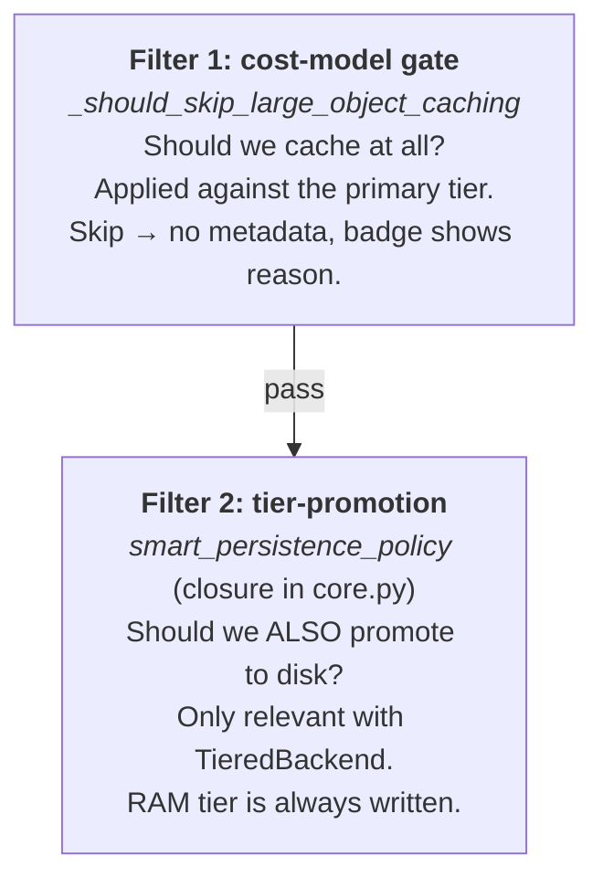

# Cost model and smart persistence

Cash does **not** cache every value your notebook produces. Behind every successful cache write — and every silently-not-cached row in the badge — sits a cost-benefit decision: would loading this value back from cache be faster than recomputing it? If not, the statement still runs to completion; its result simply isn't stored.

The decision is made by a **fitted linear regression** of serialize/deserialize wall time as a function of `(type_family, backend_kind, size_bytes)`. The model lives in [`src/cash/notebook/cost_model.py`][cost_model] and is refit offline by [`benchmarks/fit_cost_model.py`][fit_cost_model] against the measurement matrix in `benchmarks/results/`. Re-running those scripts updates the coefficients in-place.

This page explains how the persistence decision is made, what knobs you can tune, when to override it with `# @cash:persist`, and a handful of surprises that bite users who think of caching as "just store everything".

[cost_model]: https://github.com/galgtonold/cash/blob/main/src/cash/notebook/cost_model.py
[fit_cost_model]: https://github.com/galgtonold/cash/blob/main/benchmarks/fit_cost_model.py

## Two filters in series

There is no single "cache yes/no" switch in Cash. Two independent filters fire one after the other:



The two filters answer different questions and use different formulas. A value can pass filter 1 and fail filter 2 — the common case for medium-sized DataFrames produced by sub-second cells. You see RAM caching but no disk promotion, so a kernel restart misses.

The README's claim that "TieredBackend is smart about what reaches disk" refers to **filter 2 only**. Filter 1 is the one that emits the `skipped_reason` you see in the badge tooltip.

## Filter 1: the cost-model gate

### The rule

For each output variable, the gate computes a predicted restore time, then compares it to a budget derived from the statement's actual execution time. Cited from [`statement/processor.py:1591-1596`](https://github.com/galgtonold/cash/blob/main/src/cash/notebook/statement/processor.py):

<!-- test:skip reason="source-code excerpt: incomplete if-body and references undefined names" -->
```python
max_acceptable_restore = max(
    fixed_budget,
    (1.0 - min_savings_pct) * execution_time,
)

if execution_time > 0 and est_restore_time > max_acceptable_restore:
    # ... build skip reason, return (skip=True, reason, prediction)
```

In English:

> **Skip** caching when the predicted restore time exceeds **both**
>
> - the fixed budget (`min_cache_fixed_budget_seconds`, default 0.05 s), and
> - the configured fraction of compute time you're willing to spend on restore (`(1 - min_cache_savings_pct) × execution_time`, default 80 % of compute).

The `max(...)` matters: small cells get a flat floor so trivial overhead doesn't trip the gate; long cells get the ratio so a 20 s cell isn't allowed to spend 19 s on restore.

When the gate refuses, the badge for that row shows the skip reason:

<iframe class="cash-badge" src="/_badges/not_cached_too_cheap.html" loading="lazy" scrolling="no" height="40" style="width:100%;border:0;display:block;margin:8px 0;"></iframe>

### What `est_restore_time` actually is

The prediction comes from `cost_model.estimated_restore_time(type_name, size_bytes, backend_kind)` at [`cost_model.py:106-118`](https://github.com/galgtonold/cash/blob/main/src/cash/notebook/cost_model.py). Internally:

1. Map the Python `type(value).__name__` to a **family** via `resolve_family` ([`cost_model.py:78`](https://github.com/galgtonold/cash/blob/main/src/cash/notebook/cost_model.py)). Recognised families:

    | `type(value).__name__` | Family |
    |---|---|
    | `DataFrame` | `dataframe_numeric` |
    | `Series` | `series_numeric` |
    | `ndarray` | `ndarray_dense` |
    | `csr_matrix`, `csc_matrix` | `sparse` |
    | `dict` | `dict_shallow` |
    | `list`, `tuple` | `list_flat` |
    | `bytes`, `bytearray` | `bytes` |
    | anything else | `_GENERIC` |

2. Coerce the backend kind via `_resolve_backend` ([`cost_model.py:82`](https://github.com/galgtonold/cash/blob/main/src/cash/notebook/cost_model.py)) — only `"ram"` and `"disk"` are modelled; everything else (Redis, S3, custom remote backends) is silently charged as **disk**.

3. Look up the fitted `(intercept, slope_per_byte)` pair for `(family, backend, "deserialize")` and return `a + b * size_bytes`.

That's it. No concurrency model, no cold-cache modeling, no network latency, no compression cost. Linear in size, per-family intercept.

The coefficients live in the `_COEFFS` table at [`cost_model.py:33-73`](https://github.com/galgtonold/cash/blob/main/src/cash/notebook/cost_model.py); each entry carries its R² from the fit as a comment. `bytes` on RAM has R²=0.05 because the operation is too fast to model meaningfully; `sparse` on disk has R²=0.52 because sparse matrices are high-variance. Most pandas/numpy families fit at R²≥0.99.

### Which backend is "primary"?

The gate measures cost against the **first tier** of the backend, not the slowest. From [`statement/processor.py:1506-1511`](https://github.com/galgtonold/cash/blob/main/src/cash/notebook/statement/processor.py):

<!-- test:skip reason="source-code excerpt: references undefined names (backend_type, backend)" -->
```python
if backend_type == 'TieredBackend' and hasattr(backend, 'backends') and backend.backends:
    primary_backend_type = type(backend.backends[0]).__name__
else:
    primary_backend_type = backend_type

is_ram_backend = primary_backend_type == 'InMemoryBackend'
```

The default Cash setup is `TieredBackend([InMemoryBackend, FileBackend])`. Filter 1 is therefore measured against **RAM** — the `deepcopy` cost — which is roughly two orders of magnitude cheaper than pickle to disk. The practical effect: filter 1 almost never skips unless you're working with hundreds of megabytes of `_GENERIC`-family values.

### The "too cheap to cache" floor

Before filter 1 even runs, there's an earlier short-circuit at [`statement/processor.py:1672-1688`](https://github.com/galgtonold/cash/blob/main/src/cash/notebook/statement/processor.py):

<!-- test:skip reason="source-code excerpt: has return outside function" -->
```python
if not force_persist and not file_dependencies:
    if execution_time < min_exec_time:        # default 0.01 s
        # ... debug log, return None — no metadata written
        return None
```

Statements that run faster than `min_execution_time_to_cache_seconds` (default 0.01 s) **don't even get a metadata-only entry**. The cache machinery costs more than the compute it would save — writing 100 metadata files for 100 trivial `a_i = i + 1` statements means every subsequent run pays ~1 ms/statement of cache-lookup overhead just to discover those entries are empty.

A side effect: trivial-cell skips have **no `skipped_reason` to show in the badge**. There's nothing to read back. You see the cell rerun on every cold start with no badge annotation explaining why.

## Filter 2: tier-promotion (only with TieredBackend)

Filter 1 decided "yes, cache this somewhere". Filter 2 decides "do we also write to slower tiers?" — i.e. should this RAM-cached value also be promoted to disk?

This filter only matters if you're using `TieredBackend` (the default). With a single-tier backend (a bare `FileBackend`, `InMemoryBackend`, `RedisBackend`, …) there is no filter 2.

### The smart_persistence_policy

`_build_smart_persistence_policy` at [`factory.py`](https://github.com/galgtonold/cash/blob/main/src/cash/backends/factory.py) constructs the closure used as the tier-promotion policy. Since CAS-141 it applies the **same fitted cost model** as filter 1 (the notebook Gate A), so the two persistence gates agree instead of contradicting each other:

<!-- test:skip reason="source-code excerpt: references cost_model / min_savings from outer closure" -->
```python
min_persist_compute_s = 0.1                     # HARDCODED compute floor

def smart_persistence_policy(execution_time: float, size_bytes: int) -> bool:
    if execution_time < min_persist_compute_s:
        return False                            # tiny compute: never
    # Fitted cost model: predicted read + deserialize seconds for this size.
    est_restore = cost_model.estimated_restore_time("", size_bytes, "disk")
    # Promote only when recompute saves more than restore, by min_savings.
    return execution_time - est_restore > min_savings * execution_time
```

Three cases (the 2-arg closure has no type, so it predicts with the slowest `_GENERIC` family; when the entry records a `cost_model_family`, `TieredBackend.set` predicts with the real type):

| Compute time | Result | Decision |
|---|---|---|
| `< 0.1 s` | (any) | **No** — disk I/O round-trip alone costs more than rerunning the cell. |
| `≥ 0.1 s` | expensive to recompute vs. restore | **Yes** — restoring saves more than `min_cache_savings_pct` of the compute. |
| `≥ 0.1 s` | cheap to recompute, slow to restore | **No** — a large result whose predicted restore exceeds the recompute cost stays RAM-only. |

The 0.1 s minimum is **not configurable** — it's a constant in the closure body. To change it you'd have to provide your own promotion policy.

The cost-model coefficients were fitted on one dev machine's NVMe; on very different storage the predictions drift (per-machine recalibration is a planned follow-up).

### Force-promote via @cash:persist

The promotion check is gated by `force_persist` in [`tiered_backend.py:99-102`](https://github.com/galgtonold/cash/blob/main/src/cash/backends/tiered_backend.py):

<!-- test:skip reason="source-code excerpt: references undefined names (metadata, self)" -->
```python
force_persist = metadata.get('force_persist', False)

if force_persist or self.promotion_policy(exec_time, size):
    # ... write to disk tier(s)
```

`# @cash:persist` therefore bypasses filter 2 as well.

### Disabling smart persistence

Set `smart_persistence=False` on the config (no env var). The backend constructor at [`core.py:218`](https://github.com/galgtonold/cash/blob/main/src/cash/core.py) returns a `TieredBackend` with no promotion policy — every value that passes filter 1 is written to every tier unconditionally.

## Knobs you can tune

All on `CashConfig` (see [`src/cash/config.py`](https://github.com/galgtonold/cash/blob/main/src/cash/config.py)). Environment-variable equivalents are read by `_load_env_config` at [`config.py:90`](https://github.com/galgtonold/cash/blob/main/src/cash/config.py).

| Field | Env var | Default | Filter | Effect |
|---|---|---|---|---|
| `smart_persistence` | — | `True` | 2 | When `False`, falls back to `_default_promotion_policy` (same rule, 1.0 s floor). |
| `smart_persistence_threshold` | — | `1.0` s | — | **Legacy / no longer consulted (CAS-141);** superseded by the cost-model comparison. |
| `min_cache_savings_pct` | `CASH_MIN_CACHE_SAVINGS_PCT` | `0.20` | 1 & 2 | Predicted savings ratio required; now used by both filter 1 and the tier policy. |
| `min_cache_fixed_budget_seconds` | `CASH_MIN_CACHE_FIXED_BUDGET` | `0.05` s | 1 | Floor on the restore-time budget. Trivial cells get this much budget regardless of compute. |
| `min_execution_time_to_cache_seconds` | `CASH_MIN_EXECUTION_TIME_TO_CACHE` | `0.01` s | floor | Statements faster than this never cache. |
| `max_memory_entries` | `CASH_MAX_MEMORY_ENTRIES` | `None` | RAM tier | LRU cap on `InMemoryBackend`. Indirect: forces eviction even when filter 1 said cache. |

The `_config_float` helper used by filter 1 reads each field defensively; missing or non-numeric values fall back to the defaults shown above.

### What changes if I raise `min_cache_savings_pct`?

Higher ratio ⇒ stricter gate ⇒ more skips. Setting it to `0.5` means "restore must take less than 50 % of compute to be worthwhile". Useful on remote backends where the cost model under-charges actual round-trip latency.

### What changes if I lower `min_execution_time_to_cache_seconds`?

Lower floor ⇒ more cheap statements get cached. Useful when you have many cheap cells whose results are inputs to expensive downstream cells and you want the lineage chain intact across kernel restarts. Beware: each cached cheap cell adds ~1 ms of lookup overhead on subsequent runs.

## Forcing or disabling caching

### `# @cash:persist`

Bypasses **all three** decision points:

1. The cheap-floor at [`statement/processor.py:1672`](https://github.com/galgtonold/cash/blob/main/src/cash/notebook/statement/processor.py) (`if not force_persist and not file_dependencies:`).
2. The cost-model gate at [`statement/processor.py:1545`](https://github.com/galgtonold/cash/blob/main/src/cash/notebook/statement/processor.py) (`if force_persist or has_file_dependencies: return False, None, ...`).
3. The tier-promotion policy at [`tiered_backend.py:102`](https://github.com/galgtonold/cash/blob/main/src/cash/backends/tiered_backend.py) (`if force_persist or self.promotion_policy(...):`).

```python
# @cash:persist
cheap_constant = compute_something_small()   # forced; bypasses cheap-floor + filter 1 + filter 2
```

Use it when *you* know the cost model is wrong — typically when:

- The statement is cheap but a downstream cell depends on it being available across kernel restarts.
- The cost model is undercharging an exotic backend (Redis over WAN, encrypted S3 with KMS) and you've seen filter 1 over-promote.
- You're benchmarking restore overhead and need the value on disk regardless.

The flow: [`annotations.py:48-49`](https://github.com/galgtonold/cash/blob/main/src/cash/notebook/annotations.py) parses the comment → [`statement/processor.py:_parse_annotation`](https://github.com/galgtonold/cash/blob/main/src/cash/notebook/statement/processor.py) at lines 559-568 extracts `persist=True` → `_run_and_process` threads `force_persist=True` into `_store_in_cache` → the three bypass sites above all check that flag.

### `# @cash:no-cache`

A different mechanism — opts out *earlier*, at the cacheability decision in [`cacheability_decision.py:71-72`](https://github.com/galgtonold/cash/blob/main/src/cash/notebook/cacheability_decision.py). The statement is never even considered for caching; filter 1 and filter 2 don't run. `no-cache` wins over `persist` when both are present. See [Annotations · `@cash:no-cache`](annotations.md#cashno-cache-alias-nocache).

### File-dependent statements always cache

When a statement reads a file Cash knows about (auto-detected, or declared via `file_depends_on=` on a `@cash.cache`-decorated function), filter 1 is bypassed at [`statement/processor.py:1545`](https://github.com/galgtonold/cash/blob/main/src/cash/notebook/statement/processor.py):

<!-- test:skip reason="source-code excerpt: has return outside function" -->
```python
if force_persist or has_file_dependencies:
    return False, None, largest_prediction
```

The reasoning: file I/O is inherently expensive, and Cash's whole value proposition over re-reading is undermined if it refuses to cache file-bound values just because they're large.

Filter 2 still runs — file-dependent values can be RAM-only if compute was sub-100 ms.

## What you see when caching is refused

The skip reason is built at [`statement/processor.py:1600-1605`](https://github.com/galgtonold/cash/blob/main/src/cash/notebook/statement/processor.py):

<!-- test:skip reason="source-code excerpt: references undefined names (var_name, size_mb, etc.)" -->
```python
reason = (
    f"Restoring '{var_name}' ({size_mb:.0f} MB {type_name}) would take "
    f"~{est_restore_time:.2f}s vs {execution_time:.2f}s compute "
    f"({backend_label}, <{pct_label} savings) — "
    f"use @cash:persist to force"
)
```

A concrete example:

```
Restoring 'big_frame' (412 MB DataFrame) would take ~0.71s vs 0.85s compute
(serializing, <20% savings) — use @cash:persist to force
```

That string is stored on the cache metadata as `skipped_reason` and surfaced in three places:

- **Badge tooltip (HTML)** — emitted as `<dt>Skipped</dt><dd>{reason}</dd>` at [`renderers/html.py:995-996`](https://github.com/galgtonold/cash/blob/main/src/cash/notebook/badge_renderer/renderers/html.py).
- **Badge text mode** — appended after the timing at [`renderers/text.py:70,93-94`](https://github.com/galgtonold/cash/blob/main/src/cash/notebook/badge_renderer/renderers/text.py).
- **Debug log** — line `[SIZE_AWARE] {reason}` at [`statement/processor.py:1607`](https://github.com/galgtonold/cash/blob/main/src/cash/notebook/statement/processor.py) when `debug=True`.

Only filter 1 emits this string. The cheap-floor and filter 2 produce only debug log lines; the cheap-floor doesn't even write metadata, so the badge has nothing to render.

## Common situations

### "Why isn't my big DataFrame cached?"

If the frame took real time to build, it **is** promoted to disk now (that was the CAS-141 fix — the old bandwidth model wrongly refused large results). If it's still RAM-only, the frame is **cheap to recompute relative to its restore cost**:

- Filter 1 passes trivially because the primary tier is `InMemoryBackend`. A 400 MB DataFrame's `est_restore_time` on RAM is around 65 ms — well under the 50 ms fixed budget (close, but `max(0.05, 0.8 × execution_time)` will be governed by execution_time for a non-trivial cell).
- Filter 2 (the tier policy) predicts the *disk* restore time and compares it to compute. A frame that took only, say, 0.3 s to build but would take ~1 s to reload is deliberately kept RAM-only — rehydrating it costs more than rerunning.
- After a kernel restart the RAM tier is empty. The lookup misses. The cell reruns.

**Fix:** lower `min_cache_savings_pct` toward `0` so nearly any hit clears the promotion bar, or add `# @cash:persist` to the offending cell to force it past both gates.

### "Why is this tiny computation re-running?"

Cheap-floor. Statements faster than `min_execution_time_to_cache_seconds` (0.01 s) don't get cached, and no metadata is written. There's no `skipped_reason` because there's nothing to read back — the next lookup is a clean miss.

**Fix options:**

- Don't bother — the compute is already fast.
- Add `# @cash:persist` if the value is downstream of something expensive and you want it pinned.
- Lower `min_execution_time_to_cache_seconds` if you genuinely want to cache sub-10 ms cells. (Each one costs ~1 ms of lookup overhead per run, so weigh accordingly.)

### "I'm on Redis or S3 — why are things slow?"

The cost model charges everything non-RAM as **local disk**. Real Redis-over-network and S3 round-trips are typically 5-50× slower than the modelled cost. Two consequences:

- **Filter 1 under-skips.** It says "restore is fast, cache it" when the real restore is much slower than recompute.
- **Filter 2 doesn't apply** with a single-tier backend, so you don't get the promotion-policy protection.

**Mitigations:**

- Raise `min_cache_savings_pct` to 0.5 or 0.7 to demand a larger predicted margin (the modelled cost is then small relative to a strict threshold).
- Keep the default `TieredBackend([InMemoryBackend, RemoteBackend])` so RAM absorbs most reads.
- Use `# @cash:no-cache` on values you'd otherwise expect to be cached but don't want to round-trip.

### "I added `# @cash:persist` and it didn't help"

Check that the annotation is being parsed:

- No space after the colon: `# @cash:persist` not `# @cash: persist`. See [Annotations · grammar](annotations.md#grammar).
- The annotation is on the line(s) immediately above the statement, with no blank lines between them.
- `no-cache` isn't also active — `no-cache` wins over `persist`.

If `force_persist=True` is genuinely being set but you still see no disk file, you're probably looking at filter 0 — the value simply isn't picklable, or the backend write raised an error caught at [`tiered_backend.py:88-92`](https://github.com/galgtonold/cash/blob/main/src/cash/backends/tiered_backend.py). Check the debug log.

## Surprises

A grab bag of things that have bitten users.

### The default backend makes filter 1 permissive

Because `backend.backends[0]` of the default `TieredBackend` is `InMemoryBackend`, filter 1 measures cost against **RAM** — the `deepcopy` family — which is 1-2 orders of magnitude cheaper than pickle. A 10 MB DataFrame's est_restore_time on RAM is around 1.7 ms, well under the 50 ms fixed budget. **The skip path mostly fires for hundreds-of-megabytes objects.** See [`statement/processor.py:1506-1513`](https://github.com/galgtonold/cash/blob/main/src/cash/notebook/statement/processor.py).

### README "smart about disk" refers to filter 2, not filter 1

When the README says TieredBackend is smart about what reaches disk, it means the **tier-promotion** policy in [`core.py:226-244`](https://github.com/galgtonold/cash/blob/main/src/cash/core.py), not the cost-model gate. The cost-model gate decides whether to cache at all; once a value passes it, the promotion policy decides where it lands.

### Two hardcoded constants hide in the tier-promotion policy

`min_persist_compute_s = 0.1` and `small_result_bytes = 64 * 1024` at [`core.py:223-224`](https://github.com/galgtonold/cash/blob/main/src/cash/core.py) are **not** in `CashConfig`. They live inside the closure body. To change them, subclass `Cash` and override `_create_default_backend`, or construct a `TieredBackend` yourself with a custom `promotion_policy`.

### Cheap-floor writes no metadata

Statements that hit the `< 0.01 s` floor at [`statement/processor.py:1672-1688`](https://github.com/galgtonold/cash/blob/main/src/cash/notebook/statement/processor.py) return `None` — no metadata file, no badge entry. The badge has nothing to show, so the cell just looks "uncached" with no reason. This is intentional: writing 100 metadata-only entries for a notebook of trivial assignments would mean 100 cache lookups on the next run, all of them slow misses.

### `# @cash:persist` has three independent bypass sites

The annotation must be honoured at the cheap-floor ([`statement/processor.py:1672`](https://github.com/galgtonold/cash/blob/main/src/cash/notebook/statement/processor.py)), the cost-model gate ([`statement/processor.py:1545`](https://github.com/galgtonold/cash/blob/main/src/cash/notebook/statement/processor.py)), **and** the tier-promotion policy ([`tiered_backend.py:102`](https://github.com/galgtonold/cash/blob/main/src/cash/backends/tiered_backend.py)). Forgetting to thread `force_persist` through any one of these would silently re-introduce skipping. If you're modifying the persistence path, this is the thing to watch.

### Backend-specific costs aren't modelled

`_resolve_backend` at [`cost_model.py:82`](https://github.com/galgtonold/cash/blob/main/src/cash/notebook/cost_model.py) coerces anything that isn't `"ram"` or `"disk"` to `"disk"`:

<!-- test:skip reason="source-code excerpt: references undefined name _KNOWN_BACKENDS" -->
```python
def _resolve_backend(backend_kind: str) -> str:
    return backend_kind if backend_kind in _KNOWN_BACKENDS else "disk"
```

Redis network round-trips and S3 PUT/GET latency are charged as **local pickle cost**. On a fast LAN this overcharges (Redis is much faster than disk pickle); on WAN it dramatically undercharges. Users on remote backends should expect filter 1 to be poorly calibrated and lean on `min_cache_savings_pct` to compensate.

### `_GENERIC` family overcharges custom types

For any `type(value).__name__` not in the `_TYPE_TO_FAMILY` map at [`cost_model.py:17-28`](https://github.com/galgtonold/cash/blob/main/src/cash/notebook/cost_model.py), `resolve_family` returns `"_GENERIC"`, whose coefficients at [`cost_model.py:64-72`](https://github.com/galgtonold/cash/blob/main/src/cash/notebook/cost_model.py) are deliberately picked as the **slowest observed family per (backend, op)**. A custom class with a fast `__reduce__` (e.g. a small `dataclass` of primitives) is charged at `dict_shallow`'s disk-deserialize rate, which can overstate its actual cost by 5-10×. Result: custom types are over-skipped relative to ground truth.

If this hurts you, the workarounds are: convert to a recognised type before storing (`dataclasses.asdict` to a `dict`), or use `# @cash:persist` to bypass the gate.

### Filter 2 doesn't fire without TieredBackend

If you configured `backend = "file"` (single-tier `FileBackend`) or any other non-tiered backend, the `smart_persistence_*` knobs are inert. There's no promotion decision to make — every value that passes filter 1 goes to the one backend you have.

### Redis / S3 coefficients are *estimates*, not measurements

`RAM` and `DISK` coefficients come from the offline measurement campaign in `benchmarks/measure_ser_deser.py` and are refit by `benchmarks/fit_cost_model.py`. The Redis and S3 coefficients added in commit [`8832780`](https://github.com/galgtonold/cash/blob/main/src/cash/notebook/cost_model.py) are **estimated** from a documented bandwidth/latency model:

- Redis: `500 µs` round-trip latency + `20 ns/B` (≈ 50 MB/s LAN sustained); pickle work scaled from the DISK fits at `0.1×` (most of disk's intercept is disk I/O, not pickling).
- S3: `80 ms` request setup (DNS + TLS + auth) + `50 ns/B` (≈ 20 MB/s single-stream same-region); pickle work scaled at `0.2×`.

Cross-region or public-internet S3 is 5–10× slower; users with those topologies should override the relevant `[[tool.cash.tiers]]` block manually or refit. A future measurement pass can replace these constants without touching the cost-model API — the consumer only sees `estimated_serialize_time(family, size_bytes, backend_kind)` etc.

## API reference

### `cash.notebook.cost_model`

<!-- test:skip reason="signature-only excerpt with ellipsis body" -->
```python
def resolve_family(value_type_name: str) -> str: ...
```
Maps a Python `type(value).__name__` to one of the eight families above, or `"_GENERIC"`.

<!-- test:skip reason="signature-only excerpts with ellipsis body" -->
```python
def estimated_serialize_time(value_type_name: str, size_bytes: int, backend_kind: str) -> float: ...
def estimated_restore_time(value_type_name: str, size_bytes: int, backend_kind: str) -> float: ...
```
Predicted wall-seconds. `backend_kind` must be `"ram"` or `"disk"` — anything else is coerced to `"disk"`. Returns `a + b * size_bytes` where `(a, b)` are the fitted coefficients for `(family, backend, op)`.

The persistence decision uses `estimated_restore_time` (not serialize) because the decision is "can we read this back cheaply?" — write cost is paid once on cache, read cost is paid every hit.

### `cash.CashConfig`

The relevant fields (see [`src/cash/config.py`](https://github.com/galgtonold/cash/blob/main/src/cash/config.py)):

<!-- test:skip reason="source-code excerpt: @dataclass not imported in fence" -->
```python
@dataclass
class CashConfig:
    smart_persistence: bool = True
    smart_persistence_threshold: float = 1.0
    min_cache_savings_pct: float = 0.20
    min_cache_fixed_budget_seconds: float = 0.05
    min_execution_time_to_cache_seconds: float = 0.01
    max_memory_entries: int | None = None
    # ...
```

Set them programmatically:

```python
import cash
cash_instance = cash.Cash(config=cash.CashConfig(
    min_cache_savings_pct=0.5,
    min_cache_fixed_budget_seconds=0.1,
))
```

Or via environment variables (see the table in [Knobs you can tune](#knobs-you-can-tune)).

### Where the decision is made

| Decision | Code location |
|---|---|
| Cheap-floor (< 0.01 s, no metadata) | [`statement/processor.py:1672-1688`](https://github.com/galgtonold/cash/blob/main/src/cash/notebook/statement/processor.py) |
| Filter 1 dispatch | [`statement/processor.py:1445-1552`](https://github.com/galgtonold/cash/blob/main/src/cash/notebook/statement/processor.py) |
| Filter 1 per-variable rule | [`statement/processor.py:1591-1596`](https://github.com/galgtonold/cash/blob/main/src/cash/notebook/statement/processor.py) |
| Filter 1 skip-reason string | [`statement/processor.py:1600-1605`](https://github.com/galgtonold/cash/blob/main/src/cash/notebook/statement/processor.py) |
| Filter 2 policy closure | [`core.py:226-244`](https://github.com/galgtonold/cash/blob/main/src/cash/core.py) |
| Filter 2 application | [`tiered_backend.py:95-110`](https://github.com/galgtonold/cash/blob/main/src/cash/backends/tiered_backend.py) |
| Cost-model coefficients | [`cost_model.py:33-73`](https://github.com/galgtonold/cash/blob/main/src/cash/notebook/cost_model.py) |
| `# @cash:persist` parse | [`annotations.py:48-49`](https://github.com/galgtonold/cash/blob/main/src/cash/notebook/annotations.py) → [`statement/processor.py:559-568`](https://github.com/galgtonold/cash/blob/main/src/cash/notebook/statement/processor.py) |

See also: [Annotations](annotations.md), [Reading the Cash Badge](badges.md), [Configuration](getting-started/configuration.md), [Smart persistence tutorial](tutorials/feature-guides/smart-persistence.md).
