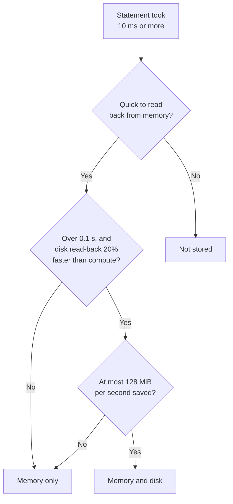

# Cost model

!!! info "Applies to: notebook"
    Notebooks with `%cash_on`. How cash decides which statement results to store,
    and which to write to disk.

In a notebook cash sees every statement, so it has to judge which results are
worth keeping. It asks one question: would reading this value back be faster
than computing it again? If not, the statement still runs and gives the right
result; the result is just not stored, or not written to disk.

None of this applies to a `@cash.cache` function: decorating a function is the
decision to cache it, and its results are always written to disk (see the
[decorator guide](decorator.md)).

## The thresholds

<!-- claim: cash/config.py:CashConfig.min_execution_time_to_cache_seconds == 0.01, cash/backends/persistence_policy.py:COMPUTE_FLOOR_S == 0.1 -->
| Compute time | What cash does | Survives a restart? |
|---|---|---|
| under 10 ms | nothing: the statement runs every time | — |
| 10 ms to 0.1 s | keeps the result in memory | no |
| over 0.1 s, and worth reading back | keeps it in memory and on disk | yes |

"Worth reading back" means the predicted time to read the value back beats the
compute time by at least `min_cache_savings_pct` (20%). A large value that
computes in 0.3 s but takes a second to read back stays in memory.

<!-- claim: cash/notebook/statement/call_routing.py:CallRouting.price @2197abce -->
Compute time is your code's, not cash's. Time cash spends inside a statement
(tracking files, storing the calls it caches) is left out. A cached call counts
the time it measured, as its own entry records it, so a statement never costs
less than a call inside it.

The thresholds apply to each statement on its own; cash does not add them up. A
cell of 120 independent statements at 0.05 s each takes six seconds and writes
nothing to disk. The exceptions work in your favour:

- A long loop that cash runs as one unit counts the whole loop's time.
- A cheap value whose inputs would be expensive to rebuild after a restart is
  written at the end of the cell; see
  [Restarts and persistence](tutorials/feature-guides/smart-persistence.md).
- A statement that reads a tracked file skips the in-memory check below: it is
  always cached, and written to disk if it took over 0.1 s. A file read inside a
  cached call does not count; the call's entry keeps it.

`# @cash:persist` skips every threshold for one statement, and `%cash_persist on`
for all of them. Only a storage tier's size cap still applies.

### A statement around a cached call { #a-statement-around-a-cached-call }

<!-- claim: cash/notebook/statement/store.py:StatementStore._store @cc8fe383, cash/notebook/call_unit.py:CallUnit._count_cached @48acf47c, cash/notebook/call_unit.py:CallUnit._cached @6680f15e -->
Cash also caches the slow calls inside a statement on their own (see
[`no-cache-calls`](annotations.md#call-level-caching-default-and-cashno-cache-calls)).
The call's result is kept in the call's entry, so a statement around it is
judged by its **own** work: what it does beyond its cached calls, plus reading
their results back. That time goes through the thresholds above. A call that
took under 0.1 s stays in memory only, so it counts as the statement's own work:
after a restart, only the statement's entry would bring it back.

| Statement, with a slow `shifted` | What cash keeps |
|---|---|
| `b = shifted(a) + 1` | the call only; the next run reads it back and adds 1 again |
| `b = shifted(a) + slow_part(a)` | the call, and the statement's value |
| `b = shifted(a)` | the call, and a small entry that points at it |

The time a hit shows as saved is still the whole statement's, the call's time
included. A statement whose own work is too cheap to store still records the
names it bound, so the cells below it can be restored after a restart.

## What the badge shows

A statement under 10 ms shows as a plain `EXECUTED` row with no reason: nothing
was stored, so there is nothing to explain.

When a value is too big to be worth storing, the row detail (and the text badge)
gives the arithmetic:

```text title="Output"
Restoring 'big_frame' (412 MB DataFrame) would take ~0.71s vs 0.85s compute
(serializing, <20% savings) — use @cash:persist to force
```

<!-- claim: cash/backends/value_policy.py:worth_its_bytes, cash/backends/value_policy.py:WORTH_CEILING_BYTES_PER_SECOND == 134217728, cash/backends/value_policy.py:WORTH_FLOOR_BYTES == 8388608 -->
A value that is large and quick to rebuild is refused on **rate** instead: cash
spends at most 128 MiB of disk per second of compute saved, and does not write a
value over 8 MiB that exceeds that rate. It warns once per cell with
[`CACHE-NOT-WORTH-BYTES`](warnings.md#cache-not-worth-bytes).

## Settings

Set these in `[tool.cash]` in `pyproject.toml`, as `CASH_*` environment
variables, or with `cash.configure(...)` in the first cell, before `%cash_on`:

<!-- test:skip reason="illustrative: the first cell of a notebook with two settings" -->
```python { .nb-cell }
import cash
cash.configure(
    min_cache_savings_pct=0.5,
    min_cache_fixed_budget_seconds=0.1,
)
%cash_on
```

<!-- claim: cash/config.py:CashConfig.min_cache_savings_pct == 0.20, cash/config.py:CashConfig.min_cache_fixed_budget_seconds == 0.05 -->
| Setting | Environment variable | Default | Effect |
|---|---|---|---|
| `min_cache_savings_pct` | `CASH_MIN_CACHE_SAVINGS_PCT` | `0.20` | How much faster reading back must be than computing. Higher means fewer values stored. |
| `min_cache_fixed_budget_seconds` | `CASH_MIN_CACHE_FIXED_BUDGET_SECONDS` | `0.05` | A read-back time that is always acceptable, so small values are not refused over a few milliseconds. |
| `min_execution_time_to_cache_seconds` | `CASH_MIN_EXECUTION_TIME_TO_CACHE_SECONDS` | `0.01` | Statements faster than this are not stored. |
| `max_memory_entries` | `CASH_MAX_MEMORY_ENTRIES` | none | A cap on the number of entries in memory. |

Lowering `min_execution_time_to_cache_seconds` stores more cheap statements, at
about 1 ms of lookup per statement per run. The 0.1 s disk threshold is fixed.
Every setting is in [Configuration](getting-started/configuration.md).

## Common questions

### Why is this tiny statement running again? { #why-is-this-tiny-computation-re-running }

It took under 10 ms, so it was not stored. That is usually right. If a slow
statement below needs it after a restart, mark it `# @cash:persist`.

### Why did my big DataFrame not survive a restart?

It took under 0.1 s, or reading it back would have been nearly as slow as
building it, so it stayed in memory. Mark it `# @cash:persist`, or lower
`min_cache_savings_pct`.

### I added `# @cash:persist` and nothing changed

Check that the comment is directly above the statement with no blank line in
between, and that `no-cache` is not also set: it wins. If both are fine, turn on
[`%cash_debug on`](magics.md#cash_debug); the value may not be picklable, or the
write may have failed (`%cash_stats` then shows a "discarded writes" line).

## Remote backends: the predictions are estimates

The prediction of read-back time comes from measurements on a local disk. The
Redis and S3 figures are estimates for a nearby server (Redis about 0.5 ms plus
50 MB/s, S3 about 80 ms plus 20 MB/s in the same region), and a distant server
can be 5 to 10 times slower. On such a backend cash stores values that would be
faster to compute. Raise `min_cache_savings_pct` to 0.5–0.7, keep the in-memory
tier in front, and mark values you would rather not fetch remotely
`# @cash:no-cache`.

## How the decision is made

<!-- claim: cash/cost_model.py:_TYPE_TO_FAMILY @674b9d86, cash/cost_model.py:resolve_family @91ef972a, cash/cost_model.py:_resolve_backend @d6308bba, cash/cost_model.py:_KNOWN_BACKENDS @3f31251c -->
A statement that took 10 ms or more goes through three checks in order:



1. **Store it at all?** Cash predicts how long reading the value back from the
   first tier (memory, by default) would take, and refuses when that exceeds
   both `min_cache_fixed_budget_seconds` and 80% of the compute time. In memory
   this almost never refuses.
2. **Write it to disk?** Only when the compute time is over
   0.1 s and reading the value back from disk beats computing it by
   `min_cache_savings_pct`. A value that fails stays in memory, with no reason
   shown.
3. **Worth its bytes?** At most 128 MiB of disk per second of
   compute saved, as above.

The read-back time is predicted from the value's type and size: a straight line
(`a + b × size`) fitted per type family (DataFrame, Series, array, sparse
matrix, dict, list, bytes) and per backend. Other types use the slowest family,
so an unknown type is stored less often rather than more. A small dataclass can
be charged more than it really costs; convert it to a dict or mark it
`# @cash:persist`.

See also: [Where your cache lives](how-it-works/storage.md),
[Benchmarks](benchmarks.md) for the measured numbers,
[Restarts and persistence](tutorials/feature-guides/smart-persistence.md).
