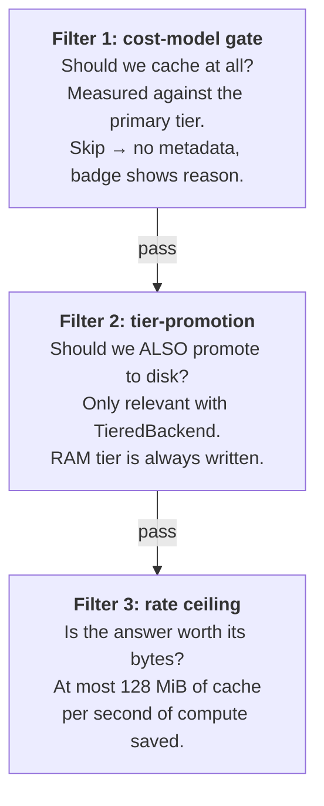

# Cost model and smart persistence

Cash does **not** cache every value your notebook produces. Behind every
*cost-related* not-cached row in the badge sits one question: *would loading this
value back be faster than recomputing it?* If not, the statement still runs to completion — its
result simply isn't stored. This page is the reference for how that decision is
made, **every knob you can turn**, when to override it, and why the predictions
can be off on remote backends.

For the promotion decision as you *experience* it — the tiers, read-repair, size
caps — see [Where your cache lives](how-it-works/storage.md). This page is the
model behind that decision.

---

## What gets cached

The decision reduces to your statement's **compute time**. There are two floors,
and together they sort every statement into one of three outcomes:

<!-- claim: cash/notebook/statement/call_routing.py:CallRouting.statement_cost @a49c0cd3 -->
Compute time is your code's, not cash's: time cash spends inside the statement
tracking the files it reads, or keying and storing the calls it intercepts, is
taken out, and a call served from the cache counts at what it cost to compute.
So a statement whose expensive call hit is still valued at that call, and the
badge's "saved" is not inflated by cash's own bookkeeping.

<!-- claim: cash/config.py:CashConfig.min_execution_time_to_cache_seconds == 0.01, cash/backends/persistence_policy.py:COMPUTE_FLOOR_S == 0.1 -->

| Compute time | What cash does | Survives a kernel restart? |
|---|---|---|
| **< 10 ms** | Nothing — recomputed every run (too cheap to be worth an entry) | — |
| **10 ms – 0.1 s** | Cached in **RAM** — instant this session | No |
| **> 0.1 s** *(and worth it)* | Cached in **RAM and on disk** | Yes |

The floors above are the **notebook's**, where cash caches every statement by
itself and has to judge which are worth keeping. **None of it applies to a
`@cash.cache` function.** Decorating one is the decision to cache it, so its
result is written to disk however quick the call was and however slow the value
is to read back. Nothing on this page overrides that — not the floors, not the
savings margin, not the cost model. The only thing that can still stop it is a
per-tier [size cap](how-it-works/storage.md): a value too large for any disk
tier has nowhere to go, and says so.

That is narrower than it was. The cost model used to get a vote on decorated
entries too, and it decided them on a fitted intercept that priced a small read
at 10.4 ms where it measures about 1.3 ms — so nothing under roughly 13 ms of
compute was ever written, however often it was called, and a script run twice
recomputed everything. A wrong refusal there is silent and permanent: you
decorated the function and got nothing across processes, with no way to see why.
The decision belongs to whoever wrote the decorator.

The "and worth it" caveat on the last row is the one surprise: a result that took
more than 0.1 s to compute but would be **slow to reload** (a large object whose
predicted restore time approaches its compute time) is deliberately kept
RAM-only. Rehydrating it from disk would cost more than just rerunning the cell,
so cash doesn't promote it. The threshold is a predicted-savings margin —
restore must be cheaper than recompute by at least `min_cache_savings_pct` (20%
by default).

That's the whole model in practice. The two constants — the **10 ms** "too cheap
to cache" floor and the **0.1 s** disk-persistence floor — are what most people
mean by "smart persistence". If you never read further, the actionable takeaway
is: **cheap statements don't survive a restart; force the ones that matter with
`# @cash:persist`.**

!!! warning "The 0.1 s floor is per statement — it does not compose"
    The floor is applied to each value on its own. A cell of 120 statements at
    0.05 s each takes six seconds of wall clock and persists **nothing** — no
    single statement cleared the floor, and cash never sums them. If a genuinely
    slow cell is made of individually cheap steps, that's why nothing survives
    your restart. Force it with `# @cash:persist`, flip `%cash_persist on` for
    the session, or restructure so the expensive work lands in one statement.

    One exception, in your favour: a **long loop** is cached as a single unit
    once per-iteration bookkeeping stops paying for itself, and that entry's
    compute is the whole loop — so it clears the floor. See
    [What's worth persisting](how-it-works/storage.md#whats-worth-persisting).

---

## What you see when caching is refused

When cash declines to cache a statement, the badge row names the reason. Here a
statement was skipped as too cheap to be worth an entry:

<iframe class="cash-badge" src="/_badges/not_cached_too_cheap.html" loading="lazy" scrolling="no" height="40" style="width:100%;border:0;display:block;margin:8px 0;"></iframe>

For a **size-based** refusal — a value large enough that restoring it wouldn't
pay off — the tooltip instead carries the full arithmetic:

```
Restoring 'big_frame' (412 MB DataFrame) would take ~0.71s vs 0.85s compute
(serializing, <20% savings) — use @cash:persist to force
```

That string is stored on the cache metadata as `skipped_reason` and shown in the
badge tooltip (HTML mode), inline after the timing (text mode), and in the debug
log when [`%cash_debug on`](magics.md#cash_debug).

A third refusal reads differently: a value that is large *and* cheap to rebuild
is declined on **rate** rather than on restore time — "more cache per second
saved than cash will spend". That one comes from
[filter 3](#the-rate-ceiling) and also warns once per session as
[`CACHE-NOT-WORTH-BYTES`](warnings.md#cache-not-worth-bytes).

One case has **no** reason to show: a statement under the 10 ms floor writes no
metadata at all, so there's nothing to read back. The cell just reruns each cold
start with no badge annotation — that absence *is* the signal ("too cheap to
cache"), covered under [troubleshooting](#why-is-this-tiny-computation-re-running)
below.

---

## Knobs you can tune

All of these are `CashConfig` fields, settable programmatically, via a `CASH_*`
env var, or in a TOML file (see [Configuration](getting-started/configuration.md)):

| Field | Env var | Default | Effect |
|---|---|---|---|
| `min_cache_savings_pct` | `CASH_MIN_CACHE_SAVINGS_PCT` | `0.20` | The predicted-savings margin restore must beat to be worth caching/promoting. Higher ⇒ stricter ⇒ more skips. |
| `min_cache_fixed_budget_seconds` | `CASH_MIN_CACHE_FIXED_BUDGET_SECONDS` | `0.05` s | A flat restore-time budget floor so trivial cells aren't tripped by fixed overhead. |
| `min_execution_time_to_cache_seconds` | `CASH_MIN_EXECUTION_TIME_TO_CACHE_SECONDS` | `0.01` s | The "too cheap to cache" floor. Statements faster than this never get an entry. |
| `max_memory_entries` | `CASH_MAX_MEMORY_ENTRIES` | `None` | LRU cap on the RAM tier — forces eviction even for values that passed the gate. |

```python
import cash

cash.Cash(config=cash.CashConfig(
    min_cache_savings_pct=0.5,             # demand a bigger margin
    min_cache_fixed_budget_seconds=0.1,
))
```

**Raising `min_cache_savings_pct`** makes the gate stricter — useful on remote
backends where the model under-charges real latency (see
[below](#remote-backends-the-predictions-are-estimates)). **Lowering
`min_execution_time_to_cache_seconds`** caches more cheap statements — useful
when a chain of cheap cells feeds an expensive one and you want the lineage
intact across restarts, but each cached cheap cell adds ~1 ms of lookup overhead
per run.

The 0.1 s disk-persistence floor itself is **not** a config field — it lives in
the promotion policy. To change it you supply your own policy (see
[Under the hood](#the-promotion-policy)).

---

## Forcing or disabling caching

### `# @cash:persist` — force it

Bypasses every floor and gate: the value is cached and written to disk
regardless of compute time or predicted restore cost (only the per-tier size
caps still apply).

```python
# @cash:persist
cheap_constant = compute_something_small()   # forced onto disk
```

Reach for it when *you* know the model is wrong — a cheap statement a downstream
cell needs across restarts, a remote backend the model under-charges, or a
benchmark that needs the value on disk. `%cash_persist on` does the same for
every statement in the session.

### `# @cash:no-cache` — opt out

Opts out *earlier* than the cost model — the statement is never even considered
for caching. `no-cache` wins over `persist` when both are present. See
[Annotations](annotations.md#cashno-cache).

### File-reading statements always cache

When a statement reads a file cash knows about (auto-detected, or declared via
`file_depends_on=`), the cost-model gate is bypassed — file I/O is inherently
expensive, and refusing to cache a file-bound value just because it's large would
undermine the whole point. (The 0.1 s *disk-promotion* floor still applies, so a
sub-100 ms file read can be RAM-only.)

---

## Common situations

### "Why isn't my big DataFrame cached?"

If the frame took real time to build, it **is** promoted to disk. If it's still
RAM-only, it's **cheap to recompute relative to its restore cost** — a frame that
took 0.3 s to build but would take ~1 s to reload is deliberately kept RAM-only,
and after a restart the RAM tier is empty, so the cell reruns.

**Fix:** lower `min_cache_savings_pct` toward `0` so nearly any hit clears the
bar, or add `# @cash:persist` to force it.

### "Why is this tiny computation re-running?" { #why-is-this-tiny-computation-re-running }

The 10 ms floor. Statements faster than `min_execution_time_to_cache_seconds`
get no entry and no `skipped_reason` — the next lookup is a clean miss.

**Fix:** don't bother (it's already fast), add `# @cash:persist` if it's
downstream of something expensive and you want it pinned, or lower the floor
(weighing the ~1 ms/statement lookup overhead).

### "I'm on Redis or S3 — why are things slow?"

The Redis and S3 restore predictions are *estimates* assuming LAN / same-region;
over WAN they under-charge, so the gate under-skips (thinks restore is fast when
it isn't). See [Remote backends](#remote-backends-the-predictions-are-estimates).

### "I added `# @cash:persist` and it didn't help"

Check the annotation is actually being parsed:

- It's on the line(s) immediately above the statement, with **no blank line**
  between them (a blank line ends the lookback). Spacing is *not* the problem —
  `# @cash:persist` and `# @cash: persist` both parse. See
  [Annotations · grammar](annotations.md#grammar).
- `no-cache` isn't also active — it wins over `persist`.

If `force_persist` is genuinely set but there's still no disk file, the value
probably isn't picklable, or the backend write raised. Turn on
[`%cash_debug`](magics.md#cash_debug) and check the log.

---

## Remote backends: the predictions are estimates

The cost model was fitted on one machine's local disk. Two limits follow, and
both matter most on Redis/S3:

- **The per-statement gate charges any non-RAM primary tier as local disk.** The
  *disk-promotion* decision does use per-backend Redis/S3 coefficients — but
  those are modelled for LAN Redis / same-region S3. Over WAN both dramatically
  *under*-charge, so the gate says "cheap, cache it" when the real restore is far
  slower than recompute.
- **The Redis and S3 coefficients are estimates, not measurements** — derived
  from a documented bandwidth/latency model (Redis: ~500 µs + ~50 MB/s; S3:
  ~80 ms setup + ~20 MB/s same-region), not an offline measurement campaign like
  the RAM and disk fits. Cross-region or public-internet S3 is 5–10× slower again.

**What to do:** raise `min_cache_savings_pct` (to 0.5–0.7) so the gate demands a
larger predicted margin, keep a `TieredBackend` so RAM absorbs most reads, and
use `# @cash:no-cache` on values you'd rather not round-trip. Per-machine
recalibration is a planned follow-up.

---

## Under the hood

Everything below is the mechanism behind the decision — useful when you're
diagnosing a surprising skip or modifying the persistence path. None of it is
needed to *use* cash.

### Three filters in series

There's no single yes/no switch. Three independent filters fire in order:



A value can pass filter 1 and fail filter 2 — the common case for a medium
DataFrame from a sub-second cell: RAM-cached, not disk-promoted, so a restart
misses. When the README says "TieredBackend is smart about what reaches disk," it
means **filter 2**. Filter 1 and filter 3 both emit a `skipped_reason` you can
read back; filter 2 does not — a value it declines is simply RAM-only.

### Filter 1: the cost-model gate

!!! note "Also called Gate A"

    The source, and [Smart Persistence](tutorials/feature-guides/smart-persistence.md),
    call this filter **Gate A** — it lives in the statement processor. Filter 2 is
    the **tier promotion policy**, and filter 3 the **rate ceiling**. Same three
    decisions, two sets of names.

For each output variable, the gate compares a **predicted restore time** to a
budget derived from the statement's actual execution time:

> **Skip** caching when the predicted restore exceeds **both** the fixed budget
> (`min_cache_fixed_budget_seconds`, 0.05 s) **and** the compute-fraction budget
> (`(1 − min_cache_savings_pct) × execution_time`, i.e. 80% of compute by
> default).

The `max(...)` of the two is why small cells get a flat floor (trivial overhead
doesn't trip the gate) while a 20 s cell isn't allowed to spend 19 s on restore.

**Which tier is "primary"?** The gate measures against the **first tier**, not
the slowest. The default is `TieredBackend([InMemoryBackend, FileBackend])`, so
filter 1 is measured against **RAM** (the `deepcopy` cost) — roughly an order of
magnitude cheaper than pickle-to-disk for array-backed types, and near-free for
small objects. The practical effect: filter 1 almost
never skips unless you're moving hundreds of megabytes of `_GENERIC`-family
values.

### Filter 2: the promotion policy { #the-promotion-policy }

Filter 2 decides whether a RAM-cached value is *also* written to disk. It applies
the **same fitted cost model**, so the two gates agree:

- Compute **< 0.1 s** → never promote (disk round-trip alone costs more than
  rerunning).
- Compute **≥ 0.1 s**, restore meaningfully cheaper than recompute → promote.
- Compute **≥ 0.1 s**, but large and slow to restore → stay RAM-only.

The 0.1 s floor is a constant of `PersistencePolicy`, not a config field, and a
`TieredBackend` you build by hand uses it too. An entry that carries no type
(`cost_model_family`) is predicted with the conservative `_GENERIC` family. To
decide differently for such entries, give the `TieredBackend` a
`promotion_policy`. `force_persist`
(from `# @cash:persist` or `persist_all=True`) bypasses this filter too; per-tier
size caps still apply.

### Filter 3: the rate ceiling { #the-rate-ceiling }

<!-- claim: cash/backends/value_policy.py:worth_its_bytes, cash/backends/value_policy.py:WORTH_CEILING_BYTES_PER_SECOND == 134217728, cash/backends/value_policy.py:WORTH_FLOOR_BYTES == 8388608 -->
Filters 1 and 2 both ask whether restoring beats recomputing. Neither asks what
the answer *costs*. Filter 3 does: cash spends at most **128 MiB of cache per
second of compute saved**, and refuses any value over **8 MiB** that exceeds
that rate. A value under 8 MiB is never refused on rate alone.

It exists because the first two filters, on their own, filled five user-testing
caches with 58 GiB for 61–360 MB of input data — 1.3 GB frames that rebuild
in five seconds, 48 MiB loop iterations with 0.00 s of recorded compute.
Measured over all 3120 of those entries, the rate refuses 76% of the bytes and
gives up about 1% of the compute.

The refusal emits [`CACHE-NOT-WORTH-BYTES`](warnings.md#cache-not-worth-bytes)
once per statement, naming its code, and sets `persist_skipped = "bytes"` on the metadata — the
`skipped_reason` you see is "more cache per second saved than cash will spend".
Version pruning rations *superseded* copies at half this rate: a spare copy kept
for undo is speculative, while a live entry is the one that will actually be
restored.

Like the other two filters, an explicit decision skips it: `# @cash:persist` and
`@cash.cache` are not re-judged here.

### How the restore time is predicted

The prediction is a **fitted linear regression** of deserialize wall-time as
<!-- claim: cash/cost_model.py:_TYPE_TO_FAMILY @674b9d86, cash/cost_model.py:resolve_family @91ef972a, cash/cost_model.py:_resolve_backend @d6308bba, cash/cost_model.py:_KNOWN_BACKENDS @3f31251c -->
`a + b × size_bytes`, per `(type_family, backend)`:

1. Map `type(value).__name__` to a **family** — `DataFrame → dataframe_numeric`,
   `Series → series_numeric`, `ndarray → ndarray_dense`, `csr_matrix → sparse`,
   `dict → dict_shallow`, `list`/`tuple` → `list_flat`, `bytes` → `bytes`,
   anything else → `_GENERIC`.
2. Resolve the backend to one of `"ram"`, `"disk"`, `"redis"`, or `"s3"` —
   anything unrecognised is charged as disk.
3. Return `a + b × size_bytes` from the fitted coefficients.

No concurrency, cold-cache, network, or compression modelling — linear in size,
per-family intercept.

??? note "Coefficient quality and the `_GENERIC` overcharge"
    The fitted coefficients each carry their R² from the fit. Most pandas/numpy
    families fit at R² ≥ 0.99; `bytes` on RAM is R² = 0.05 (too fast to model
    meaningfully) and `sparse` on disk is R² = 0.52 (high variance).

    `_GENERIC` is deliberately the **slowest observed family** per
    `(backend, op)`, so an unrecognised type is *over*-charged and under-cached
    rather than promoted onto a treadmill. The cost: a custom class with a fast
    `__reduce__` (a small dataclass of primitives) can be charged 5–10× its real
    cost and skipped when it shouldn't be. Workarounds: convert to a recognised
    type before storing (`dataclasses.asdict`), or `# @cash:persist`.

### Programmatic access

The cost model exposes two prediction functions — `estimated_serialize_time`
and `estimated_restore_time`, both `(type_name, size_bytes, backend_kind) →
float` — plus `resolve_family(type_name)`. The persistence decision uses
`estimated_restore_time` (not serialize): write cost is paid once on cache, read
cost is paid on every hit. `backend_kind` is one of `"ram"`, `"disk"`, `"redis"`,
or `"s3"`; anything unrecognised coerces to `"disk"`.

The `CashConfig` fields that drive all of the above are in the
[knobs table](#knobs-you-can-tune); the full config surface is in the
[Configuration reference](getting-started/configuration.md).

??? note "Source map for divers"
    - Cost model + coefficients: [`src/cash/cost_model.py`](https://github.com/galgtonold/cash/blob/main/src/cash/cost_model.py), refit offline by [`benchmarks/fit_cost_model.py`](https://github.com/galgtonold/cash/blob/main/benchmarks/fit_cost_model.py).
    - Filter 1 (the gate, skip-reason, cheap-floor): [`src/cash/notebook/statement/processor.py`](https://github.com/galgtonold/cash/blob/main/src/cash/notebook/statement/processor.py).
    - Filter 2 (promotion policy + application): [`src/cash/backends/factory.py`](https://github.com/galgtonold/cash/blob/main/src/cash/backends/factory.py), [`src/cash/backends/tiered_backend.py`](https://github.com/galgtonold/cash/blob/main/src/cash/backends/tiered_backend.py).
    - Filter 3 (the rate ceiling): [`src/cash/backends/value_policy.py`](https://github.com/galgtonold/cash/blob/main/src/cash/backends/value_policy.py).
    - `# @cash:persist` parsing: [`src/cash/analysis/annotations.py`](https://github.com/galgtonold/cash/blob/main/src/cash/analysis/annotations.py).
    - Config fields: [`src/cash/config.py`](https://github.com/galgtonold/cash/blob/main/src/cash/config.py).

---

See also: [Where your cache lives](how-it-works/storage.md),
[Benchmarks](benchmarks.md) — measured numbers behind this model,
[Annotations](annotations.md), [Reading the Cash badge](badges.md),
[Configuration](getting-started/configuration.md),
[Smart persistence tutorial](tutorials/feature-guides/smart-persistence.md).
