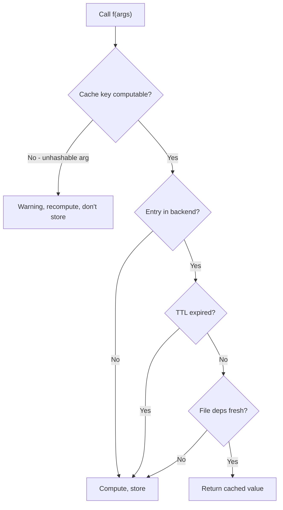

# `@cash.cache` — decorator guide

!!! info "This is the script path"
    Everything here works in a plain `.py` file - no Jupyter, no magics.
    **You do not need `%cash_on`**, which is the notebook path and is
    covered in [Notebook caching](notebook_caching_api.md). The two
    compose, but neither requires the other.

This page is the cohesive walkthrough of `@cash.cache`: when to use it,
**what invalidates a cached result by default**, what every parameter adds
on top, the wrapper methods you can call on a decorated function, and the
gotchas that bite people in practice.

For the auto-generated, exhaustive signature reference see the
[API reference](api/cash.md). For the notebook-side
equivalent (`%cash_on`) see [Notebook caching](notebook_caching_api.md).

---

## When to use the decorator

Reach for `@cash.cache` when you have a slow Python function whose
result depends on its arguments and (optionally) some external state
(files, configuration, other functions). The classic candidates:

- Network calls (`requests.get`, LLM completions, database queries)
- Expensive ETL (`pd.read_csv` of a 5 GB file followed by joins)
- CPU-bound transforms (feature extraction, simulations)
- Anything where "I've computed this exact thing already" is true at runtime

Don't use it for:

- Functions whose return value depends on hidden runtime state you
  can't capture in arguments or `depends_on=` (the cache will go
  stale silently)
- Functions called sub-microsecond in a hot loop (cache key
  computation alone will dominate the runtime)

For methods on stateful objects (database handles, model wrappers,
etc.) see the dedicated [caching class methods](tutorials/feature-guides/caching-class-methods.md)
recipe.

---

## The minimum

```python
import cash

@cash.cache
def slow_square(n):
    return sum(i * i for i in range(n))

slow_square(10_000_000)   # ~1 second
slow_square(10_000_000)   # microseconds — restored from cache
```

That's it. The default `Cash()` singleton writes a tiered RAM + disk
cache under `./.cash/`. The next call with the same `n` (this run or
next month) returns the stored value.

<!-- claim: cash/config.py:CashConfig.smart_persistence @907f59bc, cash/backends/factory.py:_SMART_PERSIST_COMPUTE_FLOOR_S == 0.1 -->
!!! note "Cross-process persistence has a compute floor"
    Only results whose computation took **longer than ~0.1 s** are promoted to
    the disk tier. A cheaper result is still cached in RAM (so a repeat call
    *in the same process* is instant), but it is **not** written to `./.cash/`,
    so a fresh process — a kernel restart or a new `python script.py` run —
    recomputes it. "Returns the stored value next month" therefore holds for the
    genuinely expensive calls that are worth caching, but a sub-0.1 s function
    shows no cross-process speedup. `# @cash:persist` will **not** help here --
    it is a notebook-statement directive and the decorator never reads it, so
    writing one in a decorated body is silently inert. To make a fast result
    survive a restart, give this `Cash` a single-tier persistent backend
    (`Cash(backend=FileBackend(...))` writes every entry regardless of compute
    time), or lower `min_cache_savings_pct` toward `0`. See
    [cost model and smart persistence](cost-model.md).

If you want a custom configuration (different backend, custom
directory, debug logging), instantiate `Cash(...)` explicitly:

```python
from cash import Cash

c = Cash(cache_dir="./my_app_cache", debug=True)

@c.cache
def slow_square(n):
    return sum(i * i for i in range(n))

slow_square(1000)      # first call on this instance — computes
slow_square(1000)      # cache hit, from ./my_app_cache
```

### Where the cache lives

<!-- claim: cash/config.py:project_anchor @5074ba29, cash/config.py:_anchor_cache_dir @7f3408d4 -->
`.cash` sits next to **your project**, not next to whoever launched the job.
Cash finds the running script, walks up to the first directory holding a
`pyproject.toml`, `setup.py`, `setup.cfg` or `.git`, and puts the cache there —
so `python /srv/etl/run.py` uses the same cache whether it was started by you,
by cron from `/`, or by a CI step in a checkout directory. A script with no
project above it caches beside itself; an interactive session or a notebook,
which has no script at all, caches in the current directory. Installed
code — `pytest`, a `python -m` module in site-packages, a `[project.scripts]`
tool you installed — anchors to the project you run it from; run from outside
any project, an installed tool caches per user, per tool, in the platform's
cache location (`%LOCALAPPDATA%\cash\<tool>`, `~/Library/Caches/cash/<tool>`,
`$XDG_CACHE_HOME/cash/<tool>`). See
[what paths are relative to](getting-started/configuration.md#what-paths-are-relative-to).

That matters most for exactly the case that cannot see it. A scheduled job runs
from whatever directory the scheduler picked, and a cwd-relative cache meant a
second cache built from scratch every time, with no symptom beyond "it is
always slow" and a disk filling with duplicates.

Four ways to say it explicitly, highest priority first:

| How | Relative to | Use it for |
|---|---|---|
| `Cash(cache_dir="…")` | your current directory | one app that owns its cache |
| `CASH_CACHE_DIR=…` | your current directory | a scheduled job, a container, CI |
| `[tool.cash] cache_dir` in `pyproject.toml` | that file's directory | a shared, committed project setting |
| *(nothing)* | the project anchor above | everything else |

`CASH_CACHE_DIR` is the one to reach for in a cron entry or a `Dockerfile`: it
needs no change to the code that is already running, and an absolute value
removes every question about where the cache ends up.

```bash
CASH_CACHE_DIR=/var/cache/cash python /srv/etl/run.py
```

If your cache used to live wherever you happened to run from, the first run
after upgrading says so ([`CACHE-DIR-MOVED`](warnings.md#cache-dir-moved)) and
recomputes once.

---

## Seeing what it did

A notebook shows a badge on every statement. A script shows nothing by
default, which makes it easy to assume caching is working when it isn't — so
there are several ways to look.

<!-- claim: cash/core.py:Cash.run_summary @8ff9b5a3, cash/core.py:Cash._summary_reasons @edbfd060, cash/core.py:Cash._print_run_summary @89b03773 -->
**What recomputed just now, and why?** Set `CASH_SUMMARY=1` and a
per-function table prints to **stderr** when the process exits — stderr, so it
never lands in a report, a pipe or a JSON response your program writes to
stdout. No code change, which is the point:

```bash
CASH_SUMMARY=1 python model.py
```

```
cash: 4 of 6 calls restored, 41.2s saved
  cache: /srv/etl/.cash
  model.ray_component   3 hits,   1 miss     41.2s saved
      missed: 1 file changed
  model.build_grid      1 hit,    1 miss      0.3s saved
      missed: 1 no entry yet
      kept in RAM only (1x): under the 0.1s persistence floor; a new process recomputes it
```

Under each row: why its calls missed, and anything that was computed but not
kept — a `cache_if` that said no, or a result so quick to compute that it was
held in memory only ([why](cost-model.md)), so the *next* run will miss it
too. The run that causes that is the one that can tell you.

The `cache:` line is the directory this run actually used. Check it first when
a run that should have been warm was not: a job started from a different
directory, a path with a typo in it, a container volume that is not the one you
meant — each of those looks exactly like "caching is broken" until you see
where the entries were going.

The summary prints on a normal exit, on `sys.exit()` with any code, and after
an uncaught exception or Ctrl-C. It cannot print when the process is killed
outright — `SIGKILL`, a default `SIGTERM`, `os._exit()`.

`cash.configure(summary=True)`, `Cash(summary=True)` and a `summary = true`
TOML key do the same thing; `f.cache_info()` gives one function's numbers
directly, its `miss_reasons` included.

**Every call as it happens.** `CASH_DEBUG=1` (or `Cash(debug=True)`) logs one
line per call to stderr — a hit, or a miss and why:

```
cash.calls: MISS model.build_grid  [3f9a1c2b7e04]  no entry yet: the first call with these arguments in this process, and no earlier run stored one  (ran 0.05s; kept in RAM only -- under the 0.1s persistence floor -- so another process will recompute it)
cash.calls: HIT  model.build_grid  [3f9a1c2b7e04]  (saved 0.05s)
cash.calls: MISS model.build_grid  [8c21d05e9a13]  new arguments: called with arguments not seen on the last call  (ran 0.05s)
cash.calls: MISS model.ray_component  [b7e4410c2d88]  code or state changed: the function's code, a helper it calls, or a value it reads changed since an earlier run stored it  (ran 9.8s)
cash.calls: RAISE model.load_prices  ValueError: no rows for 2026-09-10; nothing stored  (ran 1.20s)
```

The id in brackets is the one `cash inspect --function` lists and
`cash clear --entry` takes. `Cash(verbose=True)`, `cash.configure(verbose=True)`,
`CASH_VERBOSE=1` or `verbose = true` give these lines without the other debug
records.

A reason is not limited to what this process saw: each function's recently
stored keys are recorded beside the cache (in `.keys/`), so the first call of a
new run can still say that the code changed, that the arguments are new, that
an earlier run's entry expired under its `ttl`, or that it was evicted or
cleared.

With `CASH_DEBUG` they come with cash's other debug records. If your program configures `logging`
itself, those records go to your handlers in your format instead, and no
stderr handler is added. `Cash(verbose=True)` gives the per-call lines alone.

**What is on disk, and what is it costing me?**

```bash
cash inspect
```

```
Cache directory: /srv/etl/.cash
  Total size: 1.6 GiB    Entries: 412    Functions: 6

  FUNCTION                                  ENTRIES        SIZE   LAST USED
  model.ray_component                           180     1.2 GiB   2 min ago
  model.build_grid                               97   310.0 MiB   2 min ago

  cash inspect --function NAME   to list one function's entries
  cash clear   --function NAME   to drop them
```

**Drop one function's entries** when you're out of disk but still want the
rest:

```bash
cash clear --function build_grid
```

See the [CLI reference](cli.md) for the full set.

---

## What invalidates your cache

Worth understanding before any parameter. With a bare `@cash.cache` and nothing
configured, a cached result is discarded and recomputed when **any** of these
change:

<!-- claim: cash/dependency_state.py:DependencyStateHasher.compute @58f96079, cash/core.py:Cash._analyze_dependencies @d32aeb90 -->
| What changed | How it's detected |
|---|---|
| The **arguments** | Hashed by *content* — so DataFrames and arrays work, and two equal-but-distinct objects share one entry |
| The **function's own source** | Edit the body and old entries stop matching |
| The source of a **helper it calls** | Followed **transitively**, across your own modules and your own installed package — other people's libraries are where it stops |
| A helper's **parameter defaults** | Folded by value: `def shrink(v, alpha=ALPHA)` invalidates when `ALPHA` changes, though the helper's source reads the same — including a closure's defaults set by a factory |
| A **file it reads** | `pd.read_csv`, `open()`, `np.load`, `joblib.load`, polars and pyarrow readers are intercepted — [the full list](tutorials/feature-guides/custom-file-sources.md#whats-automatically-tracked) |
| A **module global it reads** | A config constant, a threshold, a dispatch dict — including one read by a **helper**, or by another cached function it calls, rather than by itself |
| A **class its code reaches** | Followed transitively, so editing a class that a folded class constructs invalidates too |
| A **class passed as an argument** | Keyed by its declaration, not its name — so an output specification handed to a call (`extract(doc, InvoiceFields)`) invalidates when a field or a field description changes. Works for plain classes, `@dataclass`, and pydantic `BaseModel` |

None of that needs an annotation. That is the point: the usual reasons a cached
result goes stale are tracked for you, and the [parameters](#parameters) exist
for the cases this model *can't* see.

> `functools.lru_cache` sees only the arguments — and refuses unhashable ones.
> `joblib.Memory` adds the decorated function's own body but **not** the helpers
> it calls, so editing a helper quietly serves a stale result. Cash follows the
> call graph.

### What else is in the key — the ones that cost a recompute

<!-- claim: cash/core.py:Cash._fold_defaults @6339036d, cash/core.py:Cash._hash_arg_payload @6eac8bbf, cash/dependency_state.py:DependencyStateHasher.compute @58f96079 -->
None of these gives a wrong answer. Each one costs a recompute you might not
expect, measured across fresh processes:

| You do this | What happens | Why |
|---|---|---|
| Move an unchanged helper into another module | Every function that calls it recomputes, once | A helper is keyed by where it lives as well as by its code |
| Call with `0.5` in one run and `np.float64(0.5)` in the next | Two entries, one per type | An argument is keyed by its type as well as its value, and the two pickle differently though they compare equal |
| Change a constant used as a parameter default (`def f(x, k=K)`) | Calls that pass `k` explicitly recompute too | The defaults are part of the function, whatever a particular call passes |
| Read a relative path (`open("data.csv")`) from two working directories | Every switch recomputes, and replaces the other directory's entry | The key holds the string `"data.csv"`, the same from both; the file behind it is not, so the entry is found stale and rewritten. Pass an absolute path, or one resolved from the project |
| Switch a data file back and forth between two versions | Every switch recomputes | A file is checked when its entry is read, not keyed: one entry per call, rewritten when the file changes |
| Switch code back and forth between two versions | Switching back hits | Code is in the key, so each version keeps its own entry |

<!-- claim: cash/backends/serialization.py:get_serializer @76cf2c1b -->
**A hit returns a copy.** A miss hands you the object the function returned; a
hit hands you one rebuilt from the stored bytes. The difference shows when a
function returns a view of an argument, `return a[:3]` on an array: after a
miss, writing into the result writes into `a`; after a hit it does not. Return
`a[:3].copy()` if a caller writes into what it gets back.

### It follows the functions you call

Editing a plain helper called from a cached function invalidates that
function's cache — even a few levels down:

<!-- test:skip reason="illustrative — schematic call graph" -->
```python
def clean(x):     ...                      # edit this...
def features(x):  return clean(x) + ...

@cash.cache
def pipeline(x):  return features(x)       # ...and pipeline's cache invalidates
```

<!-- claim: cash/core.py:Cash._hash_callable_source @6c6f2db6, cash/core.py:Cash._ensure_closure_analyzed @ecd28b28 -->
The analyzer captures helper source hashes and folds them into the cache key, so
both cross-process edits and in-process redefinitions (notebook cell rerun, REPL)
are picked up automatically. Overhead is ~3μs *per helper*, paid once for each helper in the
transitive call graph on every call.

<!-- claim: cash/core.py:Cash._refresh_helper_bindings @b357a2d1 -->
Each helper is looked up through the name its *caller* uses — `_sieve` in
`from sievelib import sieve as _sieve` — at every level of the call graph. So
rebinding that name at runtime (`monkeypatch.setattr(app, "_sieve", fake)`,
`mock.patch.object(...)`, a plugin swapping an implementation) changes the key
as well, and putting the original back returns to the original entry. A binding
to a `unittest.mock` object has no code to key, so a call that reaches one runs
uncached. See [mocking in tests](tutorials/feature-guides/testing-your-code.md#mocking-and-monkeypatching).

<!-- claim: cash/purity_analyzer.py:callable_layers @856b9999 -->
**A decorated helper is every function it runs.** Behind `@timed def clean(x)`
there are two: the decorator's wrapper and `clean` itself, and both are followed —
edit either body and the entry invalidates, whether or not the decorator uses
`functools.wraps`. The same goes for stacked decorators, a class-based decorator's
`__call__`, the values a decorator was configured with (`@scale(10)`, or
`@scale(K)` when `K` changes), what the wrapped function reads and calls, and the
user function held inside a library wrapper — `functools.lru_cache`,
`np.vectorize` (its `otypes=` included), `toolz.curry`, `wrapt`, the
`decorator` package, a `singledispatch` implementation. The library's own
wrapper code is treated like any other installed code: fixed for a given
environment. `@cash.cache` stacked on top of another decorator is followed the
same way.

**The boundary is your code, not your module.** A helper imported from another
file in your project is followed like any other — edit it and the entry
invalidates, verified end to end. What the analyzer stops at is *other people's*
installed code: anything under `site-packages` / `dist-packages` or the standard
library is treated as fixed for a given environment, because folding numpy's
internals into your key would churn it on every call. **Your own package is
followed wherever it is installed** — the top-level package that defines the
cached function counts as your code even after `pip install .`, so a changed
`settings.FACTOR` and a reinstall invalidates exactly as it does in an editable
checkout. If you do need a third-party function's identity in the key, name it
with [`depends_on=`](#depends_on-explicit-dependency-graph).

<!-- claim: cash/core.py:Cash._local_binding_parts @3130f596, cash/purity_analyzer.py:_resolve_local_import @e82fd5a2 -->
An import written **inside** the function (`from .models import auc`, the usual
way out of an import cycle) is followed the same way as one at the top of the
file -- a function it imports, a constant (`from .settings import ROUNDING`),
or a module whose attributes the body reads (`settings.ROUNDING`). So is a
module held in a closure: `from . import settings` inside a decorator factory,
read by the wrapper. If the first call reaches cash before the body has made that import, cash
imports a module of *yours* itself to read it; a library you deliberately import
inside a function to defer its cost is never imported early.

<!-- claim: cash/notebook/analysis.py:CodeAnalyzer.find_called_functions @61e7b6cb, cash/notebook/analysis.py:CodeAnalyzer._referenced_function @639a43a5 -->
**Another cached function counts whether you call it or hand it on.** Calling
`inner(n)` makes `inner` part of the caller's key, and so does passing it as a
value — `map(inner, xs)`, `pool.map(inner, xs)`, `joblib.delayed(inner)`,
`for fn in [inner]`, a `fn=inner` default, a `partial(inner)` — so editing
`inner` or anything it calls recomputes the caller too. This is the usual way
to spread a cached step across a pool, and before 0.10.1 only the call form
counted.

### File reads are tracked automatically

<!-- claim: cash/notebook/file_tracker.py:_install_module_patches @4cabaa21, cash/notebook/file_tracker.py:FileDependencyRegistry @db1cd112 broad="the claim is that a family of reader calls is intercepted, which is the registry's whole job" -->
You usually don't need to declare files at all: cash intercepts file reads
*inside* a cached function — `pd.read_csv`, `np.load`, `open()`, `joblib.load`,
… — and folds each file's fingerprint into the entry, so changing the file on
disk recomputes with no annotation:

<!-- test:skip reason="illustrative — references a missing data.csv" -->
```python
@cash.cache
def load():
    return pd.read_csv("data.csv")   # change data.csv → recomputes, automatically
```

Auto-tracking fingerprints file **content**; to name a file cash can't see you
read, use [`file_depends_on=`](#file_depends_on-name-a-file-explicitly).

A file that was **not** there counts as well. `if os.path.exists("cfg.toml")`
coming back False is an input — it chose the defaults branch — so the entry it
produced stops being valid once that file appears, including when the same
relative name resolves into a directory that has one.

### Module globals a function reads

A cached function that reads a module-level global — a config constant, a
dispatch dict of callables — invalidates when that global changes:

```python
TAX_RATE = 0.2

@cash.cache
def net(amount):
    return amount * (1 - TAX_RATE)

net(100)          # 80.0
TAX_RATE = 0.5
net(100)          # 50.0 — recomputed, not the stale 80.0
```

<!-- claim: cash/core.py:Cash._fold_read_globals @2037320a, cash/core.py:Cash._fold_dependency_read_globals @fbbbd0b2 -->
Only globals that are **read** participate — and that includes globals read
on someone else's behalf: by a **helper**, so a helper returning a module-level
`CONFIG` invalidates its caller when that config changes, and by another
**cached function** further down the call chain, however many modules away.
That last one is the shape a library has — a `config.py` holding a constant, an
`io.py` reading it, a `build.py` calling that — and it is followed
transitively, so a constant four modules down still invalidates the top. Globals that are *written* (`global x; x = ...`) or mutated in
place are excluded — those are side-effect accumulators, and folding them
in would invalidate the function on its own output. That exclusion applies
to a helper's own accumulator too. A read global whose value can't be hashed
warns once rather than failing the call.

Dunder-named constants count too: bumping a module's `__version__` invalidates
whatever read it. The import machinery's own dunders — `__file__`, `__name__`,
`__doc__` and friends — are the exception, and deliberately: they differ
between two checkouts of the same project and between `python job.py` and
`python -m job`, so folding them would make a cache un-shareable.

**Reading includes passing it to something.** `sum(G)`, `len(G)`,
`helper(G)` and `model.predict(G)` all count, so changing `G` invalidates
in each case — as does reading it through a non-writing method of its own,
`G.get(k)` or `G.keys()`. If cash then observes that *calling your function* is what
changed `G` — a helper that appends to it, say — it stops tracking that one
name and warns, because a value the call itself moves would key every entry
on the previous call's output. The rest of the function keeps caching
normally.

The same rule applies to variables a closure captures, not just module
globals.

<!-- claim: cash/core.py:Cash._carried_global_hash @6bd504f4 -->
**A callable built from data counts as that data.** A global that is a
library callable carrying values — `SMOOTH = partial(ndimage.gaussian_filter,
sigma=SIGMA)`, `POLY = np.poly1d(COEFFS)`, `CAL = interp1d(X, Y)`,
`LOOKUP = RATES.get`, `PREDICT = model.predict` — is keyed by what it was built
with, so editing `SIGMA` or the table recomputes, whether you import the
name or read it as `cfg.SMOOTH`. A callable wrapping *your* code is followed
as a helper instead. A bound write or log method (`record = RESULTS.append`,
`log = logger.info`) is left out: what its object holds is the call's output.
Some library callables change when called — a bound `rng.normal` advances its
generator, `np.vectorize` fills a cache — and cash stops keying those after
the first call that changes them, which costs one extra miss in that process.

Globals read inside a nested scope count too. A generator expression or
`lambda` always compiles to its own code object, and detection recurses into
it. List/set/dict comprehensions did too before Python 3.12; PEP 709 now
inlines them into the enclosing scope, where their global reads are picked up
directly — either way the global is tracked:

```python
THRESHOLD = 10

@cash.cache
def count_big(values):
    return sum(v > THRESHOLD for v in values)   # THRESHOLD is tracked

count_big([5, 20])   # 1
THRESHOLD = 1
count_big([5, 20])   # 2 — recomputed
```

#### Pre-built objects: the class's method source is tracked too

A read global that is an **instance of one of your classes** — a transformer,
client, or config object built once at import and used as data — folds its
class's *source*, not just its `__dict__`. Editing a method on that class
invalidates, even though the object's pickled state is unchanged:

<!-- test:skip reason="illustrative: two-file pipeline sketch; fit()/edit-and-rerun not executable inline" -->
```python
# preprocessor.py
class Scaler:
    def apply(self, x):
        return x / 100          # ...edit this to  x / 50

SCALER = Scaler()

# pipeline.py
@cash.cache
def run(rows):
    steps = [("scale", SCALER)]         # SCALER used as data
    return fit(steps, rows)             # fit() calls SCALER.apply internally
```

Editing `Scaler.apply` re-keys `run` and it recomputes. cash also follows, a few
levels deep, into user-class instances the object *holds* (a pipeline holding a
transformer holding another). Third-party classes (a fitted sklearn estimator,
a numpy array) are **not** walked — their source is fixed for your environment,
and stopping there keeps the key from churning.

Two boundaries worth knowing:

- **This is the *data* path, and the exclusion is a WRITING method call.**
  Calling a method that writes (`obj.append(...)`, `obj.update(...)`,
  `obj.sort()` — the mutating verbs) excludes the receiver from value-folding:
  it is an accumulator, and folding a value the call itself moves would key
  every entry on the previous call's output. Every other method call is a read:
  `ALIASES.get(v)`, `TABLE.keys()`, `text.upper()` fold the receiver's value
  like any other global, and a method cash's table does not know about is folded
  and then dropped if calling your function is observed to move the value.
  A directly *called* method's own edit is caught separately, by the
  helper-source channel.
- **Source is read once per process, and checked against what is running.**
  cash reads a helper's or class's source the first time a call needs it, and
  keeps that digest for the rest of the run. A file edited *under* a running
  process — new files land and the restart comes later, which is what every
  deploy does — would make that first read describe the new text while the
  old code is the one executing. So a file modified after the process started
  is compiled and compared with the loaded code first; if they differ, cash
  keys that helper by the code actually running and says so
  ([`KEY-SOURCE-CHANGED`](warnings.md#key-source-changed)). Results stay
  correct for the running process, and the restarted one computes afresh.
  Editing a class *between two calls* of the same process, after its first
  use, is still out of scope. Re-run the process and the edit is seen. The argument channel below relaxes
  this, but only for a *re-definition*: it hashes bytecode off the object it was
  handed and memoizes per object, so a re-run notebook cell — a **new** class
  object — is seen immediately, while an in-place edit of the same live class
  (`Schema.render = ...`) still is not.

### Code you pass as an argument

`args_hash` pickles the arguments, and pickle serializes a class or a function
**by reference** — its module and qualified name, never its body. So a call that
takes your code as data used to hit forever:

<!-- test:skip reason="illustrative: the two Schema definitions are the same name edited between runs, which one script cannot express" -->
```python
class Schema:
    def render(self): ...        # ...edit this

@cash.cache
def build(schema):
    return schema().render()

build(Schema)                    # edit Schema, call again -> used to return the old answer
```

<!-- claim: cash/core.py:Cash._fold_code_args @f9032430, cash/core.py:Cash._iter_code_carriers @90eef39d -->
Your code reached through the arguments now folds into `state_hash`, so editing
it invalidates. cash finds it in a class, a function, an instance (through its
class), any of those nested in a list/tuple/set/dict, and an instance whose
class is a subclass of `dict`/`list`/`tuple`/`set`/`str`/`int`/`float`/`bytes`,
a namedtuple, an `Enum` member, a `__slots__` instance, or a callable object.
Base classes count: editing a base invalidates a call that was passed the
subclass.

**What that code reads counts too.** A callback that reads a module constant —
`def double_well(x): return x**4 - x**2 + TILT * x`, passed to a cached
integrator — folds the constant's value as well as its own bytecode, whether it
arrives as a function, a bound method, or a callable instance. Changing `TILT`
invalidates the call. It used not to: the code was keyed and the data it read
was not, so a physics-breaking edit produced a green, cached test run.

This channel walks the **cached function's own bound arguments** — what the
caller handed it, *plus any parameter default the caller left out* — and nothing
else. Defaults count because the same logical call must key the same way however
it is written: `build()` and `build(Schema)` share one entry, and editing
`Schema` invalidates both. A module-level object the *body* reaches for is the
separate read-globals channel [above](#module-globals-a-function-reads), which
folds that object's value and its class's source on its own terms.

The digest is **bytecode**, not source — a class defined in a notebook cell has
no retrievable source at all, because `inspect.getsource` resolves a class
through `sys.modules[cls.__module__].__file__` and a kernel's `__main__` has
none. Two consequences follow from that choice: reformatting or a comment-only
edit does *not* invalidate (bytecode carries neither — though a docstring, class
or method, does), and a Python-version upgrade re-keys every entry that passes
code, once.

Where cash is handed code of yours it cannot hash — a compiled wrapper such as
`numpy.frompyfunc(my_fn, 1, 1)` — it says so once rather than silently keying on
the name. A `functools.partial` is keyed by the function it wraps and by its
arguments, like the function itself. Library code is deliberately **not**
folded, and rightly gets no warning — with one edge where cash cannot tell:
see [known limitations](known-limitations.md#code-passed-as-an-argument).

#### `cash.mark_opaque(T)` / `@cash.opaque` — opt a type out

<!-- claim: cash/core.py:Cash._is_opaque @d25796c2, cash/__init__.py:opaque @3e1ca111 -->
For a marker class you pass but do not depend on, or one whose code churns for
reasons that never change the result:

```python
@cash.opaque                       # a class you own
class RenderTarget:
    ...

VendorWidget = type("VendorWidget", (), {})   # stands in for a library's class
cash.mark_opaque(VendorWidget)                # one you can't decorate — same marker,
                                              # applied from outside
```

`@cash.opaque` returns the class itself, not a wrapper, so `isinstance` and
identity comparisons are unaffected. Neither spelling is inherited: a subclass
of an opaque class is *not* opaque, because it may carry freshly written methods
of its own. Mark the subclass too if you want the same treatment.

A `functools.partial` cannot be marked: it is the function it wraps plus
arguments, and both are keyed. `cash.mark_opaque(functools.partial)` used to be
the way to silence KEY-OPAQUE-CALLABLE for one, and it exempted every partial in
the process — including ones over code you were still editing.

### How a call decides hit vs miss



<!-- claim: cash/core.py:Cash._compute_cache_key @a3272962, cash/core.py:Cash._fold_code_args @f9032430 -->
The cache key is `f"{func_name}:{state_hash}:{dynamic_hash}:{args_hash}"`.

- `state_hash` folds in the function's own source hash + every
  `depends_on` source + transitive helper hashes (so editing a helper
  invalidates) + the content of any **module global the function *or one of
  its helpers* reads** (see above) + the code of any class or function of
  yours reached through the **arguments**
  ([below](#code-you-pass-as-an-argument)) — so passing a
  schema class or a callback and then editing it invalidates instead of
  returning the old answer.

  Reachability is **transitive**: code reached *through* code that is already
  folded is folded too. If a cached function builds an `A`, and `A`'s
  `field(default_factory=lambda: B())` constructs a `B`, then editing `B`
  invalidates — even though `B` appears nowhere in the function or in `A`'s
  own body. Names the code *loads* are followed; type annotations are not,
  since `value: B` never runs and editing a hint cannot change a result.

  The limit worth knowing: reachability is **static**. Cash follows names
  your code refers to, so code selected at *runtime* — a class pulled out of
  a dict, an implementation assigned during execution — is still invisible.
  Declare those with `depends_on=[...]`.
  Every source hash in `state_hash` is taken over a **normalized** form of
  the code, not its raw text: comments, blank lines, trailing whitespace and
  the exact indentation width are dropped first. Adding a comment or running
  a formatter therefore keeps your cache, while any change to what the code
  actually does invalidates it. Two exceptions stay load-bearing on purpose —
  `# @cash:` annotations (`no-cache`, `ttl`, `persist`, …), because they are
  directives rather than prose, and docstrings, which are ordinary string
  constants a function may well return.
- `dynamic_hash` folds in `dynamic_depends_on` resolver outputs (when
  set).
- `args_hash` is a SHA-256 over the pickled args (with custom hashers
  via `cash.register_hasher` taking precedence for non-picklable types).
  Dicts are canonicalised to sorted-key order first, so two dicts that
  are equal but for insertion order share a key —
  `f({"a": 1, "b": 2})` and `f({"b": 2, "a": 1})` hit the same entry.

When something that affects the result *isn't* among those signals — a
database table, a remote URL, a file you never `open()` — declare it with the
parameters below. And when a miss (or a suspicious hit) mystifies you,
[`func.explain()`](#funcexplainargs-kwargs) shows which signal decided.

---

## Parameters

For the cases the automatic model above can't see — plus
expiry, opt-outs, and the purity gates. All keyword-only and optional.

<!-- claim: cash/core.py:Cash.cache @2431dc44 -->
| Param | What it does |
|---|---|
| `depends_on=` | List of `Callable` or `DataSource` that contributes to the cache key |
| `dynamic_depends_on=` | Callable(s) that receive the function's args and return `DataSource`(s) — for deps that depend on the call |
| `file_depends_on=` | Shorthand: file path(s) tracked as `FileDataSource` |
| `ttl=` | Time-to-live in seconds; `None` (default) = never expires |
| `cache_if=` | Predicate `(result) -> bool`; falsy result → don't cache (still returns to caller) |
| `chunk_max_items=` / `chunk_max_bytes=` | For iterator returns, chunk thresholds (1M items / 1 GB default) |
| `strict=` | Raise `CashImpureFunctionError` at first call if purity analyzer finds issues |
| `assume_safe=` | Silence the purity warning; you've audited and know caching is safe |
| `allow_random=` | Silence the unseeded-randomness warning; you know the result is frozen |
| `frozen=` | Promise the result is not modified after it is returned, so a cached function receiving it keys it without hashing it ([below](#passing-large-objects-between-cached-functions)) |

Mutually exclusive: `strict` and `assume_safe` — pass both and the
decorator raises `ValueError` immediately.

Locking is not a decorator parameter: `use_locking=True` is set on the `Cash`
instance and applies to every function registered through it. Reach for it when
concurrent callers can ask for the same uncached result — a web worker pool, a
task queue, an `asyncio.gather` over one paid API — and see
[Thread safety](tutorials/feature-guides/thread-safety.md) for what it
guarantees and what it costs.

**Changing any of these keeps your cache.** The decorator's arguments are
configuration, not code, so editing one does not change the function's
identity and does not invalidate entries already stored. Adding
`assume_safe=True` in response to a purity warning costs you nothing; so
does adjusting a `ttl` or a chunk size. What *does* invalidate is a change
to the function's body, to a helper it calls, or to a dependency you
declared — `depends_on`, `dynamic_depends_on` and `file_depends_on` reach
the cache key through the dependency graph, so adding, removing or
re-pointing one still recomputes, as does an edit to a tracked file.

Decorators that are not cash's own are left alone. If `@inject(db=prod)`
sits above `@cash.cache`, changing it invalidates — cash cannot know it did
not change the result.

### `ttl=` — expiration

```python
@cash.cache(ttl=300)   # five minutes
def stock_price(symbol):
    return requests.get(f"https://api.example.com/{symbol}").json()
```

<!-- claim: cash/core.py:Cash._validate_ttl @98fd97a4, cash/core.py:Cash.cleanup @ba377011 -->
After the TTL elapses, the next call recomputes and replaces the entry.
Entries whose calls never come back stay on disk until you reclaim them —
call `cash.cleanup()`, or run `python -m cash clear` from the CLI.

An entry remembers the `ttl` it was written with, and the decorator's
current `ttl` applies too, so the **shorter** of the two wins. Lengthening
`ttl=60` to `ttl=3600` does not rescue entries already written under 60 s:
they expire at 60 s and are rewritten under the new value.
`explain()` reports either case as `ttl_expired` when this process wrote the
entry; an entry a previous process wrote under a shorter ttl reads as
`no_entry`, because the backend drops it on read.

Without `ttl=`, an entry lives until it is evicted or cleared, unless the tier
it is written to has a `default_ttl`. That is the way to give every function a
lifetime from configuration; see
[running as a service](tutorials/feature-guides/production-transition.md#running-as-a-service-or-a-worker-pool).

### `file_depends_on=` — name a file explicitly

Reach for this when a file the result depends on isn't read through a tracked
call — a path handed to a C extension, or a sidecar the function never `open()`s:

```python
@cash.cache(file_depends_on="config.yaml")
def parse_config():
    return yaml.safe_load(open("config.yaml"))
```

<!-- claim: cash/data_source.py:FileDataSource @4099fc64 broad="the claim is that this whole source type keys on mtime, which is the class's design" -->
Pass a list for multiple files. The two mechanisms use deliberately different
signals: **automatic** tracking fingerprints file **content** (a sha256), while
`file_depends_on=` keys on the file **mtime** — cheaper, but it re-triggers on a
content-preserving `touch` and can miss an edit that leaves the mtime unchanged.
For richer dependencies (database tables, API endpoints, remote URLs), write a
`DataSource` subclass and pass it via `depends_on=`.

### `depends_on=` — explicit dependency graph

```python
@cash.cache
def load_users():
    return db.query("SELECT * FROM users")

@cash.cache(depends_on=[load_users])
def user_summary():
    users = load_users()
    return {"total": len(users), "active": sum(1 for u in users if u.active)}
```

When `load_users`'s source changes (you edit the function), the source
hash flows up through the dependency graph and invalidates
`user_summary` too. Without `depends_on=` we can usually still detect
this via static analysis, but listing it explicitly makes the link
explicit and lets us follow it across modules.

`depends_on=` also accepts **plain, non-decorated** functions — the dep's
source is snapshotted at registration and folded into the cache key, so
editing it invalidates the dependent:

```python
def score(user):           # not decorated
    return user.visits * 2

@cash.cache(depends_on=[score])
def leaderboard():
    return sorted(load_users(), key=score)
```

Edit `score` → `leaderboard` recomputes. (Previously this edge was inert:
a non-decorated callable contributed nothing to the key, so the declared
dependency was silently ignored.) If a dep's source can't be read at all,
you get a warning rather than a silently dead edge.

### `dynamic_depends_on=` — deps that depend on args

When the data source depends on the call's arguments:

```python
from cash import FileDataSource

@cash.cache(dynamic_depends_on=lambda user_id: FileDataSource(f"/data/users/{user_id}.json"))
def load_user(user_id):
    return json.load(open(f"/data/users/{user_id}.json"))
```

<!-- claim: cash/core.py:Cash._resolve_dynamic_dependencies @8ba1651b -->
The resolver runs with the same `args/kwargs` as the function on every call.

!!! warning "A resolver exception is only *sometimes* survivable"
    Five exception types are caught — `OSError`, `TypeError`, `ValueError`,
    `AttributeError`, `RuntimeError`. Raise one of those and you get a one-shot
    `CashCacheIneffectiveWarning` and the call proceeds without the dep in the
    key.

    **Anything else propagates and fails the call.** The realistic way to hit
    this is a lookup in the resolver:

    <!-- test:skip reason="illustrative: demonstrates the KeyError escaping" -->
    ```python
    @cash.cache(dynamic_depends_on=lambda uid: FileDataSource(PATHS[uid]))
    def load(uid): ...

    load("unknown")   # KeyError — from the resolver, not from load()
    ```

    A resolver is dependency *bookkeeping*, so keep it total: return `None` for
    an input you can't map rather than raising, and do the lookup inside the
    function where an error belongs.

### `cache_if=` — skip caching by result

```python
@cash.cache(cache_if=lambda r: r is not None)
def lookup(key):
    return cache_backend.get_or_none(key)
```

The predicate runs after the function returns. Falsy → don't cache (the
caller still gets the result). Useful for "don't cache misses",
"don't cache empty results", etc.

If the predicate itself raises, a one-shot `CashCacheIneffectiveWarning`
fires and the result isn't cached. Don't use the predicate to assert
business invariants — its job is purely "should this be cached".

**Iterator returns + `cache_if`:** the predicate is honored when the
result fits in a single chunk. For multi-chunk results, the predicate
is bypassed (warning fires) — see the iterator section below.

<!-- claim: cash/core.py:Cash._store_refusal @a7a30b86 -->
**It decides what is written, not what is served.** `cache_if` is not part of
the key, so adding it to a function that already has entries changes nothing
about those entries: a `None` stored before you added
`cache_if=lambda r: r is not None` is still returned on the next call. After
adding or tightening a predicate, drop what was stored under the old rule with
`cash clear --function NAME` (or `f.cache_clear()` in-process).

### `strict=` and `assume_safe=` — purity gates

<!-- claim: cash/core.py:Cash._surface_purity @81b928f4, cash/purity_analyzer.py:ISSUE_UNTRACKABLE_DEP == "untrackable_dep" -->
By default, `@cash.cache` runs a static analyzer on the function body
(and module-bounded helpers) on first call. What it does depends on what it finds:

- **Impure calls, scope mutations, discarded-return calls** (`requests.get`,
  `model.fit(...)`, …) → a `CashImpurityWarning` fires and the
  function is **still cached**.
- **Ambient reads** — the clock, the environment, the working directory, a
  fresh UUID (`datetime.now()`, `date.today()`, `os.environ["..."]`,
  `os.getenv`, `os.getcwd()`, `uuid.uuid4()`) → a `CashImpurityWarning` coded
  [`KEY-AMBIENT-READ`](warnings.md#key-ambient-read), and the function is
  **still cached**. Not a side effect: the value is a hidden *input*, so the
  first call's reading is frozen into every later result, in this process and
  in every process after it. Pass it in as an argument and it reaches the key.
- **Untrackable dependencies** — a call resolved from a *runtime value*, so cash
  can't tell when it changes: `eval`/`exec`/`compile`, dynamic dispatch via
  `getattr(obj, name)()`, `getattr(mod, "exec")(...)`, or
  `importlib.import_module` — **raise `CashImpureFunctionError` by default**,
  because a cached result could go silently stale. Pass `assume_safe=True` to
  cache anyway, or refactor to a statically-named call.
- **Runtime lookups out of a table cash can't see** — one built inside the
  body (`t = {...}; t[key]()`), one on a parameter (`router.table[key]()`), or
  `globals()[name]()` → a warning, and the function is **still cached**.
  Editing the callable such a table holds does not invalidate; name it with
  `depends_on=[...]` and it will. A **module-level** table (`HANDLERS[key]()`)
  needs none of this — cash hashes it as a global already.

The analyzer stops at library boundaries, so an effect *inside* a dependency is
reachable only by the method's name (`session.post`, `cur.execute`). Because a
name cannot reach everything — `session.get` collides with `dict.get` — cash
also **watches the first call** and warns if it wrote a file, opened a
connection, or spawned a process that the analyzer never saw, naming the line
of yours that led to it. A hit repeats none of those. See
[observed effects](tutorials/feature-guides/purity-decorators.md#observed-effects-what-the-first-call-actually-did).

```python
@cash.cache
def fetch_user(uid):
    return requests.get(f"https://api/{uid}").json()
# First call: CashImpurityWarning fires (requests.get is impure) — still cached.
```

Three modes:

- **default** (warn) — impure calls warn and cache; **untrackable dependencies raise**.
- **`strict=True`** — raise `CashImpureFunctionError` on *any* purity issue. Good for
  CI: fail the build if anyone introduces caching of side-effecting code.
- **`assume_safe=True`** — silence every purity warning **and** the
  untrackable-dependency raise, caching regardless. Use after you've audited and
  know caching is correct (e.g., a memoized API call whose side effect is
  idempotent / harmless on hit).

To waive **one statement** rather than the whole function, annotate it:

```python
@cash.cache
def fetch_user(uid):
    return requests.get(f"https://api/{uid}").json()   # @cash:assume-safe
```

Prefer this over `assume_safe=True`. The flag silences the function
permanently, including calls added long after the audit; an annotation only
covers the statement it sits on, so new code is reported. It works under
`strict=True` too, and on the `def` line it waives the function-scoped
findings (a read of a mutated global, which has no line to attach to).

See [Purity tutorial](tutorials/feature-guides/purity-decorators.md) for the full story including
`@pure`, `@stateful`, and `mark_pure`/`mark_stateful` for third-party
callables.

### `allow_random=` — unseeded randomness

<!-- claim: cash/core.py:Cash._warn_unseeded_randomness @b0a31134 -->
At decoration time, `@cash.cache` scans the function's source for draws
from an unseeded RNG and emits a one-shot `CashRandomnessWarning`:

```python
@cash.cache
def sample():
    return np.random.randn()      # no seed anywhere
# CashRandomnessWarning: [RANDOM-UNSEEDED] @cash.cache on __main__.sample:
#   Unseeded randomness detected: numpy.random.randn() at line 3. ...
#   Fix: seed the RNG to make the value reproducible, leave the function
#   undecorated for a genuinely fresh draw, or pass
#   @cash.cache(allow_random=True) to keep it frozen on purpose.
#   https://cash-lib.readthedocs.io/en/stable/warnings/#random-unseeded
```

The warning matters because the first call's value is cached and
replayed forever — later calls never consult the RNG again, so the
"random" number is frozen, and it won't survive a cleared cache either.

This is the same detector the notebook path uses, so both paths agree on
what counts as unseeded. Two ways to make it silent:

- **Seed the RNG** — with a local generator whose seed is an argument,
  `rng = np.random.default_rng(seed)`. A seeded draw is reproducible, so
  no warning fires. This is the real fix. Calling the global
  `np.random.seed(0)` or `random.seed(0)` inside the function also makes
  the value reproducible, but it reseeds the whole process's RNG as a
  side effect that a cache hit skips — the next `np.random` draw after
  the call then differs between a hit and a miss, and cash flags it
  ([IMPURE-SIDE-EFFECTS](warnings.md#impure-side-effects)).
- **`allow_random=True`** — acknowledge the freeze and move on.

```python
@cash.cache(allow_random=True)
def jitter():
    return np.random.randn()
```

The notebook's [`# @cash:allow-random`](annotations.md#cashallow-random-alias-allowrandom)
comment is also honoured inside a decorated function's body.

!!! note
    `allow_random` suppresses a *warning*. It does **not** stop the
    caching — the value is still frozen. Use
    [`cache_if=`](#cache_if-skip-caching-by-result) or drop the
    decorator if you want a fresh draw every call.

Detection is source-based and runs **once per function at decoration
time**, so cached calls pay nothing for it. The one exception is a seed
that is a *parameter* — `def simulate(n, seed=None): rng =
np.random.default_rng(seed)`. Whether that draw is seeded depends on
what the caller passed, so each call checks that one argument, and a
call where it is `None` gets the same warning. The same goes for a seed
read from a parameter or a module global — `default_rng(settings.seed)`,
`default_rng(opts["seed"])`, `default_rng(CONFIG.seed)` — read without
running any of your code (a property is skipped). Two consequences: a function
with no retrievable source (defined via `exec`, or in a bare REPL) is
not scanned, and randomness *inside* a compiled library call — an
unseeded `estimator.fit()`, for example — is invisible to it. Pass an
explicit `random_state=` to such estimators.

### `chunk_max_items=` / `chunk_max_bytes=` — iterator chunking

When the decorated function returns an iterator (generator,
`map`/`filter` result, custom iterator), the result is materialized
and stored in chunks. Defaults are 1M items / 1 GB per chunk.

<!-- test:skip reason="opens huge.log which doesn't exist in test env" -->
```python
@cash.cache(chunk_max_items=10_000)
def read_lines(path):
    with open(path) as f:
        for line in f:
            yield line.strip()

for line in read_lines("huge.log"):
    process(line)
# Second run: chunks are read lazily from disk; RAM bounded by chunk size.
```

<!-- claim: cash/core.py:_ChunkedCachedIterator @d808794a broad="the claim is about the replay iterator's whole supported protocol" -->
The cached iterator supports `iter()`, `__next__`, `close()`. Generator
methods `.send()` and `.throw()` are not supported — call them and you
get an `AttributeError` reminding you the iterator is a replay.

---

## Async support

`async def` functions are first-class. The wrapper is `async def` too:

<!-- test:skip reason="async httpx.AsyncClient requires real HTTP client / network" -->
```python
@cash.cache(ttl=60)
async def fetch_user(user_id):
    async with httpx.AsyncClient() as client:
        return (await client.get(f"/users/{user_id}")).json()

users = await asyncio.gather(*(fetch_user(i) for i in range(100)))
```

Concurrent `asyncio.gather` is safe: with `use_locking=True` on the `Cash`
instance, each unique key computes once and duplicate awaits coalesce — the
leader computes and stores, the followers wait and read the stored result. See
the [API reference](api/cash.md).

Async generators (`async def gen(): yield ...`) are **not** cached
yet — they emit a `CashCacheIneffectiveWarning` and are returned
unwrapped.

---

## Wrapper methods

Every decorated function gets four extra attributes:

### `func.cache_info()`

```python
@cash.cache
def f(x): return x * 2

f(1); f(1); f(2)
f.cache_info()
# {'hits': 1, 'misses': 2, 'hit_rate': 0.333..., 'total_time_saved': 0.0,
#  'warnings': []}
```

<!-- claim: cash/core.py:Cash._wrap_with_stats.cache_info @5ecbb192 -->
Keys:

- **`hits`**, **`misses`**, **`hit_rate`** — counters since the wrapper
  was created.
- **`total_time_saved`** — sum of execution times avoided on hits.
- **`miss_reasons`** — the misses counted by why: `no entry yet`,
  `new arguments`, `code or state changed`, `file changed`, `ttl expired`,
  `not stored last time`, and the rest.
- **`warnings`** — rolling log (last 20) of recent `CashWarning`
  emissions for this function. Lets you discover silent misbehavior
  after the fact even when `warnings.simplefilter` swallowed the
  stderr emission.

!!! warning "In a notebook, `cache_info()` reads 0 / 0 — use `explain()` instead"
    The counters live on the **wrapper object**, and they count only since
    that wrapper was created. In a notebook, cash may rebuild the cell that
    defines your function, which re-runs the decorator and produces a fresh
    wrapper with fresh counters. So `cache_info()` can report
    `{'hits': 0, 'misses': 0}` **forever**, even while caching is working
    perfectly and saving you minutes.

    It is not telling you caching is broken — it is telling you *this
    wrapper* has not served a call yet. To check whether caching is actually
    working in a notebook, use either:

    ```python
    f.explain(1)      # -> [HIT] ... execution_time_saved: 23.54
    ```

    ```python
    %cash_stats       # session-wide hits, misses and net time saved
    ```

    Both read through to the real cache rather than a per-wrapper counter.
    `cache_info()` is reliable in scripts and long-lived processes, where
    the wrapper is created once.

### `func.cache_clear()`

<!-- claim: cash/core.py:Cash._wrap_with_stats.cache_clear @ab3f1cfc -->
Wipe backend entries whose key starts with this function's name. Also
resets stats, drops the warnings log, and forgets the `_warn_once`
dedup marks (so the next misbehavior re-warns instead of being silent).

### `func.explain(*args, **kwargs)`

<!-- claim: cash/core.py:Cash._explain_call @de9ca4b1 -->
Pure introspection — returns a `CacheExplanation` describing whether
the next call with these args would hit or miss the cache, and why:

```python
f.explain(5)
# [MISS] __main__.f — no_entry
#   cache_dir: /home/me/project/.cash
#   cache_key: __main__.f:9a3c...:...
#   entry_id: 4be1c09d7a21
#   hint: No matching cache entry. First call with these arguments, or...
#   why: no entry yet: the first call with these arguments in this process, ...

f(5)  # compute
f.explain(5)
# [HIT] __main__.f — hit
#   cache_dir: /home/me/project/.cash
#   cache_key: __main__.f:9a3c...:...
#   entry_id: 4be1c09d7a21
#   cached_at: 1779637032.79
#   cache_age_seconds: 0.05
#   execution_time_saved: 0.0008

f.explain(6)
# [MISS] __main__.f — no_entry
#   ...
#   why: new arguments: called with arguments not seen on the last call
```

`reason` is one of `hit`, `key_uncomputable` (unhashable arg),
`no_entry`, `ttl_expired`, `file_changed`, or `disabled` (caching switched off
with [`CASH_DISABLE`](tutorials/feature-guides/testing-your-code.md)). On `no_entry`, `details['why']`
says what this process knows: which part of the key moved since the last
call (`new arguments`, `code or state changed`, `dynamic dependency changed`),
that the last result was never stored and why (`cache_if`, a file that
changed mid-call), or that it was stored and has since been evicted. On a
`hit` or `file_changed`, `details['file_deps']` lists every file the entry
was computed from, with the fingerprint it is checked against. `entry_id` is
the id `cash inspect --function NAME` lists and `cash clear --entry` takes,
and `cache_dir` the directory the answer was read from.
See [`CacheExplanation`](api/cash.md#cash.CacheExplanation) for all of it.

Does NOT call your function, mutate stats, or write to the backend.
Safe to call from sync code even on async-wrapped functions.

### `func.__wrapped__`

The original undecorated function. Useful for testing — call it to
bypass caching entirely.

---

## Passing large objects between cached functions

<!-- claim: cash/core.py:Cash._frame_signature @5a1b17a7, cash/core.py:Cash._frame_memo_store @99f98c8a -->
An argument is keyed by what it holds **at the time of the call**, so a result
you mutate in place and pass on is keyed by its new contents:

```python
import pandas as pd

@cash.cache
def load_frame():
    return pd.DataFrame({"a": [1, 2, 3]})

@cash.cache
def column_total(df):
    return int(df["a"].sum())

df = load_frame()
column_total(df)       # 6
df.loc[0, "a"] = 100   # in place
column_total(df)       # 105 — recomputes, keyed by what df holds now
```

That costs a hash of the argument, and for a large one the hash is the cost that
shows — measured, about 150 ms for a 100 MB numeric frame (more with string
columns), 50 ms for a 100 MB numpy array. What cash does about it:

- **pandas 3 frames and series are hashed once.** Under copy-on-write, a frame
  can only be changed in place by giving it new data blocks, so cash remembers a
  frame's hash together with the identity of its blocks and axes and reuses it
  while they are the same — microseconds per call, exact rather than sampled.
  The cost: after cash has seen a frame, the first in-place write to each of its
  blocks copies that block, once. (pandas 2 with copy-on-write switched on is
  treated the same way; without it, every call hashes.)
- **In a notebook**, `%cash_on` tracks every assignment and mutation, and cash
  uses that instead of hashing a tracked object again.
- **Everything else** — numpy arrays, models, your own objects — is hashed on
  every call it is passed to. [`CACHE-NET-LOSS`](warnings.md#cache-net-loss)
  tells you when that is costing more than it saves.

When the object comes from another cached function and nothing modifies it
afterwards — a trained model, a lookup table, a feature matrix — say so on the
function that makes it:

<!-- claim: cash/core.py:Cash._audit_frozen @0f673f82, cash/core.py:Cash._frozen_array_hash @5352bc8e -->
```python
@cash.cache(frozen=True)
def train(data):
    return fit_model(data)          # not modified by anything downstream

@cash.cache
def score(model, batch):            # keys `model` by train()'s identity:
    return model.predict(batch)     # no hash per call, same key in every process
```

A cached function receiving a frozen result keys it by the call that produced
it: microseconds, the same in every process, and it works for an object that
cannot be pickled. A numpy array result comes back **read-only**, so a write
raises instead of going stale. Other objects are **audited**: cash re-hashes one
at an occasional use (every use under `CASH_DEBUG=1`), and if it has changed —
say `model.fit(...)` was called on it downstream —
[`KEY-FROZEN-MUTATED`](warnings.md#key-frozen-mutated) names the producer and
the object is keyed by its contents from then on. A result with a `ttl=` is
never treated as frozen: its value changes while its key does not.

Without `frozen=`, give cash a cheaper identity for a type yourself:
`cash.register_hasher(T, fn, override=True)` (return something that changes
whenever the data does, such as a version).

An object that can't be pickled and has no hasher can't be keyed unless it is
frozen, so a call receiving one runs uncached
([`KEY-UNHASHABLE-ARG`](warnings.md#key-unhashable-arg)).

---

## Common gotchas

### Unhashable arguments

<!-- test:expect-warning reason="threading.Lock is genuinely unpicklable; the ineffective-cache warning is the point of this gotcha" -->
```python
import threading

@cash.cache
def f(lock):
    return id(lock)

f(threading.Lock())
# CashCacheIneffectiveWarning: [KEY-UNHASHABLE-ARG] @cash.cache on __main__.f:
#   an argument of type lock could not be hashed, so this call and every call
#   like it does not cache.
#   Fix: register a hasher with cash.register_hasher(lock, ...), or pass the
#   argument by a hashable value.
#   https://cash-lib.readthedocs.io/en/stable/warnings/#key-unhashable-arg
```

`threading.Lock`, sockets, open file handles, etc. can't be pickled,
which means we can't build a cache key. The warning explains which
type is the culprit. Either:

1. Don't pass the object; pass something hashable that identifies it.
2. `cash.register_hasher(LockType, lambda lock: id(lock))` if you're
   sure same-identity caching is what you want.

### Instance methods — `self` participates in the key

`self` is an argument like any other, and it is hashed by its **state**, not
its identity. Two instances with equal attributes share an entry; change an
attribute and the key changes with it:

<!-- test:skip reason="illustrative — references missing a.csv" -->
```python
class Loader:
    def __init__(self, path):
        self.path = path

    @cash.cache
    def load(self):
        return pd.read_csv(self.path)

Loader("a.csv").load()
Loader("a.csv").load()   # HIT — equal state, same key
Loader("b.csv").load()   # MISS — different path, different key
```

The gotcha is an attribute that cannot be hashed — a lock, a live database
connection, an open file. Then `self` cannot be hashed either, and the method
does not cache at all ([KEY-UNHASHABLE-ARG](warnings.md#key-unhashable-arg)).
Tell cash which attributes identify the instance with
[`register_hasher`](tutorials/feature-guides/caching-class-methods.md):

<!-- test:skip reason="Loader class defined in skipped previous fence" -->
```python
cash.register_hasher(Loader, lambda l: hashlib.sha256(l.path.encode()).hexdigest())
```

Now two instances with the same `path` share an entry, whatever else they hold.

### C-extension callables and builtins

Caching a callable with no readable Python source — a C-extension
function, a builtin, a NumPy ufunc, a dispatcher, or a
`functools.partial` wrapping one — works rather than crashing. The
source-hashing and AST-analysis steps have no source to read for these,
so they degrade to a stable identity-based fallback instead of raising:

```python
import functools, numpy as np

cached_sqrt = cash.cache(np.sqrt)              # ufunc — fine
cached_max = cash.cache(functools.partial(max, 0))   # partial over a builtin — fine
```

Because there is no source to hash, cash cannot notice a change *inside*
a C extension (upgrading the library, say). That's the same blind spot
any source-based invalidation has; pin the dependency if it matters.

### Caching code with side effects

The purity analyzer warns by default if your function calls
`requests.post`, mutates globals, writes files, etc. The cached
behavior is: the side effect runs on the **first** call only. Every
hit replays the return value without the side effect.

If that's what you want (memoizing an API call where the network
roundtrip is the "side effect"), `assume_safe=True` silences the
warning. If it isn't, refactor: separate the pure compute from the
side effect, and only cache the pure part.

### A function returning a matplotlib `Figure` is never cached

<!-- claim: cash/core.py:Cash._refuses_identity_coupled @27e72e7a -->
`@cash.cache` refuses to store a result that is — or contains — a matplotlib
`Figure` or `Axes`, and warns once saying so.

This is not a limitation cash is apologising for; storing one would be *wrong*.
pyplot keeps a process-wide registry of the "current figure", and
`plt.savefig()` / `plt.title()` act on whatever that registry says, not on your
variable. Cash's RAM tier deep-copies every value it stores, and reconstructing
a `Figure` re-registers the **copy** as current. From then on you draw on your
figure while `plt.savefig()` writes the cache's private snapshot — a blank
image, on the first call, with no error.

The trade is one-sided: a figure costs milliseconds to build, so there is no
version of this that pays for the risk. Cache the *data* and draw from it:

<!-- test:skip reason="illustrative — needs a df and a pyplot import the page doesn't set up" -->
```python
@cash.cache
def summarise(df):          # expensive, cacheable
    return df.groupby("region")["sales"].sum()

fig, ax = plt.subplots()    # cheap, never cached
summarise(df).plot(ax=ax)
```

The statement cache and call-unit caching refuse these objects for the same
reason, so the rule is the same wherever you write it.

### `@cash.cache` on a generator

Generators are materialized into a list (or chunks) on first call so
the cache replay can give back fresh iterators. Don't decorate a
function returning an infinite generator (it will hang trying to
exhaust). For very large finite iterators, tune `chunk_max_items=` /
`chunk_max_bytes=`.

### `cache_clear()` clears more than you'd expect on iterators

<!-- claim: cash/core.py:Cash._delete_backend_entries @6f7d8f2e -->
For chunked iterator caches, `cache_clear()` removes the manifest entry
but the individual chunk entries (keyed
`f"{cache_key}:chunk_{i}"`) are also caught by the
`startswith(func_name)` sweep. No orphans.

---

## Where to go next

- [API reference — Cash class](api/cash.md) — exhaustive signatures
- [Purity tutorial](tutorials/feature-guides/purity-decorators.md) — `@pure`, `@stateful`,
  `mark_pure`, `mark_stateful`
- [Caching class methods](tutorials/feature-guides/caching-class-methods.md) — recipe for
  stateful receivers via `register_hasher`
- [Choosing a backend](tutorials/feature-guides/choosing-a-backend.md) —
  picking RAM / disk / Redis / S3 tiers for your workload
- [Custom hashers](tutorials/feature-guides/custom-hashers.md) —
  `register_hasher` for non-picklable / domain-specific argument types
- [Dynamic dependencies](tutorials/feature-guides/dynamic-dependencies.md) —
  deeper walkthrough of `dynamic_depends_on=` patterns
- [Async caching](tutorials/feature-guides/async-caching.md) —
  `async def` functions, concurrency, and gotchas with locking
- [Thread safety](tutorials/feature-guides/thread-safety.md) —
  `use_locking`, concurrent decorator hits, and shared backends
- [Production transition](tutorials/feature-guides/production-transition.md) —
  moving notebook caches to long-lived services
- [Configuration](getting-started/configuration.md) — picking a
  backend, tier stacks, TOML / env / programmatic resolution
- [Notebook caching](notebook_caching_api.md) — the `%cash_on`
  alternative for statement-level caching in Jupyter
