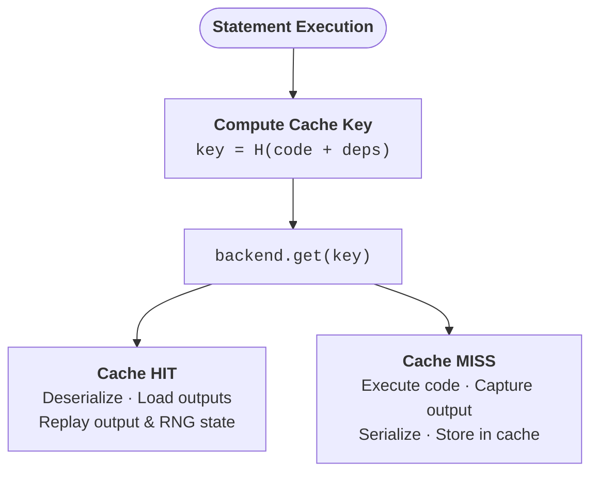
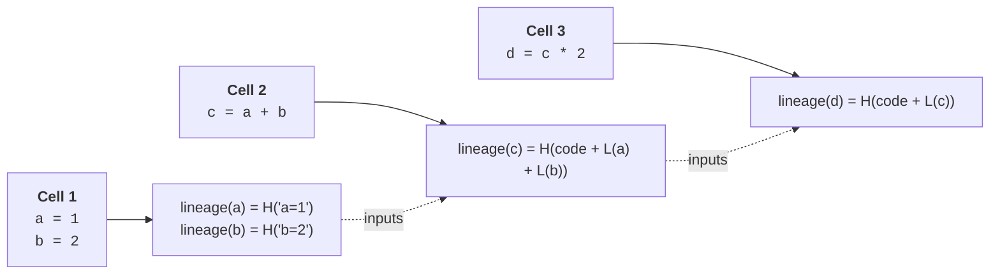

# Cache keys, lineage & hashing

Every cached result is stored under a key that captures exactly what was computed and from what inputs — understanding that key is the foundation for understanding when Cash hits or misses.

## Content-addressing

A cache key is a deterministic fingerprint of a computation: the same source code over the same inputs always produces the same key, so a hit means the result can be reused without re-executing anything. Any relevant change — edited code, a recomputed upstream variable, a changed helper function — produces a different key and causes a miss.

<!-- claim: cash/notebook/cache_key.py:compute_cache_key @4ae41646 -->
The statement-level key is built by `compute_cache_key()` in `cash.notebook.cache_key`:

```
combined  = source_hash                      # SHA256 of the statement's own text
          + ":" + input_lineages             # one lineage per input, ordered by variable name
          + [":" + func_source_hashes]       # "name:hash" per called function, sorted
          + [":" + module_source_hashes]     # "name:hash" per tracked module, sorted
          + ":occ" + occurrence_index        # 0-based; disambiguates a repeated statement
          + [":callees:" + callee_globals]   # "name:lineage" per global a callee reaches for

cache_key = "stmt:" + SHA256(combined)
```

Three details of that formula are load-bearing:

- **Bracketed components are omitted entirely when empty.** A statement that calls no
  user-defined function produces a key with no `:callees:` segment at all, not an empty
  one — so adding these components never invalidated the keys that existed before them.
- **Input lineages are ordered by *variable name*, not sorted by hash.** The function and
  module components *are* sorted, because they are `name:hash` strings.
- **Modules are not input lineages.** A module-valued input (and any of Cash's own
  instrumentation, such as the wrapper it puts over `open`) is excluded from
  `input_lineages` and routed to the module component instead. Hashing a module object
  would fall back to its memory address, which is fresh in every kernel and would make
  every downstream key drift across a restart.

Note what is *not* in the key: **files**. A file you read does not enter the key directly. It enters the *lineage* of whatever variable the read produced (see below), and it is re-checked on every lookup by a separate freshness pass — see [knowing when to recompute](invalidation.md#what-counts-as-a-change).



??? warning "Keys survive a restart, not a move to another machine"
    <!-- claim: cash/notebook/statement/file_deps.py:compute_file_hash_component @3dc65a7c -->
    Keys carry no wall-clock value *of their own*, so re-running the same notebook in a
    fresh kernel recomputes the same key and hits. But a statement that reads a file folds
    that file's **mtime and size** into its lineage (`compute_file_hash_component` in
    `cash.notebook.statement.file_deps`), and the path is only relative when the file sits
    near the notebook. Copy a `.cash` directory to another machine — or point two machines
    at one shared backend — and those file-reading statements will still miss, because the
    two runs compute *different keys*. A shared [storage backend](storage.md) puts everyone
    in the same store, but it cannot make mismatched keys agree. The decorator revalidates
    by content instead of baking a timestamp into the key, so its entries can survive a
    move — when the file paths recorded at write time still resolve. See
    [Sharing a cache](../tutorials/feature-guides/sharing-caches.md) for what survives a
    move and what doesn't.

## The lineage chain

Each variable carries a **lineage hash** — a fingerprint that encodes not just the code that produced it, but the full history of everything that fed into it. This makes invalidation transitive: edit `a`, and `lineage(a)` changes; because `c` was built from `a`, `lineage(c)` changes too; and so on down the chain. Every downstream cached result is invalidated automatically without any explicit dependency declaration.

The formula is recursive, and it folds in the same categories of dependency the key does — plus the files:

```
lineage(x) = SHA256(
    source_hash                                  # of the statement that produced x
    + ":" + sorted(lineage(i) for i in inputs)   # sorted by HASH here, unlike the key
    + [file_component]                           # SHA256 over "path:mtime:size" per file read
    + [func_source_hashes]                       # called functions, sorted
    + [module_source_hashes]                     # tracked modules, sorted
)
```

A worked example:

```python { .nb-cell }
a = 1
b = 2
c = a + b      # lineage(c) folds in lineage(a) and lineage(b)
d = c * 2      # lineage(d) folds in lineage(c)
```

The chain that results:



??? question "Why lineage hashing instead of file timestamps?"
    Content-addressing means the same code over the same inputs always produces
    the same key — no clock skew, no "changed within the same second" blind spot,
    and a changed CSV invalidates every computation that read it. Hashing the
    *result* would be the alternative, but that's expensive for large DataFrames
    and impossible for unhashable objects, so Cash hashes the recipe, not the dish.

## Two inputs a statement never names

A statement's `inputs` come from its AST, which only sees the names it mentions. Two real dependencies are invisible there, and each gets its own key component.

<!-- claim: cash/notebook/randomness.py:rng_virtual_var @a0a5f014, cash/notebook/randomness.py:hidden_lineage_reads @e9ddd20b, cash/notebook/randomness.py:hidden_lineage_writes @1369d609 -->
**The RNG is modelled as a hidden lineage variable.** A draw such as `x = np.random.rand(3)` has stable source and no tracked inputs, so nothing about it moves when you edit the seed above it — Cash would replay the previous seed's numbers. So each RNG module gets a virtual variable, `__cash_rng__numpy.random`: a `seed()` statement *writes* it (taking the seeding statement's own cache key as its lineage), a draw *reads* it. That virtual name never enters `user_ns`; it exists only as a key in the lineage dict, and it flows through the ordinary input-lineage code, which is what makes a re-seed propagate to everything cached downstream of the draw. See `rng_virtual_var` / `hidden_lineage_reads` / `hidden_lineage_writes` in `cash.notebook.randomness`.

**A call site is keyed on the globals its callees reach for.** `r = a(3)` names `a`, not what `a` touches when it runs. Python resolves a function's globals at *call* time, so the call genuinely depends on every global `a` reads — but the ordinary input path cannot supply them: it is built when `def a` executes and only sees names bound *above* it. Cash therefore walks `__code__.co_names` transitively from the called functions (with a seen-guard so mutual recursion terminates) and folds `name:lineage` for each into the `:callees:` component. A **missing** name contributes the literal string `ABSENT` rather than being skipped, and that half is the point: it is what makes *deleting* a callee change the key, so Cash surfaces the `NameError` a plain kernel would raise instead of reprinting a cached value.

!!! note "One known gap"
    Re-running **only** the call site after editing a callee defined below it is still
    stale, and is pinned as an expected failure
    (`tests/test_notebook_integration/test_downward_function_dependency.py`). The edited
    cell never executed, so `user_ns` still holds the old function and the key legitimately
    does not move. Editing and running the notebook top-to-bottom propagates correctly.

## Hashing your inputs

Most notebook variables never need content hashing: a variable produced by a tracked statement already carries a lineage hash, and that is what the key uses. Content hashing is the fallback for a value Cash sees but did not produce — and it is the *primary* path for the decorator, which hashes call arguments.

<!-- claim: cash/core.py:Cash._try_builtin_type_hash @9c5166b5 -->
The decorator path's built-in type hashers (`Cash._try_builtin_type_hash`) cover the common data-science types:

| Type | Module | Hashing strategy |
|------|--------|------------------|
| `DataFrame`, `Series` | pandas | schema labels + `pd.util.hash_pandas_object()` |
| `ndarray` | numpy | shape + dtype + **all** bytes (object arrays: stable repr) |
| `DataFrame`, `Series` | polars | `hash_rows()` / `hash()` |
| `LazyFrame` | polars | `serialize()` — the plan **and** the data it closes over. Not `explain()`: two frames over different in-memory data print the same plan, so they collided into a wrong hit. A plan reading from a file still serializes the *path*, not the contents — see [known limitations](../known-limitations.md). |
| `Table`, `RecordBatch` | PyArrow | schema + row count + every column buffer |
| `DataFrame`, `Series` | modin | convert to pandas, then hash |
| any collection | dask | `__dask_keys__()` task-graph key hash |

Numpy arrays are hashed in **full**, not sampled: two large arrays differing only outside a sampled window would otherwise collide and return a wrong result. The schema prefix on pandas is there because `hash_pandas_object` covers values and index values but not column names, so `df.rename(columns=...)` used to collide with the original.

For any type not listed above you can register a custom hasher with `register_hasher()`:

```python
from cash import Cash

class MyModel:
    def __init__(self, weights):
        self.weights = weights

    def get_fingerprint(self) -> str:
        return f"MyModel:{self.weights}"

c = Cash()
c.register_hasher(MyModel, lambda model: model.get_fingerprint())
```

See [custom hashers](../tutorials/feature-guides/custom-hashers.md) for the full API, including class-hierarchy matching and versioned hashers.

!!! warning "`register_hasher` is a decorator-path feature"
    <!-- claim: cash/core.py:Cash.register_hasher @5d116e94, cash/notebook/object_hashing.py:compute_hash @61e351a4 -->
    Registered hashers are consulted when hashing `@cash.cache` **call arguments**. The
    notebook path hashes fallback values through `cash.notebook.object_hashing.compute_hash`,
    a pure function with no registry, so a registered hasher does **not** change a
    statement's cache key. In practice this rarely bites: a notebook variable produced by a
    tracked statement is keyed on its lineage, never on its content.

## The priority ladders

The two paths answer "what is this object's fingerprint?" differently, and the ordering in each is deliberate.

<!-- claim: cash/core.py:Cash._hash_arg_payload @8be5a896 -->
**Decorator — hashing a call argument** (`Cash._hash_arg_payload`):

1. **Hashers registered with `override=True`** — see [overriding a built-in](../tutorials/feature-guides/custom-hashers.md#overriding-a-built-in-content-hasher). Nothing below runs for such a type.
2. **Built-in content hashers** — pandas, numpy, polars, PyArrow, modin, dask.
3. **`_cash_lineage_hash` attribute** — the cheap identity for objects with no content hasher.
4. **Registered type hashers** — anything added via `register_hasher()`.
5. **`pickle.dumps()` of the whole argument payload.**
6. **No key at all** — an unpicklable argument means the call runs *uncached* and Cash emits `CashCacheIneffectiveWarning`. It is never cached under a wrong key.

Content beats the lineage attribute, and that ordering is the fix for a real bug: a notebook variable's `_cash_lineage_hash` is re-derived in every kernel session and is not reproducible across a restart, so keying a persisted decorator entry on it made `train_model(X_train, ...)` miss after a restart and re-train the model. Pinned by `tests/test_core/test_arg_hash_restart_stable.py`.

<!-- claim: cash/notebook/lineage_store.py:LineageStore.resolve @f1dc058b, cash/notebook/object_hashing.py:_hash_dataframe_or_series @3cb5309c, cash/notebook/object_hashing.py:_hash_collection @f3ff9c8e, cash/notebook/object_hashing.py:compute_hash @61e351a4 -->
**Notebook — resolving a statement input** (`LineageStore.resolve`):

1. **Virtual lineage** — the simulated value, when an upstream simulation is in flight.
2. **The recorded lineage** for that variable name.
3. **`_cash_lineage_hash` attribute** on the value.
4. **`compute_hash(value)`** — type-specific, and *sampled* for large objects (first 5 rows of a DataFrame, first 100 elements of an ndarray, head/tail of a collection over 200 items).
5. **`sha256(str(value))`.**

`compute_hash` itself ends at `sha256(str(id(obj)))` for an object that cannot be pickled. That does not corrupt anything — the statement executes normally and the result is stored — but the key is then tied to a memory address, so the entry is effectively per-session and will not restore after a kernel restart.

??? note "Under the hood"
    <!-- claim: cash/notebook/statement/lineage.py:StatementLineageBuilder.capture_and_track_variables @a1f1d54b -->
    All statement keys are built by `compute_cache_key()` in
    `cash.notebook.cache_key` — a single source of truth shared by runtime
    execution and upstream simulation, so the two can never diverge. Output
    lineages are built by `StatementLineageBuilder.capture_and_track_variables`
    in `cash.notebook.statement.lineage`, and all lineage reads and writes go
    through `LineageStore`, which writes the dict entry and the value's
    `_cash_lineage_hash` attribute together so they cannot drift.
