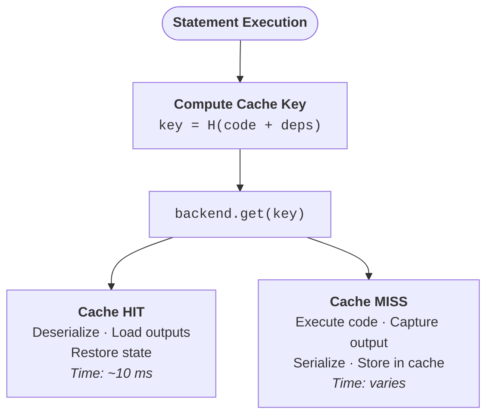
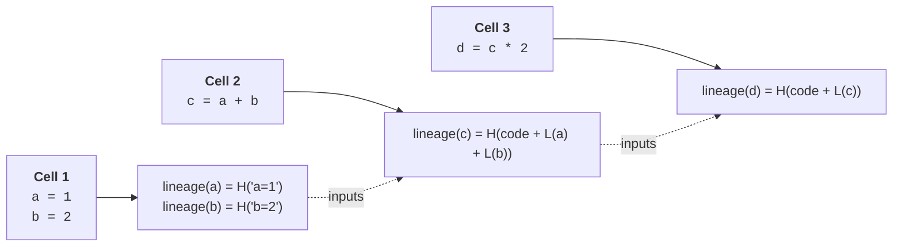

# Cache keys, lineage & hashing

Every cached result is stored under a key that captures exactly what was computed and from what inputs — understanding that key is the foundation for understanding when Cash hits or misses.

## Content-addressing

A cache key is a deterministic fingerprint of a computation: the same source code over the same inputs always produces the same key, so a hit means the result can be reused without re-executing anything. Any relevant change — edited code, a modified CSV, a recomputed upstream variable — produces a different key and causes a miss. Because no timestamps or wall-clock values enter the formula, keys survive kernel restarts and round-trip across machines.

The statement-level key is defined as:

```
cache_key = SHA256(
    "stmt:" +
    source_hash + ":" +
    sorted(input_lineage_hashes) + ":" +
    file_dependency_hash + ":" +
    func_source_hashes
)
```



## The lineage chain

Each variable carries a **lineage hash** — a fingerprint that encodes not just the code that produced it, but the full history of everything that fed into it. This makes invalidation transitive: edit `a`, and `lineage(a)` changes; because `c` was built from `a`, `lineage(c)` changes too; and so on down the chain. Every downstream cached result is invalidated automatically without any explicit dependency declaration.

The formula is recursive:

```
lineage(x) = SHA256(code_that_produced_x + ":" + lineage(input1) + ":" + lineage(input2) + ...)
```

A worked example:

```python { .nb-cell }
a = 1
b = 2
c = a + b      # lineage(c) folds in lineage(a) and lineage(b)
d = c * 2      # lineage(d) folds in lineage(c)
```

The chain that results:



??? question "Why lineage hashing instead of file timestamps?"
    Content-addressing means the same code over the same inputs always produces
    the same key — no clock skew, no "changed within the same second" blind spot,
    and a changed CSV invalidates every computation that read it. Hashing the
    *result* would be the alternative, but that's expensive for large DataFrames
    and impossible for unhashable objects, so Cash hashes the recipe, not the dish.

## Hashing your inputs

When Cash builds a lineage hash it needs a stable, content-based fingerprint for every input variable. The built-in type hashers cover the most common data science types:

| Type | Module | Hashing strategy |
|------|--------|------------------|
| `DataFrame`, `Series` | pandas | `pd.util.hash_pandas_object()` |
| `ndarray` | numpy | `value.tobytes()` (< 10 MB) or shape+dtype+sample |
| `DataFrame`, `Series`, `LazyFrame` | polars | `hash_rows()` / `hash()` / `explain()` |
| `Table`, `RecordBatch` | PyArrow | schema + row count + data bytes |
| `DataFrame`, `Series` | modin | convert to pandas, then hash |
| `DataFrame` | dask | task-graph key hash |

For any type not listed above you can register a custom hasher with `register_hasher()`:

```python
from cash import Cash

c = Cash()
c.register_hasher(MyModel, lambda model: model.get_fingerprint())
```

See [custom hashers](../tutorials/feature-guides/custom-hashers.md) for the full API, including class-hierarchy matching and versioned hashers. The decorator path (`@cash.cache`) reuses this same argument-hashing machinery, so a hasher registered once covers both notebook statements and decorated functions.

## When an object can't be hashed

Cash follows a priority ladder when computing a hash for an object:

1. **`_cash_lineage_hash` attribute** — if the object carries this attribute, it is used directly; it participates in lineage tracking and is the cheapest option.
2. **Registered type hashers** — checked next; any hasher added via `register_hasher()` takes precedence over the built-ins.
3. **Built-in type hashers** — the library defaults for pandas, numpy, polars, and friends (see table above).
4. **`pickle.dumps()`** — a content-based fallback for arbitrary Python objects.
5. **`id()`** — last resort when the object is not picklable; tracks identity, not content, so mutations are not detected.

An object that reaches `id()` degrades gracefully rather than silently breaking the cache: the statement is executed normally, and the result is stored under a key tied to that object's identity. The cache is never corrupted; at worst, a future run on a freshly constructed object will miss and recompute.

??? note "Under the hood"
    All statement keys are built by `compute_cache_key()` in
    `cash.notebook.cache_key` — a single source of truth shared by runtime
    execution and upstream simulation, so the two can never diverge. Lineage
    values are read through a fixed priority ladder
    (virtual → stored → `_cash_lineage_hash` attribute → content hash).
