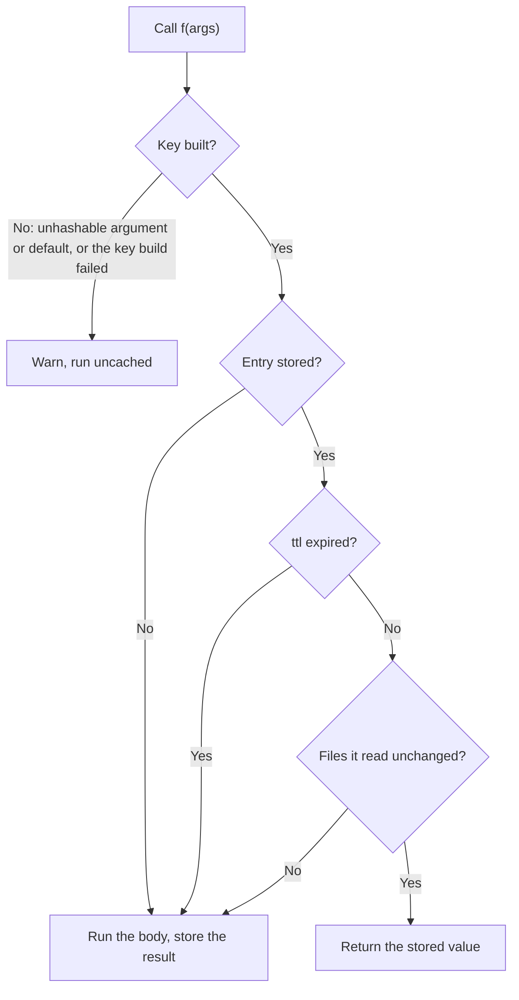

# How `@cash.cache` decides

!!! info "Applies to: decorator"
    Scripts, services and libraries that use `@cash.cache`, and anyone asking why a call hit or missed.

Every call to a decorated function takes the same route:

The rest of this page explains each box. For the parameters (`ttl=`,
`file_depends_on=`, `depends_on=`, `assume_safe=` and the rest), see the
[decorator guide](../decorator.md).

## The key

<!-- claim: cash/decorator/runtime.py:compute_cache_key @fe76bcca, cash/decorator/code_identity.py:func_key @7ed93e6b -->
A key has four parts, joined by colons: `function:state:dynamic:args`.

| Part | What it holds |
|---|---|
| `function` | The module-qualified name, such as `pipeline.train`. A function in the script you ran is named after the script's file, so `python model.py` and `import model` share entries. A REPL or `python -c` keeps `__main__`. |
| `state` | The function's code and everything it reads that is not an argument ([below](#what-goes-into-the-state)). |
| `dynamic` | What the `dynamic_depends_on=` resolvers returned for this call; empty without them. |
| `args` | The arguments, hashed by content ([below](#how-arguments-are-hashed)). |

## What goes into the state

<!-- claim: cash/decorator/runtime.py:KeyBuilder.build @070ed402, cash/dependency_state.py:DependencyStateHasher.compute @5007a8fe -->
The state starts from source code and then folds in, on every call, each input
that can change the result without changing an argument:

| Folded in | Detail |
|---|---|
| The function's source | Comments, docstrings, blank lines and indentation width are stripped first, so a reformat keeps the cache. `# @cash:` directives count. |
| Helpers it calls | Followed transitively through your own modules and your own installed package; other people's libraries are where it stops. `depends_on=` adds more. |
| Classes its code reaches | Classes it constructs, names or annotates, transitively. For a cached method: the class-level code and constants it reaches. |
| Module globals it reads | Data globals read by the function or a helper: a threshold, a config dict. Modules, functions and classes are tracked as code instead. |
| Closures, defaults, a bound method's instance | The values a closure captured, parameter defaults by value, and the `self` of `cash.cache(obj.method)`. |
| What a callable was built with | The arguments of a `functools.partial`, a factory closure's values, an `operator.itemgetter` key. |
| Code passed as an argument | A class or function passed in is keyed by its code, not its name, so editing a schema class you pass recomputes. |
| Files named in `file_depends_on=` | The names only; their content is checked on lookup ([Files](#files)). |
| Environment reads | A digest of each `os.getenv("NAME")`, `os.environ["NAME"]` or `os.getcwd()` value the function, its helpers or the cached functions it calls read with the name written out. A new value is a new entry. |
| The random seed | For a function seen drawing from the global `random` or `numpy.random` stream: which seed is in force. Re-seeding recomputes. |

<!-- claim: cash/decorator/globals_fold.py:GlobalsFold.fold_read_globals @3068be4c -->
Two limits. A global that cannot be hashed (a lock, a live connection) is left
out with a [`KEY-UNHASHABLE-GLOBAL`](../warnings.md#key-unhashable-global)
warning. And reachability is static: code picked at run time, from a dict or
through `getattr`, is not seen. Name it with `depends_on=[...]`.

<!-- claim: cash/decorator/rng.py:RngWatch.fold_rng_epoch @52a28e20 -->
An unseeded draw is not a change. The first value is stored and returned on
every later call, with a [`RANDOM-UNSEEDED`](../warnings.md#random-unseeded)
warning; `allow_random=True` accepts that on purpose.

## How arguments are hashed

<!-- claim: cash/decorator/arg_hashing.py:ArgHasher.hash_payload @c4f48efb -->
Each argument is fingerprinted by the first rule that applies:

1. A hasher you registered with `cash.register_hasher(T, fn, override=True)`.
2. A built-in content hasher: pandas, numpy, polars, pyarrow, modin and dask
   values are hashed by content.
3. An identity tag Cash keeps current, such as the one a `frozen=True`
   cached function puts on its result.
4. A hasher you registered without `override=True`.
5. The pickled value, in one canonical form: dicts and sets in sorted order,
   every container tagged with its type.

Content comes before any in-memory tag, so a stored entry is still found after
a restart. Equal values share a key (`{"a": 1, "b": 2}` and
`{"b": 2, "a": 1}`), but the type counts: `[1, 2]` and `(1, 2)`, or `0.5` and
`np.float64(0.5)`, are separate entries.
[Custom hashers](../tutorials/feature-guides/custom-hashers.md) covers
registration.

## When there is no key

<!-- claim: cash/decorator/runtime.py:KeyBuilder.resolve @b144476a -->
If any part of the key cannot be built, the call runs uncached and Cash warns.
It never caches under a partial key. The usual causes:

- an argument that cannot be hashed, such as a generator or a lock
  ([`KEY-UNHASHABLE-ARG`](../warnings.md#key-unhashable-arg));
- a parameter default that cannot be hashed
  ([`KEY-UNHASHABLE-DEFAULT`](../warnings.md#key-unhashable-default));
- any other failure while building the key
  ([`KEY-BUILD-FAILED`](../warnings.md#key-build-failed)).

## Files

<!-- claim: cash/decorator/file_deps.py:FileDeps.fold_declared_files @5d8d7594, cash/tracking/file_dep_snapshot.py:file_dep_is_fresh @3dd62608 -->
A file the body reads through a tracked reader, and every file named in
`file_depends_on=`, is recorded with its content hash when the entry is
written. Before a stored value is returned, each file is checked; if one
changed, the call recomputes and the entry is rewritten. Which readers are
tracked, and how the check works, is under
[what counts as a change](invalidation.md#what-counts-as-a-change).

File content is checked, not keyed, so each call has one entry. Switching a
data file between two versions recomputes on every switch, while switching
code between two versions hits, because code is in the key. A URL given to
`file_depends_on=` is treated as a missing local file; use
[`RemoteFileDataSource`](../tutorials/feature-guides/custom-file-sources.md)
for remote files.

## Side effects

On the first call, the decorator reads the function's source. It warns about
side effects and still caches:

- a file write, a POST or a database write warns
  [`IMPURE-SIDE-EFFECTS`](../warnings.md#impure-side-effects), and a hit
  skips the effect;
- a network or database read warns
  [`KEY-NETWORK-READ`](../warnings.md#key-network-read), which `ttl=`
  silences;
- a clock read or a fresh UUID warns
  [`KEY-AMBIENT-READ`](../warnings.md#key-ambient-read).

<!-- claim: cash/decorator/purity_checks.py:PurityChecks.surface_purity @3f8526f2 -->
One case raises instead: a body that picks code from a run-time value
(`eval`, `exec`, `getattr(obj, name)()`, `importlib.import_module`) raises
`CashImpureFunctionError`, because Cash cannot tell when that code changes.
The [decorator guide](../decorator.md#side-effects) covers
`assume_safe` and the `# @cash:assume-safe` line marker.

## Storing and returning

<!-- claim: cash/backends/serialization.py:get_serializer @76cf2c1b -->
A result is written to the RAM tier and to disk, however cheap it was, unless
a tier's size cap refuses it; see
[where results are stored](../decorator.md#where-results-are-stored). A hit returns a copy rebuilt from the
stored bytes, not the object the first call returned, and it does not replay
the body's `print` output.

In a notebook, a statement that calls a decorated function shows that call's
hits and misses on the statement's badge; see
[the notebook path](notebook-path.md#decorated-functions-inside-a-cell).
