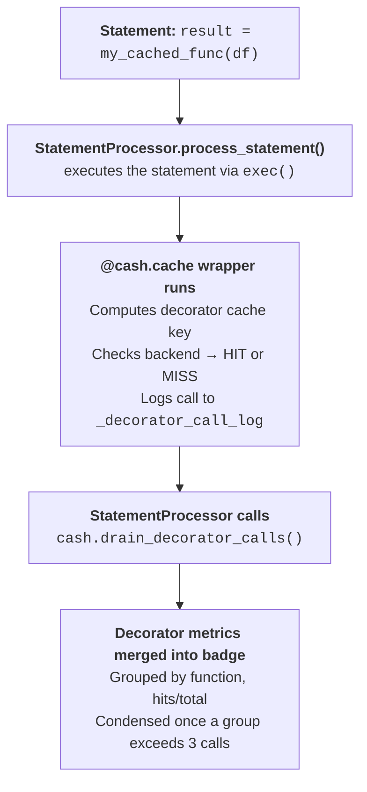

# The decorator path

The decorator is the call-level entrance to Cash. Wrap a function with
`@cash.cache` and every call routes through the same content-addressed core the
notebook path uses — only the *trigger* differs. Where a notebook statement is
keyed on its source and its inputs' lineage, a decorated **call** is keyed on
four segments:

<div class="cash-keybreak" role="img" aria-label="The decorator cache key is four colon-separated segments: func_name (func), state_hash (state), dynamic_hash (dynamic), and args_hash (args).">
  <div class="cash-keybreak-seg">
    <span class="cash-keybreak-val">func_name</span>
    <span class="cash-keybreak-label">func</span>
  </div>
  <span class="cash-keybreak-colon" aria-hidden="true">:</span>
  <div class="cash-keybreak-seg">
    <span class="cash-keybreak-val">state_hash</span>
    <span class="cash-keybreak-label">state</span>
  </div>
  <span class="cash-keybreak-colon" aria-hidden="true">:</span>
  <div class="cash-keybreak-seg">
    <span class="cash-keybreak-val">dynamic_hash</span>
    <span class="cash-keybreak-label">dynamic</span>
  </div>
  <span class="cash-keybreak-colon" aria-hidden="true">:</span>
  <div class="cash-keybreak-seg">
    <span class="cash-keybreak-val">args_hash</span>
    <span class="cash-keybreak-label">args</span>
  </div>
</div>

<!-- claim: cash/core.py:Cash._compute_cache_key @a3272962 -->
The segments are joined with colons, and an unused one is simply empty — a
function with no `dynamic_depends_on` produces a key with an empty `dynamic`
segment (`__main__.load:ca32…::0bba…`). Each segment answers a different "did
anything change?" question:

| Segment | Captures | Changes when… |
|---------|----------|---------------|
| `func` | The module-qualified function name (`my_module.process`) | …you call a different function |
| `state` | The **dependency-state hash**, plus everything the function reads that isn't an argument | …you edit the function, a helper it transitively uses, or a value it closes over / defaults to / reads as a global |
| `dynamic` | Dependencies declared at call time via `dynamic_depends_on` | …a runtime-declared dependency changes |
| `args` | A hash of the call arguments | …you pass different arguments |

<!-- claim: cash/dependency_state.py:DependencyStateHasher @7a3f8cec broad="the state digest is the hasher class as a whole - own source, graph deps, transitive helpers" -->
The interesting one is `state`. It starts as a `DependencyStateHasher` digest
that folds three things together: the node's own source hash, each graph
dependency's state hash (recursively, in sorted order), and the **transitive
helper source hashes** captured by the purity analyzer. That last part is what
makes editing a *plain, undecorated* helper invalidate the caller's key — the
same "what counts as a change" guarantee the notebook path gives statements,
extended to the call graph. (The purity analyzer is the same machinery behind
the function purity markers in [Safety](safety.md).)

Source alone isn't enough, though, because a function can read inputs that never
appear in `args` and never change its bytes. So Cash folds several more things into
`state` on every call, each one closing a hole that produced a silent wrong
answer:

| Folded in | The hole it closes |
|-----------|--------------------|
| Captured free variables (closures) | Two closures from the same factory share source *and* qualname, so `make(2)` and `make(5)` collided on one key |
| Parameter defaults | Editing `n_estimators=300` to `400` lives on the function object, not in the code object — the key stayed byte-identical and returned the 300-tree model |
| A bound method's `__self__` | With `cash.cache(obj.method)`, `self` never reaches `args`, so two instances shared a key |
| Module-level **data** globals the body reads | A config constant or dispatch dict changing left every cached result stale, silently |
| Class-level code a cached **method** reaches, transitively | Editing a method or class-body helper the cached method calls left its result stale |
| Class constants read via `ClassName.ATTR` / `type(self).ATTR` | Changing a class-level constant the body reads didn't move the key |
| A helper reached through a **value**, not a bare name (`fn = mod.f; fn(x)`) | A value-indirected call used to slip past the plain-helper source hash |

Modules, plain callables (already tracked as helpers) and classes are excluded
from the globals fold. A capture or global that can't be hashed warns once and is
skipped rather than silently pretending it doesn't exist.

<!-- claim: cash/core.py:Cash._hash_arg_payload @8be5a896 -->
The `args` segment resolves each argument through its own ladder, and the order
is deliberate:

1. **Hashers registered with `override=True`** — a type you have explicitly
   taken over from Cash, so nothing below is consulted for it.
2. **Built-in content hashers** — pandas, numpy, polars, pyarrow, modin, dask.
   These hash the argument's *content*, which is byte-stable across processes.
3. **A lineage-tracked `_cash_lineage_hash`**, for values that carry no content
   hasher (custom objects).
4. **Registered hashers** from `cash.register_hasher(...)`.
5. **A pickle fallback** over the value itself.

Content comes first *on purpose*. A notebook lineage hash is recomputed per
session and is not reproducible across a kernel restart, so keying a persisted
entry on it would make every decorator call miss after a restart even though the
argument is byte-identical — which is exactly the "restart and re-run in seconds"
guarantee Cash exists to provide. Note this is the reverse of the notebook
statement ladder in [Cache keys, lineage & hashing](cache-keys-and-lineage.md),
where lineage is checked first; statement entries and decorator entries have
different lifetimes, so they weigh reproducibility differently.

If an argument can't be hashed at all (a generator, say) the decorator gives up
gracefully: it emits a `CashCacheIneffectiveWarning` naming the offending
argument type, and runs the function uncached.

??? question "Why is the `func` segment module-qualified?"
    <!-- claim: cash/core.py:Cash._get_func_key @6285ab22 -->
    Cash keys functions on `f"{func.__module__}.{func.__qualname__}"`, not
    `__qualname__` alone. Early on, bare qualnames collided: a notebook cell's
    `dep()` and a helper module's `dep()` produced the *same* key, so a call to
    one could return the other's cached result — a silent wrong answer. Folding
    in `__module__` makes the key unique (`analysis.dep` vs `my_utils.dep`).
    `__module__` is set correctly by Python for every function type, so it's a
    stable, free disambiguator.

    **`__main__` is resolved to a filename.** A function defined in the script
    you ran belongs to module `__main__`, so `python model.py` keyed it
    `__main__.work` while `import model` keyed the same function, same source,
    same arguments as `model.work` — two entries for one computation, on the
    very ordinary path of developing a script behind an
    `if __name__ == "__main__"` block and later importing it from a driver.
    Cash resolves `__main__` through the defining file's name so those two
    agree. It also *reduces* collisions: every script alike used to be
    `__main__`, so two unrelated scripts with a same-named function met;
    now only two scripts with the same **filename** do — and the state hash
    (source, helpers, read globals) still separates those.

    A REPL, `python -c`, a frozen app and a Jupyter kernel have no defining
    file, so they stay `__main__` — there is no import for them to agree with.

## The bridge to notebook caching

The two paths aren't separate worlds. When a notebook statement *calls* a
decorated function, the decorator's own hit/miss shows up in that statement's
execution badge. The mechanism is a call log the statement processor drains:



<!-- claim: cash/core.py:Cash._log_decorator_call @55a1f795 -->
Every `@cash.cache` call appends an entry to `Cash._decorator_call_log`:

<!-- test:skip reason="illustrative dict literal at top level" -->
```python
{
    'func_name': 'my_module.process',     # module-qualified key
    'cache_hit': True,                    # whether the cache was hit
    'execution_time': 0.001,              # wall-clock time of THIS operation
    'time_saved': 2.3,                    # compute this hit avoided; 0.0 on a miss
    'args_hash': 'abc123...',             # hash of arguments
    'cache_key': 'my_module.process:...', # full four-segment key
    'timestamp': 1718000000.0,
}
```

`execution_time` and `time_saved` are deliberately different numbers. A hit's
`execution_time` is the microseconds the lookup cost; its `time_saved` is the
full compute the lookup stood in for — the execution time measured when the
entry was first written. Summing `execution_time` would under-report savings by
orders of magnitude; `time_saved` is an estimate of the *original* cost, not a
re-measurement of what recomputing would cost today.

<!-- claim: cash/core.py:Cash.drain_decorator_calls @eb8f14d5 -->
After the statement runs, `drain_decorator_calls()` atomically reads and clears
the log. The badge groups the calls by function, so a helper called in a loop is
one line, not fifty:

```
  @cash.cache:
    load_features(): 2/2 cached (0.002s)
    train(): 0/1 cached (4.200s)
```

<!-- claim: cash/notebook/badge_renderer/view_builder.py:_CONDENSE_THRESHOLD == 3 -->
In the HTML badge each call gets its own `@cache my_func() HIT` row until a
group exceeds three calls, at which point it condenses to a single expandable
row (`3/5 cached, 2 computed`) with a per-call sparkline. Nested calls are all
captured, at every level.

So the decorator path inherits the notebook path's visibility for free — see
[Inspecting what Cash did](inspecting.md) for how to read those badges. And
because the `state` segment tracks source, editing a decorated function (or its
helpers) invalidates exactly the calls that depended on it, the same way editing
a cell invalidates downstream statements in
[Staying correct: invalidation](invalidation.md).
