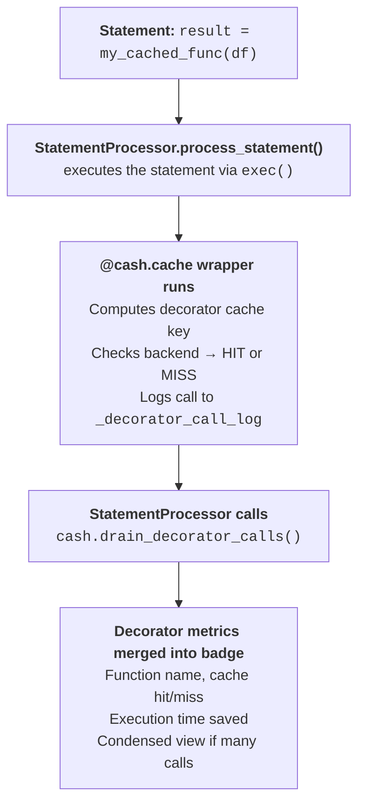

# The decorator path

The decorator is the call-level entrance to Cash. Wrap a function with
`@cash.cache` and every call routes through the same content-addressed core the
notebook path uses — only the *trigger* differs. Where a notebook statement is
keyed on its source and its inputs' lineage, a decorated **call** is keyed on
four segments:

```
cache_key = f"{func_name}:{state_hash}:{dynamic_hash}:{args_hash}"
#             └ func ┘    └ state ┘    └ dynamic ┘    └ args ┘
```

Each segment answers a different "did anything change?" question:

| Segment | Captures | Changes when… |
|---------|----------|---------------|
| `func` | The module-qualified function name (`my_module.process`) | …you call a different function |
| `state` | The **dependency-state hash** — the function's own source, plus every dependency's state, plus the source of any plain helper it calls | …you edit the function *or any helper it transitively uses* |
| `dynamic` | Dependencies declared at call time via `dynamic_depends_on` | …a runtime-declared dependency changes |
| `args` | A hash of the call arguments | …you pass different arguments |

The interesting one is `state`. It's produced by a `DependencyStateHasher` that
folds three things into one digest: the node's own source hash, each graph
dependency's state hash (recursively, in sorted order), and the **transitive
helper source hashes** captured by the purity analyzer. That last part is what
makes editing a *plain, undecorated* helper invalidate the caller's key — the
same "what counts as a change" guarantee the notebook path gives statements,
extended to the call graph. (The purity analyzer is the same machinery behind
the function purity markers in [Safety](safety.md).)

The `args` segment runs the same hasher-resolution ladder documented for
statement inputs in [Cache keys, lineage & hashing](cache-keys-and-lineage.md): a
lineage-tracked `_cash_lineage_hash` first, then registered hashers, then built-ins,
then a pickle fallback. If an argument can't be hashed at all (a generator, say)
the decorator gives up gracefully and just runs the function uncached.

??? question "Why is the `func` segment module-qualified?"
    Cash keys functions on `f"{func.__module__}.{func.__qualname__}"`, not
    `__qualname__` alone. Early on, bare qualnames collided: a notebook cell's
    `dep()` and a helper module's `dep()` produced the *same* key, so a call to
    one could return the other's cached result — a silent wrong answer. Folding
    in `__module__` makes the key unique (`__main__.dep` vs `my_utils.dep`).
    `__module__` is set correctly by Python for every function type, so it's a
    stable, free disambiguator.

## The bridge to notebook caching

The two paths aren't separate worlds. When a notebook statement *calls* a
decorated function, the decorator's own hit/miss shows up in that statement's
execution badge. The mechanism is a call log the statement processor drains:



Every `@cash.cache` call appends an entry to `Cash._decorator_call_log`:

<!-- test:skip reason="illustrative dict literal at top level" -->
```python
{
    'func_name': 'my_module.process',     # module-qualified key
    'cache_hit': True,                    # whether the cache was hit
    'execution_time': 0.001,              # wall-clock time
    'args_hash': 'abc123...',             # hash of arguments
    'cache_key': 'my_module.process:...', # full four-segment key
    'timestamp': 1718000000.0,
}
```

After the statement runs, `drain_decorator_calls()` atomically reads and clears
the log, and the badge renderer condenses it:

- **Single call** → `✅ my_func: HIT (saved 2.3s)`
- **Many calls** → `📦 3 decorator calls (2 HIT, 1 MISS)`
- **Nested calls** are all captured, at every level.

So the decorator path inherits the notebook path's visibility for free — see
[Inspecting what Cash did](inspecting.md) for how to read those badges. And
because the `state` segment tracks source, editing a decorated function (or its
helpers) invalidates exactly the calls that depended on it, the same way editing
a cell invalidates downstream statements in
[Staying correct: invalidation](invalidation.md).
