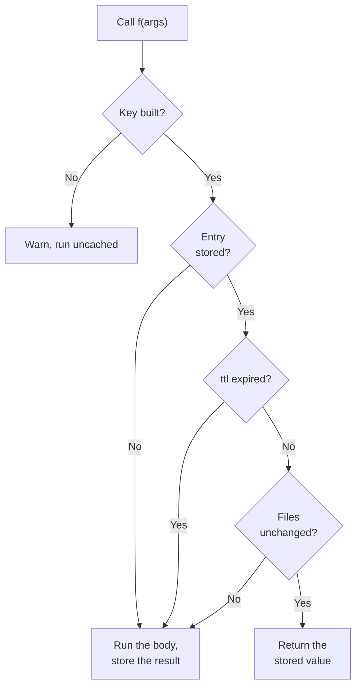

# The decorator path: how `@cash.cache` decides

!!! info "Applies to: decorator"
    Scripts, services and libraries that use `@cash.cache`, and anyone asking why a call hit or missed.

Every call to a decorated function takes the same route:

```mermaid
flowchart TD
    A["Call f(args)"] --> B{"Key built?"}
    B -->|No| W["Warn, run uncached"]
    B -->|Yes| C{"Entry<br/>stored?"}
    C -->|No| D["Run the body,<br/>store the result"]
    C -->|Yes| E{"ttl expired?"}
    E -->|Yes| D
    E -->|No| F{"Files<br/>unchanged?"}
    F -->|No| D
    F -->|Yes| G["Return the<br/>stored value"]
```

The rest of this page explains each box, and
[when there is no key](#when-there-is-no-key) lists why a key can fail to
build. For the parameters (`ttl=`, `file_depends_on=`, `depends_on=`,
`assume_safe=` and the rest), see the [decorator guide](../decorator.md).

## The key

<!-- claim: cash/decorator/runtime.py:decorator_key @58733f82, cash/decorator/function_identity.py:func_key @88a3b5fb -->
A key has four parts, joined by colons: `function:state:dynamic:args`.

| Part | What it holds |
|---|---|
| `function` | The module-qualified name, such as `pipeline.train`. A function in the script you ran is named after the script's file, so `python model.py` and `import model` share entries. A REPL or `python -c` keeps `__main__`. |
| `state` | The function's code and everything it reads that is not an argument ([below](#what-goes-into-the-state)). |
| `dynamic` | What the `dynamic_depends_on=` resolvers returned for this call; empty without them. |
| `args` | The arguments, hashed by content ([below](#how-arguments-are-hashed)). |

## What goes into the state

<!-- claim: cash/decorator/runtime.py:KeyBuilder.build @1c273577, cash/dependency_state.py:DependencyStateHasher.compute @8e272f43 -->
The state starts from source code and then folds in, on every call, each input
that can change the result without changing an argument:

| Folded in | Detail |
|---|---|
| The function's source | Parsed and rendered back (`ast.unparse`) without docstrings (code that reads one at run time, through `__doc__` or `inspect.getdoc`, keys the docstrings it reaches as data), so comments, blank lines, indentation, quote style, trailing commas, redundant parentheses and line breaks do not count: running `ruff format` or `black` keeps the cache. `# @cash:` directives count, except the waivers: a `# @cash:assume-safe` comment and a `with cash.assume_safe():` wrapper (not the code inside it) are dropped, so adding or removing one keeps the cache. A function with no readable source (`python -c`, a `python - <<EOF` heredoc, `exec`) is keyed by its bytecode, and its helpers and globals are found from the names that bytecode looks up. |
| Helpers it calls | Followed transitively through your own modules and your own installed package; other people's libraries are where it stops. A function of a compiled extension built in your project (`build_ext --inplace`) is keyed by the content of its built file. `depends_on=` adds more. |
| Classes its code reaches | Classes it constructs, names or annotates, transitively. For a cached method: the class-level code and constants it reaches. For every class of yours it reaches (also as `module.Class`, or through an instance): its class attributes, re-read on every call (an Enum's member values, a namedtuple's fields and defaults), and the module globals its functions read, inherited methods, properties and `__init__` included. A class attribute the class's own code writes (a counter, a registry) is state, not an input, and is left out. |
| Module globals it reads | Data globals read by the function or a helper: a threshold, a config dict, and an attribute read through a module however it is spelled (`conf.RATE`, `pkg.conf.RATE`, `m = pkg.conf; m.RATE`). Modules, functions and classes are tracked as code instead, and so is a function held inside a data global, in a dict, a list or an object's attribute (`CFG = {"b": Box(lambda x: x + 1)}`): editing it recomputes. |
| Closures, defaults, a bound method's instance | The values a closure captured (a captured module: its name and the code of the functions and classes read from it), parameter defaults by value (a function default also by the globals it reads: `fn=lambda v: v + K`), data stored on a function (`scale.k`), and the `self` of `cash.cache(obj.method)`. |
| What a callable was built with | The arguments of a `functools.partial`, a factory closure's values, an `operator.itemgetter` key, the attributes of your class's callable instance and a bound method's instance, also when the callable sits in a dict or list global, is captured by a closure or decorator, or is itself passed to `cash.cache`. |
| Code passed as an argument | A class or function passed in is keyed by its code, not its name, so editing a schema class you pass recomputes. A decorated function is keyed by the function and every layer its decorators wrap, and a class or function by the code of the classes and functions its code names, transitively. So is one held in an argument or a data global, however deep: an instance's attribute, a list of steps, a transformer inside a library pipeline (a library object is only searched for your code; its own state is not keyed this way, and loggers, streams, threads and locks are not searched). A value a [registered hasher](../tutorials/feature-guides/custom-hashers.md) keys is not searched. What that code reads is keyed as the function's own reads are: the globals it and its helpers read, and what the callables it calls were built with. |
| Files named in `file_depends_on=` | The names only; their content is checked on lookup ([Files](#files)). |
| Environment reads | A digest of each `os.getenv("NAME")`, `os.environ["NAME"]`, `"NAME" in os.environ` or working-directory (`os.getcwd()`, `Path.cwd()`, `os.path.abspath(p)`) value the function, its helpers or the cached functions it calls read with the name written out. A new value is a new entry. |
| The random seed | For a function seen drawing from the global `random` or `numpy.random` stream: which seed is in force. In a notebook that is the seeding statement. In a script it is where the seeded stream stands at the call, for a `random.seed()` or `np.random.seed()` made after the function was decorated, by the caller too (module level, or an outer function before it calls this one). Re-seeding recomputes, and two draws in a row under one seed are two entries. |

<!-- claim: cash/decorator/globals_fold.py:GlobalsFold.fold_read_globals @3c898b99 -->
Two limits. A global that cannot be hashed (a lock, a live connection) is left
out with a [`KEY-UNHASHABLE-GLOBAL`](../warnings.md#key-unhashable-global)
warning. And reachability is static: code picked at run time, from a dict or
through `getattr`, is not seen. Name it with `depends_on=[...]`.

<!-- claim: cash/decorator/rng.py:RngWatch.fold_rng_epoch @8346a209 -->
An unseeded draw is not a change. The first value is stored and returned on
every later call, with a [`RANDOM-UNSEEDED`](../warnings.md#random-unseeded)
warning; `allow_random=True` accepts that on purpose.

## How arguments are hashed

<!-- claim: cash/decorator/arg_hashing.py:ArgHasher.hash_payload @7af4e89b, cash/decorator/arg_hashing.py:ArgHasher._nested_hasher @6c8d0ce6 -->
Each argument is fingerprinted by the first rule that applies:

1. A hasher you registered with `cash.register_hasher(T, fn, override=True)`.
2. The value's
   [`__cash_key__`](../tutorials/feature-guides/custom-hashers.md#cash-key)
   method, when its class has one and no hasher is registered for it: what it
   returns, with the class's name and the method's code.
3. A built-in content hasher: pandas, numpy, polars, pyarrow, modin, dask and
   scipy.sparse values are hashed by content.
4. An identity tag cash keeps current, such as the one a `frozen=True`
   cached function puts on its result.
5. A hasher you registered without `override=True`.
6. The pickled value, in one canonical form: sets in sorted order, every
   container tagged with its type.

Inside a list, tuple, set or dict argument, a value a registered hasher, a
`__cash_key__` or a built-in content hasher covers is hashed by it too;
everything else is pickled.

<!-- claim: cash/canonical_form.py:holds_content_data @c313e890, cash/decorator/arg_hashing.py:ArgHasher._memo_content_digest @7adf4b09 -->
An object that holds frames, arrays or tables, directly or in a list, tuple or
dict attribute, is keyed part by part rather than pickled whole: each frame
by its content, the rest as pickle would store it. That happens when it holds
a frame cash can check for changes (below) or an array, frame or table of
1 MiB or more; an object holding only small ones, such as a fitted
scikit-learn model, is pickled whole, which is faster. Under pandas 3, a frame
cash has already hashed is checked for changes instead of read again, so a
repeat call on an unchanged object costs milliseconds however large its
frames are, also when other frames share its data. A frame whose memory can
be written without pandas noticing is read in full every time: one built with
`copy=False` (or `index=`) over a numpy array you still hold, one from
`read_parquet` (its memory belongs to Arrow), and one with categorical or
nullable columns.

Content comes before any in-memory tag, so a stored entry is still found after
a restart. Equal values share a key, but the type counts: `[1, 2]` and
`(1, 2)`, or `0.5` and `np.float64(0.5)`, are separate entries. So does a
dict's order, which code can read (`pd.DataFrame(d)` orders its columns by
it): `{"a": 1, "b": 2}` and `{"b": 2, "a": 1}` are separate entries, and so
are `**kwargs` passed in two orders. Named arguments share a key in any order.
One list held twice is not two equal lists either: `[[0] * 3] * 3` repeats
one row, and a write to it shows in every row, so it keys apart from a
3x3 grid of separate rows. The same goes for a list, dict, set or array
that two arguments, or two records of one argument, share. Which strings,
dates or numbers are one object never matters: they cannot be written into,
so a config parsed from JSON hits the equal one written as literals.
[Custom hashers](../tutorials/feature-guides/custom-hashers.md) covers
registration.

## When there is no key

<!-- claim: cash/decorator/runtime.py:KeyBuilder.resolve @5765b31b -->
If any part of the key cannot be built, the call runs uncached and cash warns.
It never caches under a partial key. The usual causes:

- an argument that cannot be hashed, such as a generator or a lock
  ([`KEY-UNHASHABLE-ARG`](../warnings.md#key-unhashable-arg));
- a parameter default that cannot be hashed
  ([`KEY-UNHASHABLE-DEFAULT`](../warnings.md#key-unhashable-default));
- any other failure while building the key
  ([`KEY-BUILD-FAILED`](../warnings.md#key-build-failed)).

## Files

<!-- claim: cash/decorator/file_deps.py:FileDeps.fold_declared_files @5d8d7594, cash/tracking/file_dep_snapshot.py:file_dep_is_fresh @5ea5c38d -->
A file the body reads through a tracked reader, and every file named in
`file_depends_on=`, is recorded with its content hash when the entry is
written. Before a stored value is returned, each file is checked; if one
changed, the call recomputes and the entry is rewritten. Which readers are
tracked, and how the check works, is under
[what counts as a change](invalidation.md#what-counts-as-a-change).

File content is checked, not keyed, so each call has one entry. Switching a
data file between two versions recomputes on every switch, while switching
code between two versions hits, because code is in the key. A URL given to
`file_depends_on=` is treated as a missing local file; use
[`RemoteFileDataSource`](../tutorials/feature-guides/custom-file-sources.md)
for remote files.

## Side effects

On the first call, the decorator reads the function's source. It warns about
side effects and still caches:

- a file write, a POST or a database write warns
  [`IMPURE-SIDE-EFFECTS`](../warnings.md#impure-side-effects), and a hit
  skips the effect;
- a network or database read warns
  [`KEY-NETWORK-READ`](../warnings.md#key-network-read), which `ttl=`
  silences;
- a clock read or a fresh UUID warns
  [`KEY-AMBIENT-READ`](../warnings.md#key-ambient-read).

<!-- claim: cash/decorator/purity_checks.py:PurityChecks.surface_purity @d8880798 -->
One case raises instead: a body that picks code from a run-time value
(`eval`, `exec`, `getattr(obj, name)()`, `importlib.import_module`) raises
`CashImpureFunctionError`, because cash cannot tell when that code changes.
The [decorator guide](../decorator.md#side-effects) covers
`assume_safe`, the `# @cash:assume-safe` line marker and the
`with cash.assume_safe():` block.

## Storing and returning

<!-- claim: cash/decorator/store.py:ResultStore.store @860f12a7 -->
A result is written to the RAM tier and to disk, however cheap it was, unless
a tier's size cap refuses it; see
[where results are stored](../decorator.md#where-results-are-stored). A hit returns a copy rebuilt from the
stored bytes, not the object the first call returned, and it does not replay
the body's `print` output.

In a notebook, a statement that calls a decorated function shows that call's
hits and misses on the statement's badge; see
[the notebook path](notebook-path.md#decorated-functions-inside-a-cell).

## Related

- [`@cash.cache` guide](../decorator.md): every parameter, with examples.
- [Knowing when to recompute](invalidation.md): which changes make a call
  recompute.
- [Where your cache lives](storage.md): where results are written and how
  much is kept.
- [Seeing what cash did](inspecting.md): `explain()` and `cache_info()` for a
  call.
