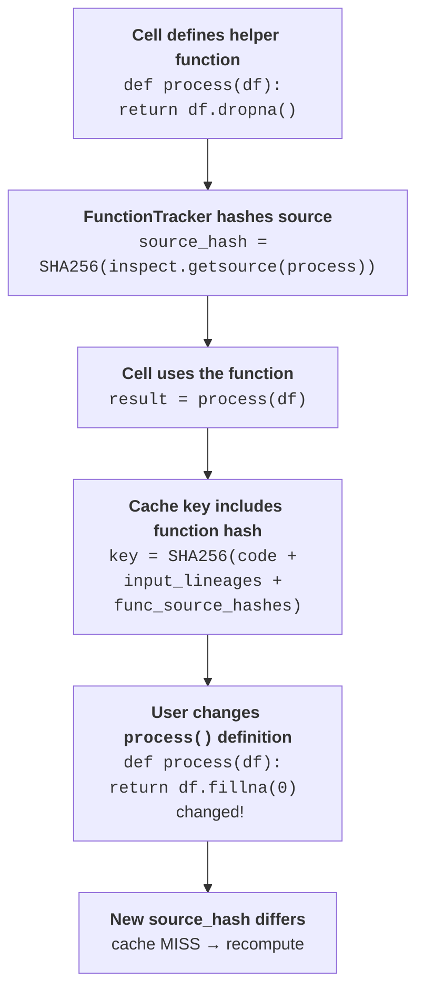

# Knowing when to recompute

Cash never silently serves a stale result: it propagates every change through the lineage chain so that a modification anywhere upstream triggers recomputation of everything downstream.

## Lineage propagation

A change in any cell propagates transitively through the lineage chain: if `raw` changes, every variable derived from `raw` — `clean`, `features`, `model` — is also invalidated, regardless of how many steps separate them. This follows directly from the way lineage hashes are built: a variable's lineage encodes the full history of everything that fed into it, so editing anything upstream produces a new lineage hash downstream without any explicit dependency declaration. See [cache keys and lineage](cache-keys-and-lineage.md#the-lineage-chain) for the full definition of the lineage hash.

## Finding your notebook

To check upstream cells, Cash must read the live `.ipynb` file. It locates it through a prioritised fallback chain: first it reads the **VS Code injected variable** (`__vsc_ipynb_file__`) set by the Jupyter extension; if that is absent it tries the **`ipynbname` library** when installed; and finally it queries the **Jupyter Server REST API** (reliable inside JupyterLab or the classic Notebook). The resolved path is cached in memory for five minutes, and the cache is cleared whenever you switch notebooks via `%cash_on`.

Graceful degradation is by design. If notebook discovery fails entirely — for example in a plain IPython REPL or an environment where none of the three mechanisms succeed — Cash disables upstream checking rather than guessing. Notably, it does **not** fall back to scanning the filesystem for the most-recently-modified `.ipynb`: that heuristic can silently pick the wrong notebook, so Cash skips upstream detection instead. The current cell still uses its own code and input hashes, but stale-upstream detection is simply skipped. Cash never invalidates against a notebook it cannot see.

## Upstream simulation

The classic problem: you edited cell 1 but then ran cell 3 directly. Cash solves this with a virtual-lineage approach. When cell 3 runs, Cash reads the current notebook file and *simulates* the upstream cells — cells 1 and 2 — without executing them. It parses each upstream statement's AST to compute what its lineage hash *should* be given the current code, then compares those virtual lineages against the in-memory lineages stored from the last actual run. Only the cells whose simulated lineage differs from what is in memory are re-executed; the rest still serve from cache.

??? question "Why AST analysis, not bytecode?"
    Cash reads each statement's inputs and outputs from Python's Abstract Syntax
    Tree — the canonical, version-stable representation — using the standard
    library `ast` module. It needs no execution, decomposes loops and conditionals
    cleanly, and stays readable. Bytecode inspection is more precise but
    version-dependent and opaque; runtime tracing is precise but far too slow.

??? question "Why simulate upstream cells instead of re-running them?"
    Simulation computes virtual lineage hashes by parsing upstream code — orders
    of magnitude cheaper than executing it (~2 ms per cell). Cash re-executes only
    the cells whose simulated lineage differs from what's in memory, and it works
    correctly even if you reorder cells.

??? note "Under the hood"
    The simulation logic lives in `UpstreamChecker`, which drives `NotebookSimulator`.
    `NotebookSimulator` walks the parsed AST of each upstream cell, infers which
    names each statement reads and writes, and builds the virtual lineage hashes that
    `UpstreamChecker` compares against the in-memory state.

The notebook path applies these rules per statement — see [what happens when you run a cell](notebook-path.md#what-happens-when-you-run-a-cell).

## What counts as a change

Four independent sources can cause a cache miss. Each feeds into the cache key independently, so any one of them is sufficient to trigger recomputation:

=== "Code"
    The statement's own source hash changes → new key → recompute.

=== "Inputs"
    Any input variable's lineage changed → new key (this is lineage propagation).

=== "Files"
    A file you read (CSV, parquet, …) is hashed by path + mtime + size; changing
    it invalidates every computation that read it, transitively.

=== "Functions / modules"
    Editing a helper function or an imported local module changes its source hash;
    caches that called it miss. Changes expand transitively across imported modules.

File tracking is covered in depth in [Dynamic Dependencies](../tutorials/feature-guides/dynamic-dependencies.md). Module tracking — including the `%cash_track` magic that brings third-party modules into scope — is documented in [Magic Commands](../magics.md).

??? note "Finer points"
    - **Granular module invalidation**: only variables that actually call the changed symbol are re-executed; unrelated variables in the same cell are not affected.
    - **From-import constants**: `from mymodule import VALUE` is tracked; if `VALUE` changes in the source module, downstream caches miss.
    - **Module-attribute dependencies**: Cash tracks attribute access paths (e.g. `mymodule.helper.process`) so that a change deep in a module tree propagates only to callers of the changed attribute, not to unrelated callers.
    - **Notebook TTL / freshness**: the resolved notebook path is considered fresh for five minutes; subsequent runs within that window skip the discovery step entirely, keeping overhead near zero.

## Try it: the invalidation playground

Mark a change on any cell below and watch which downstream cells go stale.

| Cell | If you change `raw` | If you change `features` |
|---|---|---|
| `raw = pd.read_csv('data.csv')` | recompute | cache hit |
| `clean = raw.dropna()` | recompute | cache hit |
| `features = engineer(clean)` | recompute | recompute |
| `model = train(features)` | recompute | recompute |

