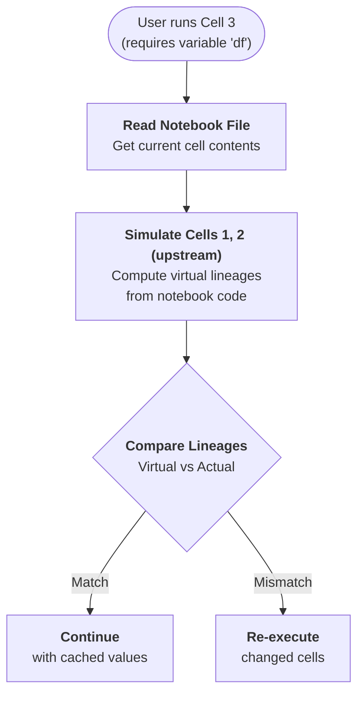
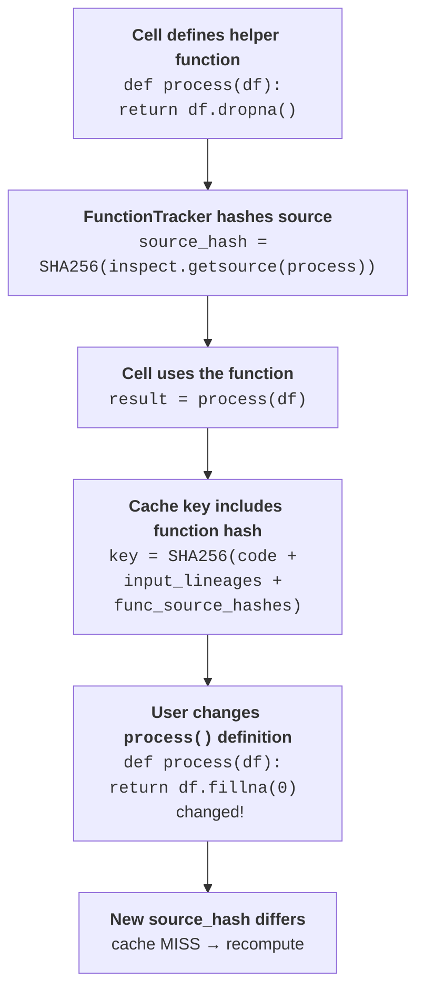

# Knowing when to recompute

Cash never silently serves a stale result: it propagates every change through the lineage chain so that a modification anywhere upstream triggers recomputation of everything downstream.

## Lineage propagation

A change in any cell propagates transitively through the lineage chain: if `raw` changes, every variable derived from `raw` — `clean`, `features`, `model` — is also invalidated, regardless of how many steps separate them. This follows directly from the way lineage hashes are built: a variable's lineage encodes the full history of everything that fed into it, so editing anything upstream produces a new lineage hash downstream without any explicit dependency declaration. See [cache keys and lineage](cache-keys-and-lineage.md#the-lineage-chain) for the full definition of the lineage hash.

## Finding your notebook

<!-- claim: cash/notebook/server_discovery.py:_NOTEBOOK_PATH_CACHE_TTL == 300.0 -->
To check upstream cells, Cash must read the live `.ipynb` file. It locates it through a prioritised fallback chain: first it reads the **VS Code injected variable** (`__vsc_ipynb_file__`) set by the Jupyter extension; if that is absent it tries the **`ipynbname` library** when installed; and finally it queries the **Jupyter Server REST API** (reliable inside JupyterLab or the classic Notebook). The resolved path is cached in memory for five minutes, and the cache is cleared whenever you switch notebooks via `%cash_on`.

Graceful degradation is by design. If notebook discovery fails entirely — for example in a plain IPython REPL or an environment where none of the three mechanisms succeed — Cash disables upstream checking rather than guessing. Notably, it does **not** fall back to scanning the filesystem for the most-recently-modified `.ipynb`: that heuristic can silently pick the wrong notebook, so Cash skips upstream detection instead. The current cell still uses its own code and input hashes, but stale-upstream detection is simply skipped. Cash never invalidates against a notebook it cannot see.

<!-- claim: cash/notebook/server_discovery.py:_NOTEBOOK_PATH_NEGATIVE_TTL == 2.0 -->
A *failed* lookup is memoised too, but for two seconds rather than five minutes — long enough to stop a dead Jupyter runtime entry from being probed once per statement, short enough that a notebook which becomes discoverable is picked up on the next cell.

## Upstream simulation

<!-- claim: cash/notebook/upstream/checker.py:UpstreamChecker @ba7e70bc, cash/notebook/upstream/simulator.py:NotebookSimulator @8ffd10e8 broad="the simulation story is the two orchestrating classes, not one method" -->
The classic problem: you edited cell 1 but then ran cell 3 directly. Cash solves this with a virtual-lineage approach. When cell 3 runs, Cash reads the current notebook file and *simulates* the upstream cells — cells 1 and 2 — without executing them. It parses each upstream statement's AST to compute what its lineage hash *should* be given the current code, then compares those virtual lineages against the in-memory lineages stored from the last actual run. Only the cells whose simulated lineage differs from what is in memory are re-executed; the rest are restored straight from cache, which is also how a variable you never computed this session appears in the namespace without its cell running.

??? question "Why AST analysis, not bytecode?"
    Cash reads each statement's inputs and outputs from Python's Abstract Syntax
    Tree — the canonical, version-stable representation — using the standard
    library `ast` module. It needs no execution, decomposes loops and conditionals
    cleanly, and stays readable. Bytecode inspection is more precise but
    version-dependent and opaque; runtime tracing is precise but far too slow.

??? question "Why simulate upstream cells instead of re-running them?"
    Simulation computes virtual lineage hashes by parsing upstream code and probing
    the cache — no user code runs, which is why it is worth doing on every cell.
    Cash re-executes only the cells whose simulated lineage differs from what's in
    memory, and it works correctly even if you reorder cells.

??? note "Under the hood"
    The orchestration lives in `UpstreamChecker`, which owns a `NotebookSimulator`.
    The forward simulation itself — walking each upstream cell's AST, inferring the
    names each statement reads and writes, and building the virtual lineage hashes —
    lives in `VirtualLineage`; `MismatchClassifier` decides what a divergence means
    and `ReexecutionPlanner` turns that into the list of statements to run. The
    simulator calls the *same* `compute_cache_key` the runtime does, so the two
    cannot compute different keys for the same statement.

The notebook path applies these rules per statement — see [what happens when you run a cell](notebook-path.md#what-happens-when-you-run-a-cell).

## What counts as a change

Several independent signals can cause a miss. The first four feed the [cache key](cache-keys-and-lineage.md#content-addressing), so any one of them is enough to produce a different key; the last three invalidate an entry that the key would otherwise have found.

=== "Code"
    The statement's own source hash changes → new key → recompute.

=== "Inputs"
    Any input variable's lineage changed → new key (this is lineage propagation).

=== "Functions / modules"
    Editing a helper function or an imported local module changes its source hash;
    caches that called it miss. Changes expand transitively across imported modules.

=== "Callee globals"
    A call site is also keyed on the globals its callees reach for at call time —
    including names bound *below* it, which the ordinary input path cannot see. A
    deleted callee contributes `ABSENT`, so the call re-runs and raises rather than
    reprinting a cached value.

=== "Files"
<!-- claim: cash/notebook/file_dep_snapshot.py:_HASH_FULL_MAX_BYTES == 8388608, cash/notebook/file_dep_snapshot.py:_HASH_SAMPLE_REGION_BYTES == 262144, cash/notebook/file_dep_snapshot.py:file_dep_is_fresh @5f35e472 -->
    A file you read (CSV, parquet, …) is snapshotted as mtime, size **and a content
    hash**. On every lookup the size is compared first, and when it matches, the
    content hash decides — so a bare `touch` no longer invalidates, and a same-size
    edit within the same second no longer slips through. Files over 8 MiB are hashed
    by sampling three size-derived regions rather than in full; since that partial
    hash can't see an edit *outside* those regions, sampled files additionally
    require the mtime to match, so a real in-place edit is still caught. The check runs
    against the file deps of the statement itself *and* those inherited from its
    input variables, so a changed CSV invalidates the whole chain that read it.

=== "TTL"
    An entry older than its `ttl` is dropped. `ttl=0` means "never fresh" and is
    honoured without consulting the clock; a statement calling a `@cash.cache`
    function with a shorter TTL inherits that shorter TTL.

=== "Mutation"
    A method call that mutates its receiver bumps the receiver's lineage, so
    everything downstream of it misses.

File tracking is covered in depth in [Dynamic Dependencies](../tutorials/feature-guides/dynamic-dependencies.md). Module tracking — including the `%cash_track` magic that brings third-party modules into scope — is documented in [Magic Commands](../magics.md).

??? note "Finer points"
    - **Granular module invalidation**: only variables that actually use the changed symbol are invalidated; variables that only touch unchanged symbols are preserved.
    - **From-import constants**: `from mymodule import VALUE` is tracked; if `VALUE` changes in the source module, downstream caches miss.
    - **Module-attribute dependencies**: Cash tracks attribute access paths (e.g. `mymodule.helper.process`) so that a change deep in a module tree propagates only to callers of the changed attribute, not to unrelated callers.
    - **Notebook TTL / freshness**: the resolved notebook path is considered fresh for five minutes; subsequent runs within that window skip the discovery step entirely, keeping overhead near zero.

## Mutation bumps the receiver's lineage

<!-- claim: cash/notebook/cacheability.py @27fe2e57 broad="the three-tier mutation classification spans the module, not one function" -->
`items.append(x)` names `items` as a *receiver*, not as an assignment target, so nothing about it would ordinarily move. Cash classifies every standalone method call and, when the call mutates, routes the receiver into the statement's outputs — its lineage is rebuilt from the statement's source, and everything downstream misses.

The classification runs in three tiers, because "does this method mutate?" is not statically decidable in general:

1. **Statically known** — `list.append`, `dict.update`, `inplace=True`, and friends, plus known-*pure* methods (`df.mean()`) that are excluded outright. `df.to_csv(path)` sits in a third static set: it reads the frame and writes a file, so it must *not* bump the frame's lineage.
2. **Identity-coupled receivers** — a method call on a live matplotlib `Axes`/`Figure` draws on it whatever it returns, so it always counts as a mutation.
3. **Observed** — for everything else Cash content-hashes the receiver before and after execution and records the verdict, keyed by the statement's source hash.

That verdict dictionary is shared with the upstream simulation, which cannot observe execution and therefore reads the runtime's recorded answer; an unknown verdict is treated as mutating. Because the bump is derived from the statement's *source* in both engines, the runtime and the simulation compute byte-identical lineages — the invariant the whole restore path rests on. Module receivers are excluded (`time.sleep()` is a module function call, not a mutation).

## Randomness: re-seeding invalidates the draws below it

`x = np.random.rand(3)` has stable source and no tracked inputs. Editing `np.random.seed(0)` to `seed(1)` above it therefore moved nothing, and Cash replayed the first seed's numbers — following the documented advice for reproducibility produced provably wrong values. Three mechanisms now cover this, and they are separate on purpose:

<!-- claim: cash/notebook/randomness.py:hidden_lineage_writes @1369d609, cash/notebook/randomness.py:hidden_lineage_reads @e9ddd20b -->
- **The seed is a hidden lineage variable.** A `seed()` writes `__cash_rng__<module>`, a draw reads it, and that lineage flows through the ordinary input path — so a re-seed re-keys the draw *and* propagates to everything cached downstream of it.
- **A stale RNG replay is suppressed.** Restoring a cached statement also restores the RNG state it left behind, which keeps the stream coherent when a restore stands in for an execution. After a re-seed that replay would rewind the generator to the old regime, so entries record the seed epoch they were written under and are only replayed while it still holds. Keying the draw was necessary but not sufficient — both halves are required.
- **The stream is repositioned before a re-executed draw.** If reconstruction re-runs a draw because one of its *ordinary* inputs changed, the unchanged `seed()` above it is not scheduled, so the draw would continue from wherever the live stream happened to be. Cash restores the position that draw holds top-to-bottom before running it.

!!! warning "An unseeded draw is frozen, not blocked"
    Cash caches unseeded randomness deliberately. The first value you drew is the value
    you keep: on a re-run the statement lands on the same stream position and redraws the
    same number, whether or not the value was ever written to the cache. That is the
    point — a notebook stays reproducible — but it means an unseeded draw does **not**
    give you a fresh number on re-run. `# @cash:allow-random` only silences the warning;
    `# @cash:no-cache` is what switches the freeze off.

## Try it: the invalidation playground

Mark a change on any cell below and watch which downstream cells go stale.

| Cell | If you change `raw` | If you change `features` |
|---|---|---|
| `raw = pd.read_csv('data.csv')` | recompute | cache hit |
| `clean = raw.dropna()` | recompute | cache hit |
| `features = engineer(clean)` | recompute | recompute |
| `model = train(features)` | recompute | recompute |

