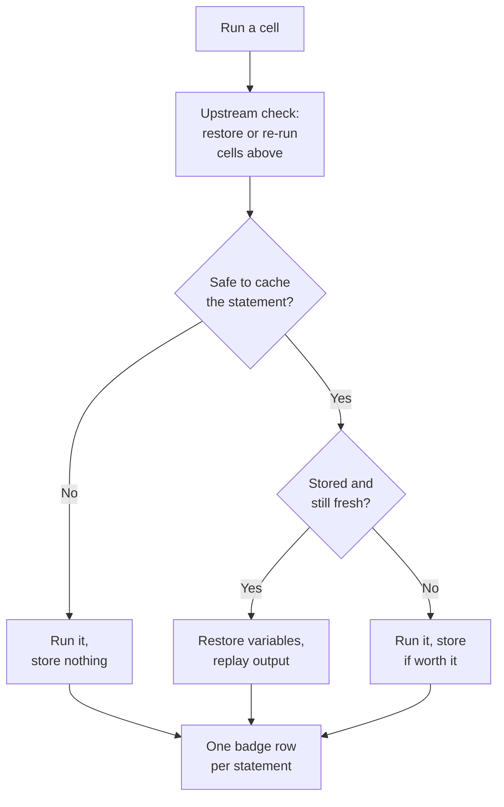

# The notebook path

!!! info "Applies to: notebook"
    Jupyter, JupyterLab, VS Code and Colab users who run `%cash_on`.

After `%cash_on`, Cash handles every cell you run, one statement at a time.
You write ordinary notebook code; for each statement Cash either restores the
stored result or runs it and stores what it produced.

## What happens when you run a cell



<!-- claim: cash/notebook/ipython/cell_executor.py:CellExecutor.execute_cell @2561f548, cash/notebook/statement/processor.py:StatementProcessor.process_statement @04870aa4 -->
1. **Inputs.** Cash reads from the cell's source which variables it uses.
2. **Upstream check.** If an input is missing (after a restart) or a cell above
   it was edited, Cash works out from the notebook's code which statements
   above are out of date, restores what is still valid and re-runs the rest.
   [Knowing when to recompute](invalidation.md#upstream-simulation) explains
   how.
3. **Statements.** Cash splits the cell into statements. For each one it
   decides whether it is safe to cache
   ([knowing when not to cache](safety.md)). If it is, Cash builds its
   [key](cache-keys-and-lineage.md) and looks it up: a hit restores the
   variables and replays the output; a miss runs the statement and stores the
   result. A statement that is not safe to cache runs without a lookup.
4. **Badge.** Cash prints a badge with one row per statement: `CACHED`,
   `EXECUTED`, `NOT CACHED` (with the reason) or `SKIPPED`.
   [Reading the badge](../badges.md#statuses) lists every status.

Cash caches statements rather than whole cells so that editing one line keeps
the rest of the cell's work. The price is a few milliseconds of bookkeeping
per statement, which the badge reports as Cash's own overhead.

## Fine-grained caching: loops and branches

<!-- claim: cash/notebook/control_structures/common.py:compute_context_hash @10c994da, cash/notebook/control_structures/for_handler.py:ForLoopHandler.process @f4b52c27 -->
A `for` loop is cached one iteration at a time. Each iteration's statements
are keyed with the loop variable's value, so changing one item of the list
does not throw away the others.

Whether the other iterations are reused depends on the body. This loop writes
into `stats`, so each iteration reads what the previous ones built:

```python { .nb-cell }
import time

def compute(ticker):
    time.sleep(0.01)
    return len(ticker)

stats = {}
for ticker in ["AAPL", "MSFT", "GOOGL"]:
    stats[ticker] = compute(ticker)
```

Appending a ticker or editing the last one re-runs one statement. Editing the
**first** one re-runs all three statements, because each later one reads the
changed `stats`. The expensive call still runs only once: Cash also caches the
call inside the statement (`compute(ticker)`), keyed on its arguments, so
`MSFT` and `GOOGL` come from the call cache.

| Change to the list | Statements re-run | `compute()` calls |
|---|---|---|
| none | 0 | 0 |
| append `"NVDA"` | 1 | 1 |
| edit the last entry | 1 | 1 |
| edit the first entry | 3 | 1 |

`# @cash:no-cache-calls` turns call caching off; then the two columns match. A
body that does not accumulate, such as `price = compute(ticker)`, has no such
chain: each iteration depends only on its own item. See
[call-level caching](../annotations.md#call-level-caching-default-and-cashno-cache-calls)
and [reordering a loop's items](../known-limitations.md#reordering-a-loops-items-re-runs-the-tail).

<!-- claim: cash/notebook/control_structures/if_handler.py:IfHandler.process @75ed4110, cash/notebook/control_structures/processor.py:ControlStructureProcessor.process @1fe61e2d -->
`if`/`elif`/`else` and `try`/`except` bodies are cached statement by
statement too, and only the branch that ran is stored. `while` and `with`
blocks are cached as one unit, because they have no list of items to key on,
and so is a `for` with `break`, `continue` or `else:`, whose outcome depends
on how the loop ended.
A long loop whose per-iteration bookkeeping stops paying for itself is also
cached as one unit ([cost model](../cost-model.md)).

## Decorated functions inside a cell

When a statement calls a `@cash.cache` function, the statement's badge lists
the function with how many of its calls were served from its own cache:

```
[Cash] EXECUTED (0.02s)
  EXECUTED: r2 = [f(i) for i in range(6)]  (0.01s) -> RAM
  @cash.cache:
    f(): 5/6 cached (0.012s)
```

<!-- claim: cash/notebook/badge_renderer/view_builder.py:_CONDENSE_THRESHOLD == 3 -->
In the HTML badge each call gets its own row until a function has more than
three calls in the statement; then they fold into one expandable row.

## Picking up after a kernel restart

After a restart, run any cell. Cash restores the variables it needs from the
cache, checking first that the code that produced them is unchanged. For a
chain of steps (`df = load()`, then `df = clean(df)`), it restores the final
value directly instead of replaying each step.

<!-- claim: cash/notebook/control_structures/processor.py:ControlStructureProcessor._persistable_callees @7692fb7f -->
A value built by a `for` loop can be restored too. Cash records what the loop
produced when it ran, and trusts that record after a restart only while
everything the loop and its functions read is unchanged, and only if the loop
did nothing else: no file written, no draw from the global random generators,
no clock, `uuid` or environment read, no global changed in place. Otherwise
the loop runs again. The loop's own working variables (`parts` in
`for f in files: parts.append(read(f))`) are not stored; a cell that reads
them runs the loop.

<!-- claim: cash/analysis/mutations.py:module_setting_receivers @2a5a82f5 -->
A setting kept inside a library, such as `plt.style.use("ggplot")`,
`plt.rcParams.update(...)`, `pd.set_option(...)` or
`warnings.filterwarnings(...)`, is not a variable Cash can store. After a
restart, a cell that uses that module runs the setting line again first, so a
chart keeps the notebook's style.

<!-- claim: cash/notebook/upstream/file_writers.py:FileWriterScheduler._writer_output_already_fresh @982cbefa, cash/notebook/upstream/file_writers.py:FileWriterScheduler.find_stale_file_writer_indices @5c48f391 -->
A cell that writes files (`df.to_csv(...)`, `fig.savefig(...)`) is not re-run
after a restart just because it ran in an earlier kernel. Cash records the
files it wrote and the lineages of what it read. It re-runs the writer only
when the cell you run reads one of those files (directly or through a helper)
and the file is gone or changed, or what the writer read has changed. A read
whose path Cash cannot work out rules nothing out, so a writer above may be
re-run to be safe. Files written by a C extension without Python's `open` are
not seen; such a writer is re-run.

A writer whose file the cell does not read is left alone. If an edit upstream
changed what it would write, the badge adds a `STALE FILE: … not rewritten`
line naming the statement to re-run. Before exporting, run the exporting cells
themselves, or the last cell of the notebook.
