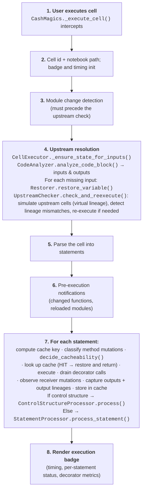
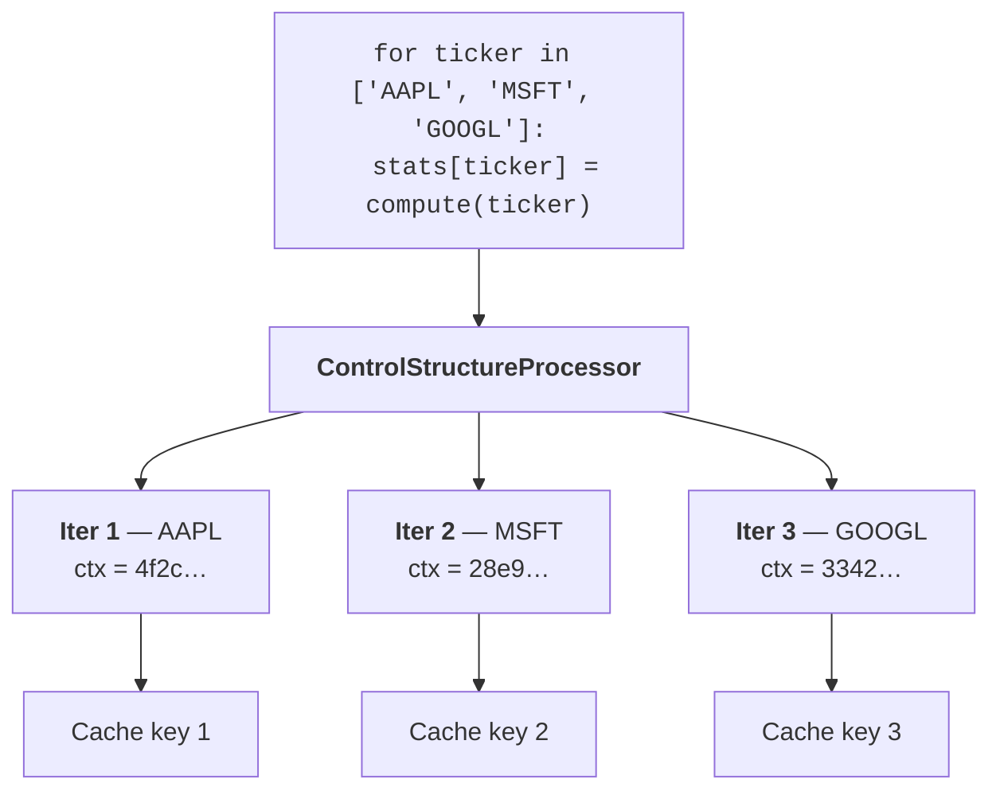

# The notebook path

Turn on caching with `%cash_on` and Cash hooks every cell you run. You write
ordinary notebook code; Cash quietly decides, *statement by statement*, whether
to replay a cached result or execute fresh. This page follows a cell from the
moment you hit **Run**.

The shape of every statement's journey is the same:

<div class="cash-stmt-flow" aria-hidden="true" markdown="0">
  <span class="cash-stmt-step" data-step="1">Run cell</span>
  <span class="cash-stmt-arrow">→</span>
  <span class="cash-stmt-step" data-step="2">Analyze</span>
  <span class="cash-stmt-arrow">→</span>
  <span class="cash-stmt-step" data-step="3">Safe?</span>
  <span class="cash-stmt-arrow">→</span>
  <span class="cash-stmt-step" data-step="4">Cache key</span>
  <span class="cash-stmt-arrow">→</span>
  <span class="cash-stmt-step" data-step="5">Hit / Miss</span>
</div>

## What happens when you run a cell

<!-- claim: cash/notebook/ipython/magics.py:CashMagics._execute_cell @6944c822, cash/notebook/ipython/cell_executor.py:CellExecutor.execute_cell @6b1a160f -->
`CashMagics` stands in front of IPython's `run_cell`, and hands the cell to
`CellExecutor.execute_cell()`. Steps 2-7 below are that method's own
seven phases; step 1 (interception) and step 8 (badge render) happen in
`CashMagics` around it:



A few of these steps deserve a closer look:

- **Step 4 — making inputs available.** Before a cell can run, every variable
  it reads has to exist. If one is missing (you restarted the kernel, or jumped
  ahead), Cash restores it from cache and *simulates the upstream cells* to
  check nothing it depends on has changed. That upstream machinery — virtual
  lineage, mismatch detection — is the subject of
  [Staying correct: invalidation](invalidation.md). This page and that one
  describe the same engine from two angles: here it's "how a cell runs," there
  it's "how a cell knows it's stale."
<!-- claim: cash/notebook/cacheability_decision.py:decide_cacheability @894ac130, cash/notebook/statement/processor.py:StatementProcessor.process_statement @728813ad -->
- **Step 7 — the per-statement decision.** Each statement passes the detector
  pre-checks from [Safety](safety.md) — merged into one verdict by
  `decide_cacheability` — before the cache is consulted at all. If the verdict
  is "cacheable", Cash computes the [cache key](cache-keys-and-lineage.md) and
  looks it up: a hit short-circuits, a miss executes and stores. If the verdict
  is "not cacheable", the lookup is skipped entirely and the statement simply
  runs.
- **Step 8 — the badge.** Every run paints an execution badge so you can see,
  at a glance, what was reused and what recomputed (see
  [Inspecting what Cash did](inspecting.md)).

Each statement row on the badge carries one status:

| Status | Meaning |
|--------|---------|
| `CACHED` | Served from cache; the row shows the time saved |
| `EXECUTED` | Ran, and the result was stored |
| `NOT CACHED` | Executed, deliberately not stored — the row names the reason |
| `SKIPPED` | Not re-run at all (a redundant import, or already covered) |
| `FUNC CHANGED` / `MODULE RELOADED` | A notification row, not a statement |

The plain-text badge (`%cash_badge print`) is ASCII-only on purpose: its output
is read by a *different* process than the one that wrote it — nbconvert, a log
scraper, an agent parsing the `.ipynb` — and an emoji encoded by a UTF-8 kernel
crashes a `cp1252` console with `UnicodeEncodeError`. The status label already
carries the meaning, so no glyph is lost.

## Fine-grained caching: loops and branches

Caching a whole loop as one blob is brittle — change one iteration and you lose
them all. For a `for` loop, Cash instead caches **each iteration separately**,
keyed on the loop variable's value:



<!-- claim: cash/notebook/control_structures/processor.py:compute_context_hash @589aad3c, cash/notebook/control_structures/for_handler.py:ForLoopHandler.process @77ef09c3 -->
The mechanism is deliberately plain: the context hash is prepended to the body
statement as a *comment*, so it flows into the ordinary statement cache key
through the source hash — no special key format is needed.

```python
import hashlib

# What compute_context_hash (module level, control_structures/processor.py) does:
context = {"ticker": "AAPL"}
context_hash = hashlib.sha256(str(sorted(context.items())).encode("utf-8")).hexdigest()[:16]

body = "stats[ticker] = compute(ticker)"
statement_source = f"# __iteration_context__: {context_hash}\n{body}"

assert statement_source.startswith("# __iteration_context__: ")
# ...and the statement key is then the usual
# "stmt:" + sha256(source_hash + input lineages + occurrence index + ...).
```

The payoff is **partial cache hits** — but *which* ones you get depends on the
body, and it is worth knowing before you rely on it.

`stats[ticker] = compute(ticker)` writes into `stats`, so each iteration reads
the dict the previous ones built. That makes reuse of the **statement's own
cache entry** a prefix property: appending a ticker, or editing the last one,
leaves the earlier iterations' statement keys untouched, while changing the
**first** entry changes every iteration's statement key from that point on,
because each one's key incorporates the dict as the previous iteration left
it.

That's still true, and it always will be — a prefix chain is what a fold
*is*. What's no longer true is that a changed statement key means a repeated
`compute()` call. By default, cash also caches the **call inside** the
statement (`compute(ticker)` here, not the assignment around it — see [Call-level
caching](../annotations.md#call-level-caching-default-and-cashno-cache-calls-alias-nocachecalls)),
and a call cache keys on arguments, not on execution history. So a re-executed
statement whose call has already been made with the same argument resolves
that call from cache instead of actually running it. Measured on this exact
loop, with the current default:

| Change to the list | Statements re-executed | `compute()` calls |
|---|---|---|
| re-run unchanged | 0 | 0 |
| append `'NVDA'` | 1 | 1 |
| edit the last entry | 1 | 1 |
| edit the **first** entry | 3 | 1 |

Editing the first entry still re-executes all three statements — `stats`'
prefix chain is real and the assignment itself still has to run three times
to reproduce it — but only the genuinely new ticker (`AMZN` replacing `AAPL`)
costs an actual `compute()` call. `MSFT` and `GOOGL` were called with these
exact arguments before, so the call cache serves them without invoking
`compute` again, regardless of which iteration they're attached to this time.

Turn call-level caching off (`# @cash:no-cache-calls`) and you get the
`compute()` calls column back matching the "statements re-executed" column —
the historical, pre-default-on shape where editing the first entry costs
three calls, not one.

A body that doesn't accumulate has no such chain — with `price =
compute(ticker)` each iteration depends only on its own loop variable, so any
one of them can change on its own and the rest still hit, at the statement
level as well as the call level. See
[Reordering a loop's items](../known-limitations.md#reordering-a-loops-items-re-runs-the-tail).

<!-- claim: cash/notebook/control_structures/if_handler.py:IfHandler.process @7cb54870, cash/notebook/control_structures/try_handler.py:TryHandler.process @c03cc7e0 -->
Conditionals work the same way with a different marker: `if`/`elif`/`else` and
`try`/`except` bodies are decomposed per statement and tagged with a
`# control_context:` branch hash, so only the branch that actually ran is
cached and unused branches never pollute the key space.

<!-- claim: cash/notebook/control_structures/processor.py:ControlStructureProcessor.process @ac7a00ad, cash/notebook/control_structures/processor.py:get_control_structure_type @eb40f97d -->
`while` and `with` are the exception — they are executed as a **single cacheable
unit** through the statement processor rather than decomposed, because neither
has an enumerable iteration space to key on.

!!! note "Mutations inside a loop body"
    A body statement that mutates an outside variable (`results.append(row)`,
    `d[k] = v`) is handled by the ordinary safety rules from
    [Safety](safety.md), with one deliberate difference: the per-statement
    method-mutation classifier is switched off inside a control body. The
    upstream simulation treats a loop or branch as one unit, so bumping a body
    statement's receiver lineage from a per-statement source would desync the
    two. The control structure owns its body's mutation lineage instead.

## Picking up after a kernel restart

The most visible payoff of statement-level caching is that your notebook state
survives a restart. Run a cell that needs `df` after restarting, and Cash
rebuilds just what's required:


For a deep chain, Cash doesn't replay every step — it **virtual-restores** the
final value straight from cache:

<!-- test:skip reason="illustrative pseudo-code (just comments)" -->
```python
# Instead of re-running the whole chain:
# df = pd.read_csv('data.csv')   # 5s
# df = df.sort_values('date')    # 2s
# df = df.groupby('x').sum()     # 3s

# Cash restores the final 'df' directly:  ~0.1s (deserialization only)
```

!!! tip "The other half of the story"
    Restoration is only safe because Cash can prove the cached value is still
    current. That proof — lineage hashes, upstream simulation, what counts as a
    change — is covered in **[Staying correct: invalidation](invalidation.md)**.
    Read the two pages together: this one is *how state comes back*, that one is
    *how Cash knows the state is still valid*.
