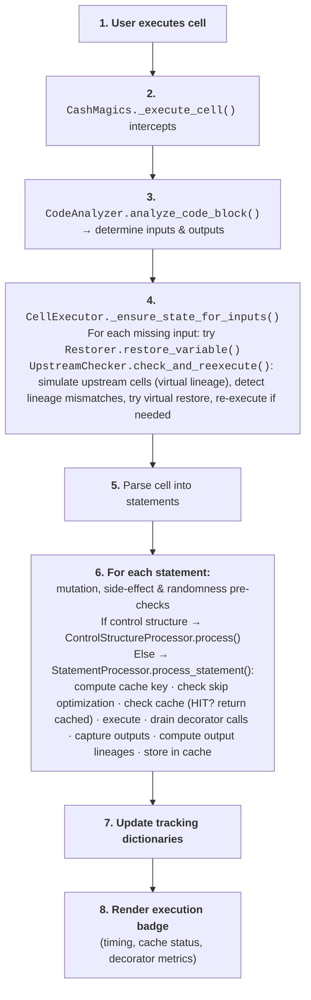
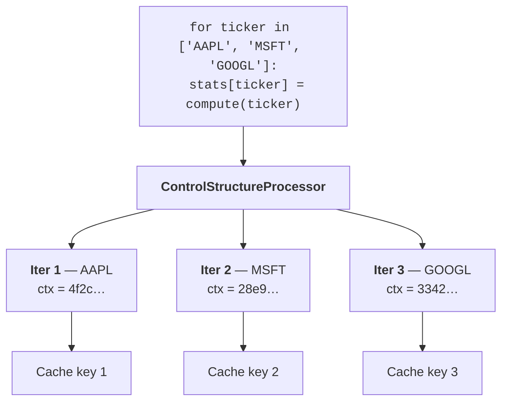
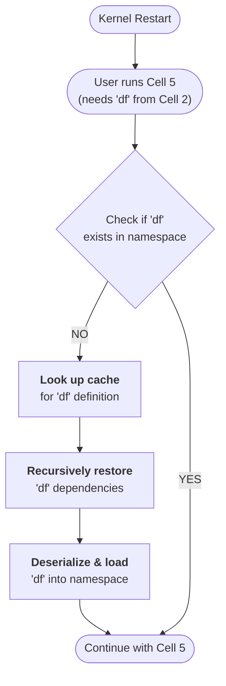

# The notebook path

Turn on caching with `%cash_on` and Cash hooks every cell you run. You write
ordinary notebook code; Cash quietly decides, *statement by statement*, whether
to replay a cached result or execute fresh. This page follows a cell from the
moment you hit **Run**.

The shape of every statement's journey is the same:

<div class="cash-stmt-flow" aria-hidden="true" markdown="0">
  <span class="cash-stmt-step" data-step="1">Run cell</span>
  <span class="cash-stmt-arrow">→</span>
  <span class="cash-stmt-step" data-step="2">Analyze</span>
  <span class="cash-stmt-arrow">→</span>
  <span class="cash-stmt-step" data-step="3">Safe?</span>
  <span class="cash-stmt-arrow">→</span>
  <span class="cash-stmt-step" data-step="4">Cache key</span>
  <span class="cash-stmt-arrow">→</span>
  <span class="cash-stmt-step" data-step="5">Hit / Miss</span>
</div>

## What happens when you run a cell



A few of these steps deserve a closer look:

- **Step 4 — making inputs available.** Before a cell can run, every variable
  it reads has to exist. If one is missing (you restarted the kernel, or jumped
  ahead), Cash restores it from cache and *simulates the upstream cells* to
  check nothing it depends on has changed. That upstream machinery — virtual
  lineage, mismatch detection — is the subject of
  [Staying correct: invalidation](invalidation.md). This page and that one
  describe the same engine from two angles: here it's "how a cell runs," there
  it's "how a cell knows it's stale."
- **Step 6 — the per-statement decision.** Each statement first passes the
  three detector pre-checks from [Safety](safety.md). If it's safe, Cash
  computes the [cache key](cache-keys-and-lineage.md), checks the skip optimisation, then
  the cache. A hit short-circuits; a miss executes and stores.
- **Step 8 — the badge.** Every run paints an execution badge so you can see,
  at a glance, what was reused and what recomputed (see
  [Inspecting what Cash did](inspecting.md)).

## Fine-grained caching: loops and branches

Caching a whole loop as one blob is brittle — change one iteration and you lose
them all. Cash instead caches **each iteration separately**, keyed on the loop
variable's value plus an *iteration-context hash*:



The iteration-context hash makes each key unique:

```
context_hash  = SHA256([("ticker", "AAPL")])          # → "4f2ca162…"
statement_key = SHA256("stmt:" + source_hash + ":" +
                       input_lineages + ":" +
                       "__iteration_context__:" + context_hash)
```

The payoff is **partial cache hits**: edit the `AAPL` case and only that
iteration recomputes; `MSFT` and `GOOGL` still hit. Conditionals work the same
way — only the branch that actually ran is cached (`branch=if` vs
`branch=else`), so unused branches never pollute the key space.

## Picking up after a kernel restart

The most visible payoff of statement-level caching is that your notebook state
survives a restart. Run a cell that needs `df` after restarting, and Cash
rebuilds just what's required:



For a deep chain, Cash doesn't replay every step — it **virtual-restores** the
final value straight from cache:

<!-- test:skip reason="illustrative pseudo-code (just comments)" -->
```python
# Instead of re-running the whole chain:
# df = pd.read_csv('data.csv')   # 5s
# df = df.sort_values('date')    # 2s
# df = df.groupby('x').sum()     # 3s

# Cash restores the final 'df' directly:  ~0.1s (deserialization only)
```

!!! tip "The other half of the story"
    Restoration is only safe because Cash can prove the cached value is still
    current. That proof — lineage hashes, upstream simulation, what counts as a
    change — is covered in **[Staying correct: invalidation](invalidation.md)**.
    Read the two pages together: this one is *how state comes back*, that one is
    *how Cash knows the state is still valid*.
