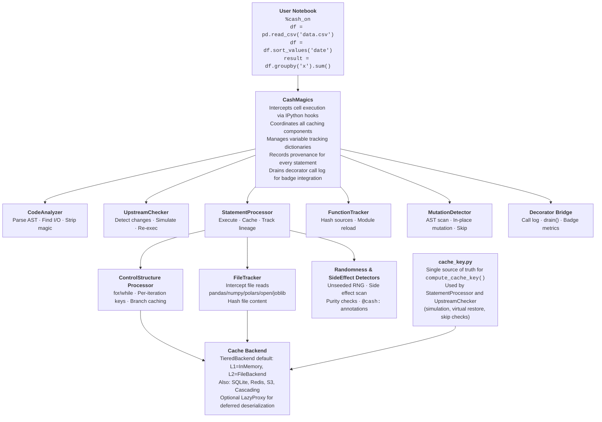

# How Cash works — overview

Cash watches your code run, fingerprints each computation and its inputs, and
restores a saved result instead of recomputing whenever nothing relevant has
changed. This section is the guided tour: start here, then follow the journey
through cache keys, invalidation, safety, the two caching paths, storage, and
the tools that let you verify what Cash did.

## The core loop

Every computation Cash touches — a notebook statement or a decorated function call — passes through the same five steps. Cash **analyzes** which variables and files the code reads and writes, **keys** the computation by fingerprinting the code together with its current inputs, **checks** the backend to see whether that exact fingerprint is already stored, then either **executes** the code fresh or **restores** the saved result, and finally **tracks** lineage so that anything downstream knows what it depends on.

The trust thesis is simple: Cash recomputes whenever something relevant changed, and refuses to cache when caching would be unsound. If your code reads a file that was modified, calls a function whose source changed, or produces a result that is non-deterministic, Cash will not serve you a stale answer.

  analyze
  key
  check
  execute / restore
  track

## One core, two front-ends

Under the surface, Cash is one engine: a shared set of cache-key computation rules, a lineage and dependency-hashing layer, a family of invalidation policies, and a pluggable storage tier. What varies is only how you drive it. The **notebook path** (`%cash_on`) operates statement by statement — Cash intercepts each line of a cell via IPython hooks and decides independently whether to execute or restore. The **decorator path** (`@cash.cache`) wraps a Python function — Cash intercepts each call and caches the return value.

The next pages explain the shared foundation first, then each path's specifics. If you read from top to bottom you will understand both paths by the time you reach the storage and inspection pages.

??? question "Why statement-level, not whole-cell?"
    Cash caches each statement in a cell independently rather than the cell as a
    unit. If a 3-statement cell changes only its first line, statements 2 and 3
    still restore from cache; a one-line edit never throws away a cell full of
    expensive work; and individual loop iterations can be cached separately. The
    cost is a more involved implementation (per-statement AST parsing and lineage)
    and ~5 ms of per-cell overhead — a trade Cash makes deliberately, because
    real notebooks pile several operations into one cell.

## Where to go next

**[Cache keys, lineage & hashing](cache-keys-and-lineage.md)** — how Cash fingerprints a computation.

**[Knowing when to recompute](invalidation.md)** — how a change ripples downstream.

**[Knowing when not to cache](safety.md)** — the safety net.

**[The notebook path](notebook-path.md)** — `%cash_on`, statement by statement.

**[The decorator path](decorator-path.md)** — `@cash.cache` on functions.

**[Where your cache lives](storage.md)** — tiers, promotion, serialization.

**[Seeing what Cash did](inspecting.md)** — badges, provenance, audit logs.

