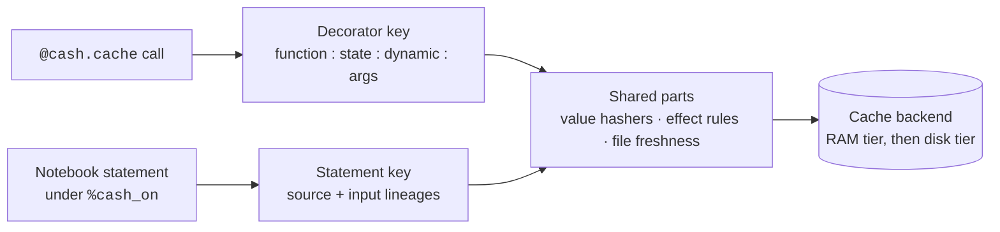

# How Cash works

!!! info "Applies to: both paths"
    Anyone who wants to know why Cash reused a result, recomputed it or refused to cache it.

Cash has two caching engines. They share building blocks, but each decides on
its own terms, so this section explains them separately.

<!-- claim: cash/decorator/runtime.py:RuntimeMixin._build_key @bdf9b846, cash/notebook/cache_key.py:compute_cache_key @c2321118 -->
- **The decorator** (`@cash.cache`) caches a function's return value. A call is
  keyed on the function's code, everything the function reads that is not an
  argument, and the arguments. A script that uses it never loads anything
  notebook-related.
- **The notebook engine** (`%cash_on`) caches each statement of each cell you
  run. A statement is keyed on its source and on the *lineage* of the variables
  it reads: a fingerprint of how each variable was produced.

## What the two engines share

- **Value hashing.** A DataFrame, array or other value is fingerprinted by its
  content with the same hashers on both paths. Source code is hashed after
  comments, docstrings and formatting are stripped.
- **The effect rules.** One list says which calls write files, send requests,
  read the clock or read the environment. Environment reads become part of the
  key on both paths; what happens on the rest differs (below).
- **File freshness.** A file that tracked code reads is recorded with a content
  hash and checked again before its result is reused. See
  [what counts as a change](invalidation.md#what-counts-as-a-change).
- **Storage.** Both write to the same backends and the same cache folder. See
  [where your cache lives](storage.md).

## Where they differ

<!-- claim: cash/backends/persistence_policy.py:COMPUTE_FLOOR_S == 0.1 -->
| | Decorator | Notebook |
|---|---|---|
| What is cached | a call's return value | a statement's assigned variables; each loop iteration on its own |
| Key | function name, state, dynamic dependencies, arguments | statement source, input lineages, called functions |
| A side effect (file write, POST) | warns, then caches; a hit skips the effect | refuses to cache the statement; it runs every time |
| Written to disk | always, unless a size cap refuses it | when it took at least 0.1 s and restoring beats recomputing |
| On a hit | returns the value; `print` output is not replayed | restores the variables and replays the statement's output |

Both engines recompute when something they track changes, and both keep the
first value of an unseeded random draw rather than drawing again. Some inputs
are not tracked, such as a file opened through a reader Cash does not wrap.
[Known limitations](../known-limitations.md) lists them.

## Where to go next

- Decorator: [how `@cash.cache` decides](decorator-path.md), then
  [where your cache lives](storage.md) and
  [seeing what Cash did](inspecting.md).
- Notebook: [the notebook path](notebook-path.md),
  [cache keys and lineage](cache-keys-and-lineage.md),
  [knowing when to recompute](invalidation.md),
  [knowing when not to cache](safety.md), then storage and inspecting.
