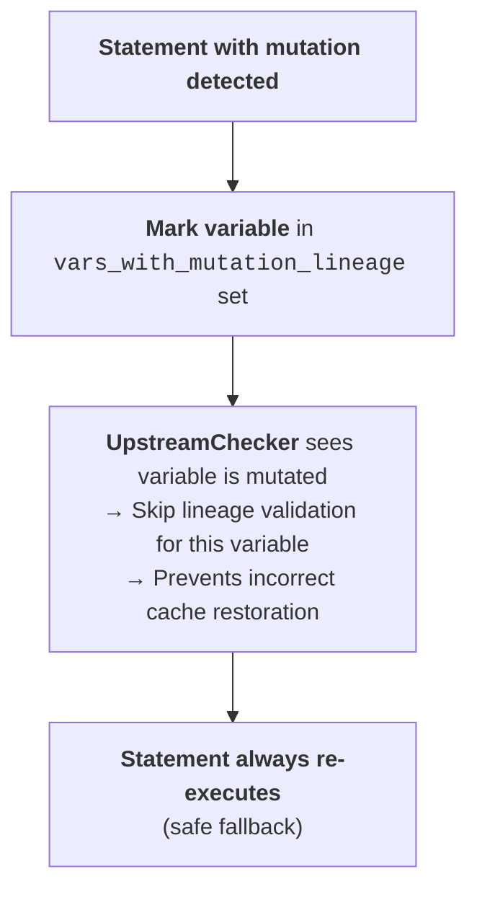

# Knowing when *not* to cache

Cash's first rule is **never serve a wrong answer**. When it cannot prove a
statement is safe to replay, it re-executes instead of guessing. This page
walks the three things Cash watches for — mutations, side effects, and
unseeded randomness — and shows the verdict it reaches for real snippets.

## The mutation problem

A cached value is a *snapshot*. If a later cell mutates that value in place,
the snapshot and the live object drift apart:

<!-- test:skip reason="illustrative pseudo-code (Cell 1/Cell 2 separators)" -->
```python
# Cell 1
data = [1, 2, 3]      # cached snapshot: [1, 2, 3]

# Cell 2
data.append(4)        # data is now [1, 2, 3, 4] — but the cache still holds [1, 2, 3]
```

Without mutation detection, re-running Cell 2 would *skip* (same code, same
lineage) and leave `data` wrong. Cash's `MutationDetector` scans each
statement's AST for the patterns that mutate in place:

| Pattern | Example | How it's detected |
|---------|---------|-------------------|
| Method calls | `list.append()`, `dict.update()`, `set.add()` | Known mutating methods |
| Augmented assign | `x += 1`, `total *= 2` | `ast.AugAssign` node |
| Subscript assign | `d['key'] = val`, `arr[0] = 1` | `ast.Assign` with `ast.Subscript` target |
| Attribute assign | `obj.attr = val` | `ast.Assign` with `ast.Attribute` target |
| `del` subscript | `del d['key']` | `ast.Delete` with `ast.Subscript` |
| Pandas inplace | `df.drop(inplace=True)` | `inplace=True` keyword |

When a mutation is found, Cash marks the variable and **stops skipping** it —
the statement re-executes every run, so the live object and any downstream
reads stay correct:



??? question "Why detect mutations but not rewrite lineage?"
    Cash *detects* mutations and disables the skip optimisation for the
    affected variable — it does **not** fold the mutation into that variable's
    lineage hash. That sounds like the obvious fix, but it breaks accumulator
    patterns. If Cell 1 does `items = []` and Cell 2 does `items.append(x)`,
    rewriting `items`'s lineage in Cell 2 would make Cell 3 miss every time,
    because `items` now hashes differently than it did when Cell 3 first ran.
    Detection alone is enough: knowing a variable was mutated lets Cash turn
    off skipping for it, which is all that's needed to avoid a stale read.
    **The default is always "better to re-run than to cache incorrectly."**

## Side effects

Some statements don't just compute a value — they *do something to the world*.
Replaying them from cache would skip the action (a file never gets written, a
request never gets sent). Cash's `SideEffectDetector` flags these statements as
**uncacheable** so they always run:

| Pattern | Examples | Why it's unsafe to replay |
|---------|----------|---------------------------|
| File writes | `open('f', 'w')`, `to_csv()`, `to_parquet()` | The file wouldn't be written on a cache hit |
| Network calls | `requests.get()`, `urllib` | The request wouldn't be sent |
| Database ops | `cursor.execute()`, `session.commit()` | The write wouldn't reach the DB |
| System calls | `os.system()`, `subprocess.run()` | The process wouldn't run |
| Print to file | `print(..., file=f)` | The output wouldn't be emitted |

## Unseeded randomness

Random calls are *deterministic only if seeded*. The `RandomnessDetector`
scans for unseeded draws and **issues a warning** (the statement is still
cached — the first result is simply frozen):

| Module | Tracked functions |
|--------|-------------------|
| `random` | `random()`, `randint()`, `choice()`, `shuffle()`, `sample()`, `uniform()`, … |
| `numpy.random` | `rand()`, `randn()`, `randint()`, `choice()`, `shuffle()`, `normal()`, … |
| `torch` | `rand()`, `randn()`, `randint()`, … |

The detector tracks `seed()` calls: once a module is seeded, later draws from
it are treated as deterministic and no warning fires. To silence the warning
deliberately, annotate the statement with `@cash:allow-random` (see
[Annotations](../annotations.md)).

## From watching to deciding

The three detectors run as *pre-checks* on every statement, before Cash
touches the cache. Their combined verdict gates the cache lookup itself:

```python
# pre-checks (per statement)
mutations    = MutationDetector.detect(code)
side_effects = SideEffectDetector.detect(code)
randomness   = RandomnessDetector.detect(code)

# the cache is only consulted when it's safe to do so
if not mutations and not side_effects:
    metadata, cached_data = backend.get(cache_key)   # HIT short-circuits here
```

So the decision is simple and conservative: **mutation or side effect → always
re-run; unseeded randomness → cache but warn; otherwise → cache normally.** Try
it on real snippets below.

<div class="cash-cacheability-checker" markdown="0">
  <table>
    <thead><tr><th>Statement</th><th>Verdict</th></tr></thead>
    <tbody>
      <tr><td><code>df = pd.read_csv('data.csv')</code></td><td>Cached — the file is tracked as a dependency</td></tr>
      <tr><td><code>result = df.groupby('k').sum()</code></td><td>Cached — pure transformation</td></tr>
      <tr><td><code>data.append(4)</code></td><td>Not cached — mutation detected</td></tr>
      <tr><td><code>total += 1</code></td><td>Not cached — augmented assignment is a mutation</td></tr>
      <tr><td><code>x = np.random.randn(100)</code></td><td>Cached + warning — unseeded randomness</td></tr>
      <tr><td><code>df.to_parquet('out.pq')</code></td><td>Not cached — file-write side effect</td></tr>
      <tr><td><code>r = requests.get(url)</code></td><td>Not cached — network side effect</td></tr>
    </tbody>
  </table>
</div>

Cash also exposes these verdicts at runtime: `@cash:no-cache` forces a
statement to never cache, and the decorator path has matching **purity
markers** for functions — see [The decorator path](decorator-path.md).
