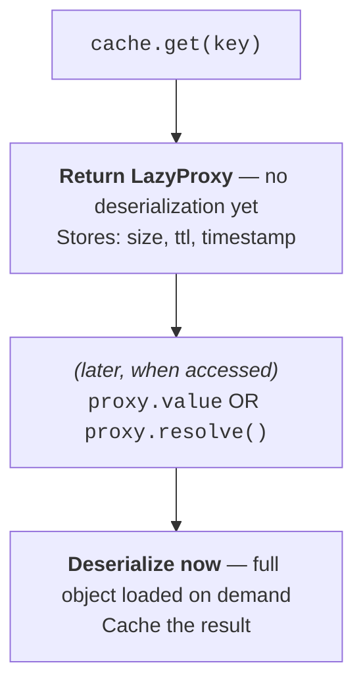

# Where your cache lives

A cache is only useful if reading it back is cheaper than recomputing. Cash's
default backend is **tiered**: a fast in-memory layer in front of a persistent
on-disk layer, with a promotion policy that decides what's worth writing down.

## The tiers

The default `TieredBackend` stacks two layers, fastest first:

| Tier | Backend | Speed | Survives restart? |
|------|---------|-------|-------------------|
| **L1** | `InMemoryBackend` | Fastest (RAM) | No — cleared on kernel restart |
| **L2** | `FileBackend` | Fast (local disk) | Yes |

On a read, a hit in L2 is **promoted back up to L1** (read-repair), so the next
access to a hot item is served from memory. Cash also ships backends you can
swap in or stack — `SQLiteBackend`, `RedisBackend`, `S3Backend`, and a
`CascadingBackend` for multi-tier setups (see
[Choosing a Backend](../tutorials/feature-guides/choosing-a-backend.md)).

## What's worth persisting

Writing every result to disk would be wasteful — a value that recomputes in
20 ms isn't worth a disk write. The promotion policy weighs the cost of
*recomputing* against the cost of *reading back from disk*:

```python
def _default_promotion_policy(self, execution_time, size_bytes):
    # Threshold 1 — too cheap to bother persisting
    if execution_time < 1.0:
        return False
    # Threshold 2 — don't persist if reading back would cost more than recomputing
    read_time = size_bytes / self._disk_bandwidth_est   # 100 MB/s estimate
    return execution_time > read_time
```

So a result is persisted to disk only when it took at least a second *and*
recomputing it would be slower than reading it back. Drag the sliders to see
where the line falls:

<div class="cash-promotion-explorer" markdown="0">
  <table>
    <thead><tr><th>Compute time</th><th>Result size</th><th>Decision</th></tr></thead>
    <tbody>
      <tr><td>0.3 s</td><td>5 MB</td><td>RAM only — under the 1 s floor</td></tr>
      <tr><td>3 s</td><td>100 MB</td><td>Persisted — recompute (3 s) beats read-back (~1 s)</td></tr>
      <tr><td>2 s</td><td>500 MB</td><td>RAM only — read-back (~5 s) costs more than recompute</td></tr>
    </tbody>
  </table>
</div>

## Turning objects into bytes

To persist a value, Cash serializes it. A small factory — `get_serializer` —
picks the strategy from the data's type:

| Data | Serializer | Why |
|------|-----------|-----|
| pandas `DataFrame` (with a parquet engine — pyarrow or fastparquet) | `ParquetSerializer` | Columnar, compact, fast |
| Everything else | `PickleSerializer` | The general-purpose default |

If a `DataFrame` has no parquet engine installed, the factory falls back to
`PickleSerializer`, so persistence always works — just less optimally. Cash also
ships a `CloudPickleSerializer` for objects plain pickle can't handle (lambdas,
closures, dynamically-defined classes); the factory doesn't select it
automatically, but it's available when you need it and itself falls back to
standard `pickle` if `cloudpickle` isn't installed.

!!! warning "Pickle executes code on load — only trust caches you created"
    The default serializers are built on Python's `pickle`, and
    **`pickle.loads()` can execute arbitrary code while unpickling.** A cache
    file is therefore as trusted as the code that wrote it. Never point Cash at
    a cache directory (or a Redis/S3 bucket) populated by an untrusted party,
    and don't ship prebuilt caches between mutually-distrusting environments.
    Within your own project — your machine, your CI — this is a non-issue;
    across a trust boundary, treat a cache like any other executable artifact.

## Loading only what you touch

Deserializing a multi-gigabyte object you never actually read is wasted work.
For large entries Cash returns a `LazyProxy` — a lightweight handle that
defers deserialization until you reach for the value:



You can inspect a proxy's metadata — size, type — without paying to
deserialize it, then load the full object only when you need it:

<!-- test:skip reason="requires backend instance — illustrative" -->
```python
from cash.backends.lazy import make_lazy_loader

proxy = make_lazy_loader(backend, cache_key)   # None if the key is absent

print(proxy.metadata)   # {'size': 1024, 'execution_time': 2.3, ...} — no deserialize
df = proxy.value        # deserialization happens here, on first access
```

??? question "How does cache metadata stay typed without locking the backends in?"
    Each entry carries metadata — execution time, size, ttl, type. Inside the
    cash layer that metadata is a **frozen dataclass** (`CacheMetadata` for the
    decorator layer, `StatementCacheMetadata` for the notebook layer), so call
    sites get typed attribute access (`meta.execution_time`) instead of
    stringly-typed `dict.get('execution_time')`. But on the wire — into and out
    of every backend — it's a **plain dict**. Producers call `.to_dict()` just
    before `backend.set(...)`; consumers call `from_dict(...)` just after
    `backend.get(...)`. Backends never see the dataclass; they round-trip an
    opaque `dict[str, Any]` and may inject their own private keys, which
    `from_dict` simply ignores. The payoff: the persisted format stays a
    version-tolerant dict — caches written by an older or newer Cash stay
    readable — while in-memory code gets real types. `to_dict()` omits `None`
    fields so the historical "only-set keys" shape is preserved, and
    `from_dict()` is lenient about unknown keys.
