# Notebook Caching: Technical Architecture

This document provides a deep technical overview of how `cash` implements statement-level caching for Jupyter notebooks and IPython sessions.

## Table of Contents

1. [Overview](#overview)
2. [Architecture](#architecture)
3. [Core Components](#core-components)
4. [Cache Key Generation](#cache-key-generation)
5. [Unified Cache Key Computation](#unified-cache-key-computation)
6. [Lineage Tracking](#lineage-tracking)
7. [Upstream Detection & Re-execution](#upstream-detection-re-execution)
8. [Control Structure Processing](#control-structure-processing)
9. [State Restoration](#state-restoration)
10. [Function Tracking & Hot Reload](#function-tracking-hot-reload)
11. [Decorator–Notebook Bridge](#decoratornotebook-bridge)
12. [Custom Type Hashers](#custom-type-hashers)
13. [Automatic Import Source Tracking](#automatic-import-source-tracking)
14. [Mutation Detection](#mutation-detection)
15. [Randomness Detection](#randomness-detection)
16. [Side Effect Detection](#side-effect-detection)
17. [File Dependency Tracking](#file-dependency-tracking)
18. [Provenance Tracking](#provenance-tracking)
19. [Lazy Deserialization](#lazy-deserialization)
20. [Execution Flow](#execution-flow)
21. [Diagrams](#diagrams)
22. [Performance Considerations](#performance-considerations)
23. [Debugging & Logging](#debugging-logging)

---

## Overview

The notebook caching system in `cash` provides **statement-level caching** for interactive Python sessions. Unlike traditional function-level caching, this system:

- Caches **individual statements** within a cell, not entire cells
- Tracks **variable lineage** to detect when dependencies change
- Automatically **re-executes upstream cells** when their code changes
- Handles **control structures** (loops, conditionals) with per-iteration/branch caching
- Supports **state restoration** across kernel restarts

### Key Principles

1. **Deterministic Cache Keys**: Cache keys are derived from source code hash + input variable lineages
2. **Lineage Propagation**: Each variable carries a "lineage hash" that encodes its entire computational history
3. **Minimal Re-execution**: Only statements with changed inputs or code are re-executed
4. **Transparent Integration**: Works via IPython magic commands with no code changes required

---

## Architecture

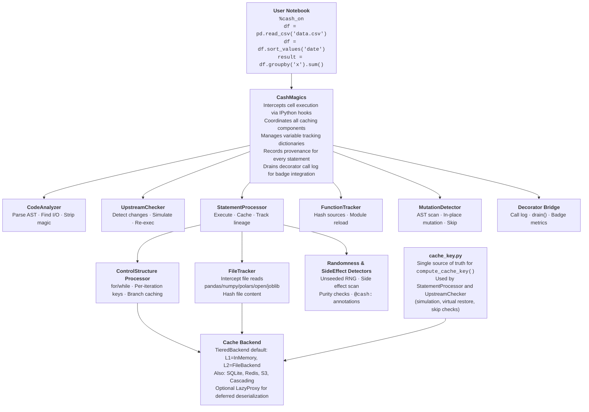

---

## Core Components

### 1. CashMagics (`magics.py`)

The entry point for notebook integration. Provides:

- **Magic Commands**: `%cash_on`, `%cash_off`, `%%cash`, `%cash_debug`
- **Execution Hook**: Intercepts cell execution via `pre_run_cell` event
- **State Management**: Maintains tracking dictionaries for variables

```python
class CashMagics(Magics):
    def __init__(self, shell, cash_instance):
        # Tracking dictionaries
        self._executed_cell_codes = {}    # var_name -> code that defined it
        self._executed_cell_hashes = {}   # var_name -> hash of defining code
        self._variable_lineage = {}       # var_name -> lineage hash
        self._variable_hashes = {}        # var_name -> set of known value hashes
        self._current_session_hashes = {} # var_name -> current value hash
```

### 2. CodeAnalyzer (`analysis.py`)

Static analysis of Python code using AST:

- **Input Detection**: Variables read by a statement
- **Output Detection**: Variables written by a statement
- **Scope Handling**: Tracks local vs. global scope in functions/classes
- **Magic Stripping**: Removes Jupyter magics before parsing

```python
class CodeAnalyzer:
    @staticmethod
    def analyze_code_block(code: str) -> tuple[Set[str], Set[str]]:
        """Returns (input_vars, output_vars)"""
        tree = ast.parse(code)
        # ... AST visitor logic
        return (inputs, outputs)
```

### 3. StatementProcessor (`statement_processor.py`)

Executes individual statements with caching:

- **Cache Lookup**: Checks if statement result exists
- **Execution**: Runs statement and captures outputs
- **Storage**: Saves results to cache backend
- **Lineage Update**: Computes and stores variable lineage

### 4. UpstreamChecker (`upstream.py`)

Ensures consistency between notebook state and cached state:

- **Notebook Simulation**: Virtually executes upstream cells to compute expected lineages
- **Mismatch Detection**: Compares simulated vs. actual variable lineages
- **Re-execution**: Triggers re-execution of changed upstream statements
- **Virtual Restore**: Restores cached results without full re-execution

### 5. ControlStructureProcessor (`control_structures.py`)

Handles loops and conditionals with fine-grained caching:

- **Per-Iteration Caching**: Each loop iteration gets its own cache key
- **Branch Caching**: Only executed if/else branches are cached
- **Nested Support**: Handles arbitrarily nested control structures

---

## Cache Key Generation

Cache keys are the foundation of the caching system. They must be:
- **Deterministic**: Same inputs → same key
- **Unique**: Different computations → different keys
- **Sensitive**: Detect any relevant change

### Statement Cache Key Formula

```
cache_key = SHA256(
    "stmt:" +
    source_hash + ":" +
    sorted(input_lineage_hashes) + ":" +
    file_dependency_hash + ":" +
    func_source_hashes
)
```

Where:
- `source_hash` = SHA256 of the statement's source code
- `input_lineage_hashes` = Lineage hashes of all input variables (sorted)
- `file_dependency_hash` = Hash of any files read by the statement
- `func_source_hashes` = SHA256 of each callable input's source code (via `inspect.getsource()`)

### Example

```python
# Statement: df = df.sort_values('date')
# Inputs: df (lineage: abc123...)
# Outputs: df

source_hash = SHA256("df = df.sort_values('date')")  # → "f0f48e4a..."
input_lineages = ["abc123..."]  # Lineage of input 'df'

cache_key = SHA256("stmt:f0f48e4a...:abc123...")
```

---

## Unified Cache Key Computation

**All cache key computation goes through `compute_cache_key()` in `cash.notebook.cache_key`.**
This is the single source of truth for building statement cache keys and is a critical architectural invariant.

### Why This Matters

Cache keys are computed in multiple contexts:
1. **Runtime execution** (`statement_processor.py` → `_analyze_and_hash()`)
2. **Upstream simulation** (`upstream.py` → `_update_virtual_lineage()`)
3. **Virtual restore** (`upstream.py` → `_try_virtual_restore()`)
4. **Skip checking** (`upstream.py` — verifying skipped statements)

Any divergence between these computations causes cache misses or stale data after kernel restarts. This has caused critical bugs in the past.

### Input Lineage Priority Order

When `compute_cache_key()` resolves the lineage of an input variable, it checks sources in this order:

1. **`virtual_lineage`** — simulation context (checked first, reflects current simulated code)
2. **`variable_lineage`** — runtime state (may hold stale lineages from previous execution)
3. **`_cash_hash` attribute** — on the object in `user_ns`
4. **`compute_hash_fn` fallback** — content-based hashing

### Module Lineage Propagation

When `_update_virtual_lineage()` processes import statements (`import X` / `from X import Y`), it copies module output lineages to `self.variable_lineage`. This ensures modules are available for downstream runtime cache key computation even after kernel restart (when imports are "skipped stmts" that never go through `process()`).

---

## Lineage Tracking

Lineage tracking is the core innovation that enables smart invalidation.

### What is Lineage?

A variable's **lineage hash** encodes its entire computational history:

```
lineage(x) = SHA256(
    code_that_produced_x + ":" +
    lineage(input1) + ":" +
    lineage(input2) + ...
)
```

### Lineage Propagation Example

```python
# Cell 1
a = 1                    # lineage(a) = SHA256("a = 1:")
b = 2                    # lineage(b) = SHA256("b = 2:")

# Cell 2  
c = a + b                # lineage(c) = SHA256("c = a + b:" + lineage(a) + ":" + lineage(b))

# Cell 3
d = c * 2                # lineage(d) = SHA256("d = c * 2:" + lineage(c))
```

If `a = 1` changes to `a = 10`:
- `lineage(a)` changes → `lineage(c)` changes → `lineage(d)` changes
- All downstream cached results are automatically invalidated!

### Lineage Storage

```python
# In _variable_lineage dict:
{
    'a': 'abc123...',  # SHA256 of "a = 1:"
    'b': 'def456...',  # SHA256 of "b = 2:"
    'c': '789ghi...',  # SHA256 of "c = a + b:abc123...:def456..."
    'd': 'jkl012...',  # SHA256 of "d = c * 2:789ghi..."
}
```

---

## Upstream Detection & Re-execution

When you run a cell that depends on upstream cells, the system ensures consistency.

### The Problem

Consider this scenario:
1. You run cells 1, 2, 3 in order
2. You modify cell 1's code
3. You run cell 3 directly

Without upstream checking, cell 3 would use stale cached results based on old cell 1 code.

### The Solution: Virtual Simulation

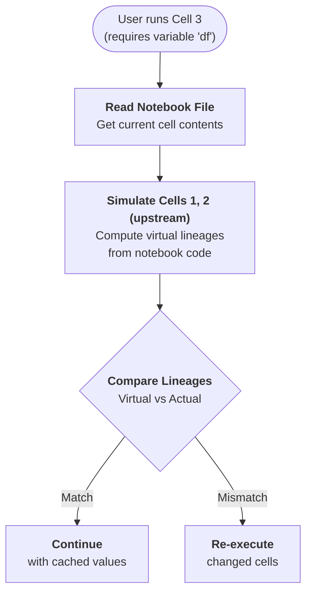

### Virtual Lineage Simulation

The `UpstreamChecker._simulate_and_find_changes()` method:

1. **Parses** each upstream cell from the notebook file
2. **Simulates** statement execution (without actually running code)
3. **Computes** what the lineages *should* be based on current notebook code
4. **Compares** virtual lineages with actual in-memory lineages
5. **Identifies** "broken" variables that need restoration

### Key Optimization: Required Inputs Only

The system only checks variables that are **actually needed** by the current cell:

```python
# Cell being executed requires only 'ticker_stats'
required_inputs = {'ticker_stats'}

# Even if 'stats' has a lineage mismatch, it's ignored
# because it's not needed for this cell
for var_name in required_inputs:
    if var_name in self.variable_lineage:
        # Check this variable's lineage
```

---

## Control Structure Processing

Loops and conditionals receive special handling for fine-grained caching.

### Per-Iteration Caching for Loops

Instead of caching an entire loop as one unit:

```python
# This loop has 4 iterations, each cached separately
for ticker in ["AAPL", "MSFT", "GOOGL", "TSLA"]:
    ticker_data = df[df["Ticker"] == ticker]
    stats[ticker] = compute_stats(ticker_data)  # Expensive!
```

Each iteration gets a unique cache key incorporating:
- The loop variable value (`ticker = "AAPL"`, `ticker = "MSFT"`, etc.)
- The iteration context hash
- All other inputs

### Iteration Context Hash

```python
def compute_context_hash(context: Dict[str, Any]) -> str:
    """Compute a hash of the iteration context."""
    items = sorted(context.items())  # Deterministic ordering
    context_str = str(items)
    return hashlib.sha256(context_str.encode()).hexdigest()[:16]
```

### Cache Key with Iteration Context

```
# For iteration where ticker = "AAPL"
context_hash = SHA256([("ticker", "AAPL")])  # → "4f2ca162..."

# Statement within loop body
statement_key = SHA256(
    "stmt:" + source_hash + ":" + 
    input_lineages + ":" + 
    "__iteration_context__:" + context_hash
)
```

### Benefits

1. **Partial Cache Hits**: Change early iterations, later iterations still cache-hit
2. **Parallel-Friendly**: Independent iterations can be processed separately
3. **Precise Invalidation**: Only affected iterations are recomputed

### Branch Caching for Conditionals

```python
if condition:
    # Branch A - cached with context "branch=if"
    heavy_computation_a()
else:
    # Branch B - cached with context "branch=else"  
    heavy_computation_b()
```

Only the executed branch is cached, avoiding key pollution from unused branches.

---

## State Restoration

The system can restore notebook state from cache across kernel restarts.

### Restoration Flow

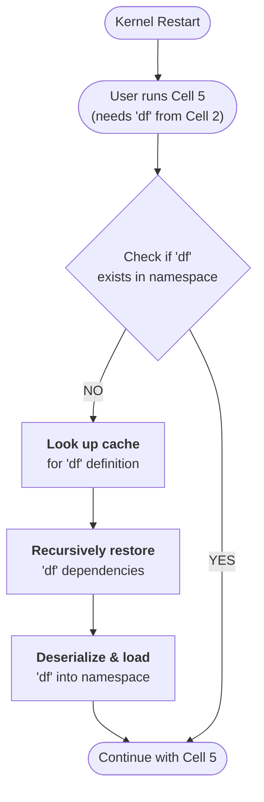

### Virtual Restore

For deep dependency chains, the system can restore from the **last cached state** without re-executing all intermediate steps:

```python
# Instead of re-running:
# df = pd.read_csv('data.csv')    # 5s
# df = df.sort_values('date')     # 2s  
# df = df.groupby('x').sum()      # 3s

# Restore final 'df' directly from cache:
# Total time: 0.1s (deserialization only)
```

---

## Function Tracking & Hot Reload

Cash tracks function definitions as dependencies, so changing a helper function automatically invalidates cached results that used it.

### How Function Tracking Works

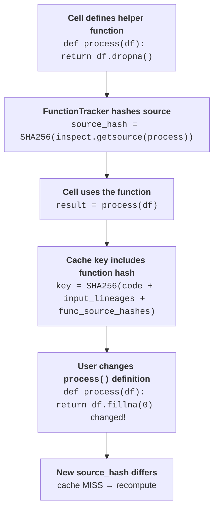

### Cache Key with Function Dependencies

```
# Standard cache key:
key = SHA256("stmt:" + code_hash + ":" + input_lineages)

# With function tracking:
key = SHA256("stmt:" + code_hash + ":" + input_lineages + ":" + func_source_hashes)
```

Where `func_source_hashes` includes the SHA256 of every callable input's source code (via `inspect.getsource()`).

### Transitive Module Dependency Expansion

When a local module function is called, Cash doesn't just track that function's source — it transitively expands to track **all modules that the function's module imports**. This means changing a deeply-nested dependency invalidates all caches that ultimately depend on it.

```python
# my_utils.py imports from my_helpers.py
# Changing my_helpers.py invalidates caches that call functions from my_utils.py
```

### Module-Qualified Function Keys

Functions are identified by `module.qualname` (e.g. `my_module.process`), not just their `__qualname__`. This prevents collisions when different modules define functions with the same name:

```python
# Both have qualname "dep", but different module-qualified keys:
# notebook cell: "__main__.dep"
# helper module: "my_utils.dep"
```

### Module Tracking (`%cash_track`)

For imported functions from external modules:

```python
%cash_track my_module           # Register module for change detection
%cash_track my_module --reload  # Force reload (clears .pyc cache)
%cash_track --list              # Show tracked modules with mtimes
%cash_track --check             # Auto-detect changes and reload
```

When a tracked module's source file changes on disk:
1. `.pyc` bytecode cache is invalidated
2. Module is reloaded via `importlib.reload()`
3. Source hash cache for all module functions is cleared
4. Next execution recomputes cache keys → cache misses for changed functions

---

## Decorator–Notebook Bridge

Cash bridges the `@cash.cache` decorator with notebook statement-level caching, so decorator call metrics appear in notebook badges.

### How It Works

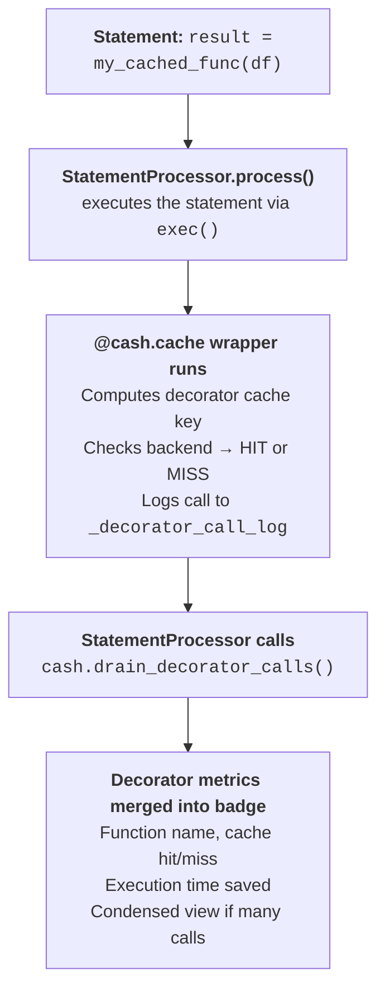

### Call Logging

Each `@cash.cache` call records an entry in `Cash._decorator_call_log`:

```python
{
    'func_name': 'my_module.process',   # Module-qualified key
    'cache_hit': True,                  # Whether cache was hit
    'execution_time': 0.001,            # Wall-clock time
    'args_hash': 'abc123...',           # Hash of arguments
    'cache_key': 'my_module.process:...', # Full cache key
    'timestamp': 1718000000.0,          # Unix timestamp
}
```

### Badge Display

After each statement executes, `drain_decorator_calls()` atomically retrieves and clears the log. The badge renderer then shows:

- **Single call**: `✅ my_func: HIT (saved 2.3s)`
- **Multiple calls**: Condensed into `📦 3 decorator calls (2 HIT, 1 MISS)`
- **Nested calls**: All levels of nesting are captured

### Notebook-Level Invalidation

When a decorated function's source code changes, Cash:
1. Detects the new source hash vs stored hash
2. Clears `_analyzed` to force dependency graph rebuild
3. All subsequent calls miss the cache (new cache key from new source hash)
4. Transitive invalidation: functions that call the changed function also get new keys

---

## Custom Type Hashers

Cash provides built-in hashing for common data types and a `register_hasher()` API for custom types.

### Built-in Type Support

| Type | Module | Hashing Strategy |
|------|--------|------------------|
| `DataFrame`, `Series` | pandas | `pd.util.hash_pandas_object()` |
| `ndarray` | numpy | `value.tobytes()` (< 10 MB) or shape+dtype+sample |
| `DataFrame`, `Series`, `LazyFrame` | polars | `hash_rows()` / `hash()` / `explain()` |
| `Table`, `RecordBatch` | PyArrow | Schema + row count + data bytes |
| `DataFrame`, `Series` | modin | Convert to pandas, then hash |
| `DataFrame` | dask | Task graph key hash |

### Hasher Resolution Order

When `_serialize_args` encounters a function argument:

1. **`_cash_hash` attribute** — lineage-tracked objects (fastest path)
2. **Registered type hashers** — via `register_hasher()` (custom types)
3. **Built-in type hashers** — the table above (common data types)
4. **`pickle.dumps()` fallback** — standard Python objects

### Registering Custom Hashers

```python
from cash import Cash

c = Cash()
c.register_hasher(
    MyModel,
    lambda model: model.get_fingerprint()
)
```

If the argument can't be hashed at all (e.g., generators, iterators), the decorator falls through to execute the function without caching.

---

## Automatic Import Source Tracking

Cash automatically tracks local module imports and invalidates caches when imported source files change.

### How It Works

When a notebook cell contains `import my_module` or `from my_module import func`:

1. **Source file located** via `inspect.getfile(module)`
2. **File modification time** tracked as a dependency
3. **Source hash** computed for all referenced module functions
4. **Cache keys** include module source hashes, so changes to the module file invalidate downstream caches

### Scope

This tracking covers:
- Local modules (files in the working directory or sys.path)
- Packages with `__init__.py`
- Transitive imports (modules imported by tracked modules)

Standard library and third-party packages are **not** tracked (they are assumed stable).

---

## Mutation Detection

Cash uses AST analysis to detect in-place mutations that could break caching correctness.

### The Mutation Problem

```python
# Cell 1
data = [1, 2, 3]           # Cached: data = [1, 2, 3]

# Cell 2
data.append(4)              # Mutation! data is now [1, 2, 3, 4]
                            # But cache still has [1, 2, 3]
```

Without mutation detection, re-running Cell 2 would skip (same code, same lineage) but the result would be wrong.

### Detection Categories

The `MutationDetector` scans AST nodes for:

| Pattern | Example | Detection |
|---------|---------|-----------|
| Method calls | `list.append()`, `dict.update()`, `set.add()` | Known mutating methods |
| Augmented assign | `x += 1`, `total *= 2` | `ast.AugAssign` node |
| Subscript assign | `d['key'] = val`, `arr[0] = 1` | `ast.Assign` with `ast.Subscript` target |
| Attribute assign | `obj.attr = val` | `ast.Assign` with `ast.Attribute` target |
| `del` subscript | `del d['key']` | `ast.Delete` with `ast.Subscript` |
| Pandas inplace | `df.drop(inplace=True)` | `inplace=True` keyword |

### How Mutations Affect Caching

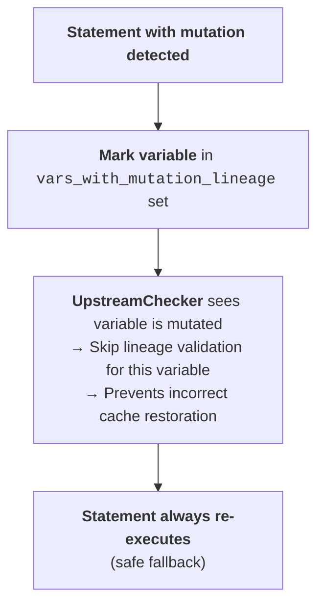

Mutations are tracked per-variable. The system errs on the side of re-execution rather than serving stale cached data.

---

## Randomness Detection

Cash detects code that uses random number generators without seeding, which could produce different results on each run.

### Detection Approach

The `RandomnessDetector` scans AST nodes for calls to random functions across multiple modules:

| Module | Tracked Functions |
|--------|-------------------|
| `random` | `random()`, `randint()`, `choice()`, `shuffle()`, `sample()`, `uniform()`, etc. |
| `numpy.random` | `rand()`, `randn()`, `randint()`, `choice()`, `shuffle()`, `normal()`, etc. |
| `torch` | `rand()`, `randn()`, `randint()`, etc. |

### Seed Tracking

The detector also tracks `seed()` calls. If a random module has been seeded, subsequent random calls are considered deterministic:

```python
# Cell 1
np.random.seed(42)    # Seed detected → numpy.random marked as seeded

# Cell 2
x = np.random.randn(100)  # No warning — module was seeded
```

### Suppressing Warnings

Use the `@cash:allow-random` annotation to suppress randomness warnings:

```python
# @cash:allow-random
result = np.random.randn(100)  # No warning issued
```

---

## Side Effect Detection

Cash detects code with side effects that make caching unsafe.

### Detection Categories

The `SideEffectDetector` scans for:

| Pattern | Examples | Description |
|---------|----------|-------------|
| File writes | `open('f', 'w')`, `to_csv()`, `to_parquet()` | Writing to files |
| Network calls | `requests.get()`, `urllib` | HTTP/network operations |
| Database operations | `cursor.execute()`, `session.commit()` | Database mutations |
| System calls | `os.system()`, `subprocess.run()` | External process execution |
| Print to file | `print(..., file=f)` | Output to non-stdout |

Statements with detected side effects are flagged as uncacheable to prevent incorrect replay of side-effectful operations.

---

## File Dependency Tracking

Cash intercepts file read operations to automatically invalidate caches when data files change.

### Tracked File Operations

| Library | Functions Tracked |
|---------|-------------------|
| pandas | `read_csv`, `read_parquet`, `read_excel`, `read_json`, `read_pickle`, `read_hdf`, `read_feather`, and all `read_*` functions |
| numpy | `load`, `loadtxt`, `genfromtxt`, `fromfile` |
| polars | `read_csv`, `read_parquet`, `read_json`, `read_ndjson`, `read_ipc`, `read_avro`, `read_excel`, `scan_csv`, `scan_parquet`, `scan_ipc`, `scan_ndjson` |
| builtins | `open()` for text/binary file reads |
| io | `open()` (used by pathlib) |
| joblib | `load` |
| pickle | `load` |
| json | `load` |

### File Dependency Hash

```
file_hash = SHA256(file_path + ":" + str(file_mtime) + ":" + str(file_size))
```

File dependencies are included in the cache key:

```
cache_key = SHA256(
    "stmt:" + code_hash + ":" + 
    input_lineages + ":" +
    file_dependency_hash        ← includes all files read
)
```

### Custom File Handler Registration

```python
from cash.notebook.file_tracker import FileDependencyRegistry

registry = FileDependencyRegistry()

# Register tracking for a custom reader
registry.register(
    module_name='my_lib',
    func_name='load_data',
    handler_factory=registry._create_path_arg_handler
)
```

The `FileDependencyRegistry` is a singleton that manages all file tracking hooks. Built-in handler factories include:
- `_create_path_arg_handler` — Tracks the first positional argument as a file path
- `_create_open_handler` — Special handler for `open()` that distinguishes read vs write modes

---

## Provenance Tracking

Cash records the full computational provenance of every variable, enabling dependency graph exploration and audit trails.

### ProvenanceRecord

Each time a variable is computed/restored/skipped, a `ProvenanceRecord` is stored:

```python
@dataclass
class ProvenanceRecord:
    variable: str          # Variable name
    code: str              # Code that produced it
    inputs: list[str]      # Input variable names
    timestamp: float       # When it was recorded
    status: str            # 'computed', 'restored', 'skipped'
    duration_ms: float     # Execution time in milliseconds
    lineage_hash: str      # Current lineage hash
    file_deps: list[str]   # File paths read
```

### Dependency Graph Traversal

```python
%cash_provenance df --graph
```

```
df
├── raw_data (via: raw_data = pd.read_csv('data.csv'))
│   └── [file: data.csv]
├── clean_data (via: clean_data = raw_data.dropna())
│   └── raw_data
└── df (via: df = clean_data.merge(other))
    ├── clean_data
    └── other
```

The `get_dependencies()` method performs transitive closure — following inputs recursively to build the full provenance tree.

### Timeline View

```python
%cash_provenance --time
```

Shows chronological execution history with timing:

```
[12:34:56] COMPUTED  raw_data    (45.2ms)  raw_data = pd.read_csv(...)
[12:34:57] COMPUTED  clean_data  (12.1ms)  clean_data = raw_data.dropna()
[12:34:57] RESTORED  model      (2.3ms)   model = train_model(clean_data)
```

---

## Lazy Deserialization

For large cached objects, Cash supports deferred deserialization via `LazyProxy`.

### How It Works

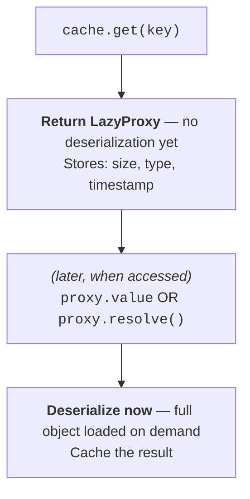

### Usage

```python
from cash.backends.lazy import make_lazy_loader

loader = make_lazy_loader(backend)
proxy = loader(cache_key)

# Check metadata without deserializing
print(proxy.metadata)  # {'size': 1024, 'type': 'DataFrame', ...}

# Full object loaded only when needed
df = proxy.value  # Deserialization happens here
```

### Benefits

- **Memory efficient**: Don't load large objects until needed
- **Fast cache inspection**: Check what's cached without loading data
- **Selective loading**: Load only the variables you actually use

---

## Execution Flow

### Complete Flow for a Single Cell

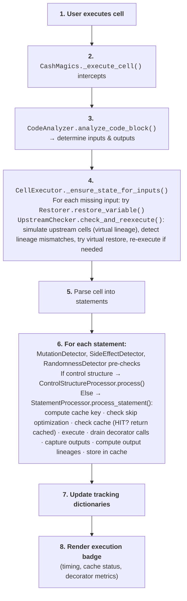

### Statement Processing Detail

```python
def process_statement(self, code, ttl=None, ...):
    # 1. Pre-checks
    mutations = MutationDetector.detect(code)      # AST scan for mutations
    side_effects = SideEffectDetector.detect(code)  # File writes, network, etc.
    randomness = RandomnessDetector.detect(code)    # Unseeded random calls
    
    # 2. Analyze
    inputs, outputs = CodeAnalyzer.analyze_code_block(code)
    
    # 3. Compute cache key (single source of truth: cache_key.compute_cache_key())
    cache_key = compute_cache_key(
        code=code,
        inputs=inputs,
        variable_lineage=self.variable_lineage,
        virtual_lineage=virtual_lineage,     # From upstream simulation
        user_ns=self.shell.user_ns,
        func_source_hashes=func_hashes,      # Callable input source hashes
        file_deps=file_dependency_hash,
    )
    
    # 4. Skip optimization: check if already computed in this session
    if can_skip(code, outputs, inputs):
        return {'status': 'SKIPPED', ...}
    
    # 5. Check cache (skip if mutations or side effects detected)
    if not mutations and not side_effects:
        metadata, cached_data = self.backend.get(cache_key)
        if cached_data is not None:
            for var, value in cached_data['outputs'].items():
                self.shell.user_ns[var] = value
                self.variable_lineage[var] = cached_data['output_lineages'][var]
            return {'status': 'RESTORED', ...}
    
    # 6. Execute
    with capture_output() as captured:
        exec(code, self.shell.user_ns)
    
    # 7. Drain decorator calls (for badge integration)
    decorator_calls = self.cash.drain_decorator_calls()
    
    # 8. Compute output lineages
    output_lineages = {}
    for var in outputs:
        lineage_str = source_hash + ":" + ":".join(input_lineages)
        output_lineages[var] = SHA256(lineage_str)
        self.variable_lineage[var] = output_lineages[var]
    
    # 9. Store in cache
    self.backend.set(cache_key, {
        'outputs': {var: self.shell.user_ns[var] for var in outputs},
        'output_lineages': output_lineages,
        'stdout': captured.stdout,
        ...
    })
    
    return {'status': 'COMPUTED', 'decorator_calls': decorator_calls, ...}
```

---

## Diagrams

### Lineage Propagation

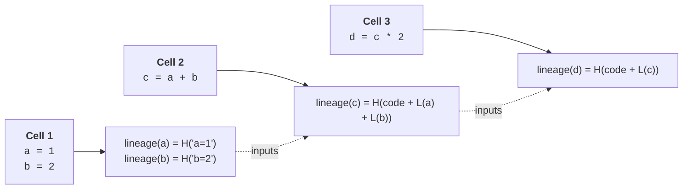

### Cache Hit vs Miss

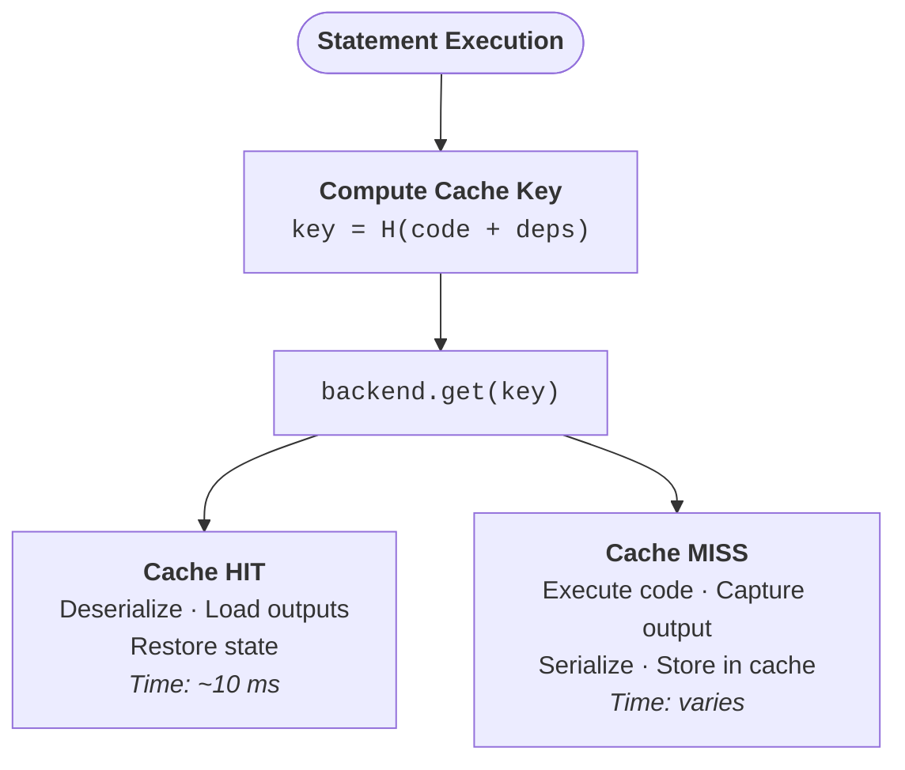

### Control Structure Processing

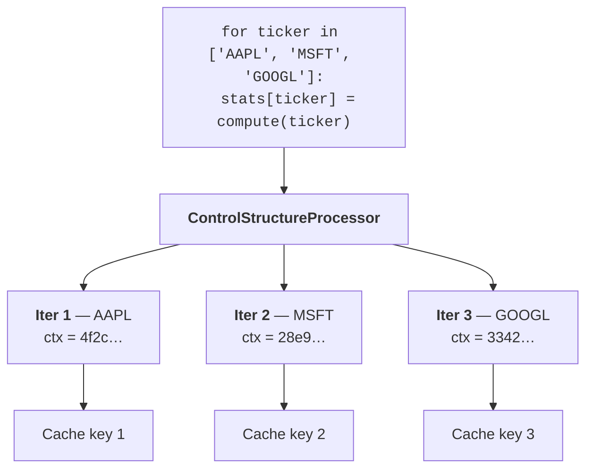

---

## Performance Considerations

### When Caching Helps

- **Expensive computations**: Data transformations, ML training, aggregations
- **Repeated execution**: Re-running cells during development
- **State restoration**: Resuming work after kernel restart

### When Caching May Not Help

- **Fast operations**: Simple arithmetic, small data
- **I/O-bound**: Network requests, database queries (use TTL carefully)
- **Random operations**: Results depend on random state

### Cache Storage Strategy

The default `TieredBackend` uses:

1. **L1 (InMemory)**: Fast access, lost on restart
2. **L2 (FileBackend)**: Persistent, survives restarts

Promotion policy:
```python
def should_persist(execution_time: float, size_bytes: int) -> bool:
    # Skip disk for items faster than 1.0s
    if execution_time < 1.0:
        return False
    # Always persist small items that took >0.1s
    if size_bytes < 64 * 1024:
        return True
    # For large items, check IO trade-off
    io_time = (size_bytes / disk_bandwidth) * 2
    return execution_time > io_time
```

---

## Debugging & Logging

### Debug Mode

Enable debug mode for detailed logging:

```python
%cash_debug on
```

This outputs:
- Cache key computations
- Lineage calculations
- Upstream detection details
- Restoration decisions

Key debug prefixes:
- `[CACHE_HIT_DEBUG]`: Cache lookup results
- `[LINEAGE_DEBUG]`: Lineage computation
- `[UPSTREAM_DEBUG]`: Upstream checking
- `[STATE]`: Variable state validation

### Debug Output Formats

```python
%cash_debug on         # Human-readable console output (default)
%cash_debug json       # JSON-formatted log records
%cash_debug file log.txt  # Write logs to file
%cash_debug off        # Disable debug output
```

### Structured Logging (`%cash_log`)

Cash includes a structured logging system that captures events with machine-readable metadata:

```python
%cash_log             # Show recent log events
%cash_log cache_hit   # Filter by event type
%cash_log --clear     # Clear log buffer
```

The `CashLogHandler` stores up to 1000 events in memory with filtering by logger name, level, and message content.

### JSON Log Format

When using `%cash_debug json`, each log record is emitted as:

```json
{
  "timestamp": "2025-02-06T12:34:56.789",
  "level": "INFO",
  "logger": "cash.notebook.magics",
  "message": "Cache hit for key stmt:abc123...",
  "extra": {
    "variable": "df",
    "cache_key": "stmt:abc123..."
  }
}
```

---

## Summary

The notebook caching system in `cash` provides intelligent, statement-level caching through:

1. **Lineage Tracking**: Every variable carries its computational history
2. **Smart Invalidation**: Changes propagate automatically through dependencies
3. **Upstream Detection**: Notebook changes are detected and handled via virtual simulation
4. **Unified Cache Keys**: Single `compute_cache_key()` function used by all code paths
5. **Fine-grained Control Structures**: Loops/conditionals cached per-iteration/branch
6. **Decorator Bridge**: `@cash.cache` calls are transparently logged and shown in badges
7. **Custom Type Hashers**: `register_hasher()` for domain-specific types; built-in support for pandas, numpy, polars, PyArrow, modin, dask
8. **Auto Import Tracking**: Local module changes automatically invalidate dependent caches
9. **Module-Qualified Keys**: `module.qualname` prevents function name collisions across modules
10. **Mutation & Side Effect Detection**: AST-based detection prevents serving stale cached data
11. **Tiered Storage**: Default TieredBackend with fast InMemory L1 + persistent File L2
