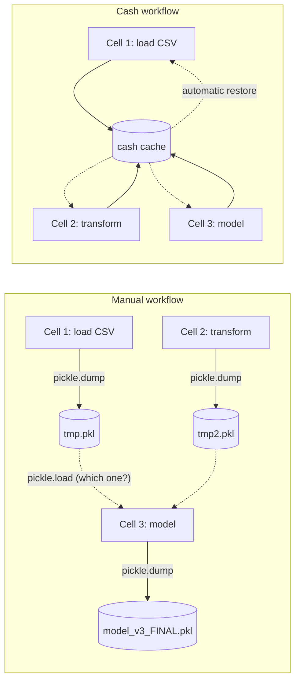

# Why Cash?

You probably aren't shopping for a notebook-caching library — there isn't one
to shop for. But there's a good chance you've already built one in pieces,
without calling it that. **Cash is the library you'd write yourself if you
had a spare month.**

## Does this sound familiar?

<div class="cash-pain-grid" markdown="0">

  <div class="cash-pain-card">
    <span class="cash-pain-icon">🕐</span>
    <span class="cash-pain-title">"Restart and Run All takes 20 minutes."</span>
    <span class="cash-pain-sub">Every small edit pays the full pipeline cost. You stop iterating and start avoiding restarts.</span>
  </div>

  <div class="cash-pain-card">
    <span class="cash-pain-icon">❓</span>
    <span class="cash-pain-title">"You're not sure if <code>df</code> is stale."</span>
    <span class="cash-pain-sub">Did the upstream cell change? Did someone mutate it? You squint at the timestamp and hope.</span>
  </div>

  <div class="cash-pain-card">
    <span class="cash-pain-icon">🥒</span>
    <span class="cash-pain-title">"Your notebook has 12 pickle files."</span>
    <span class="cash-pain-sub"><code>tmp.pkl</code>, <code>df_v3_USE_THIS.pkl</code>. You're afraid to delete any of them.</span>
  </div>

  <div class="cash-pain-card">
    <span class="cash-pain-icon">🌅</span>
    <span class="cash-pain-title">"Your kernel has been running for 4 days."</span>
    <span class="cash-pain-sub">You can't restart — that's where the state lives. One crash and you rebuild from scratch.</span>
  </div>

</div>

If two of those landed, keep reading.

## What happens when you turn cash on

Above each cell, cash shows a **badge** summarising what it did. Watch the same notebook through four states — first run, re-run, restart, then editing an upstream cell:

<iframe class="cash-badge" src="/_badges/why_cash_reel.html" loading="lazy" scrolling="no" height="260" style="width:100%;border:0;display:block;margin:8px 0;"></iframe>

Here's the same notebook workflow written three different ways. **The business logic is identical in all three tabs — only the caching scaffolding changes.**

=== "Without cash"

    ```python
    import pickle, os
    from pathlib import Path

    CACHE = Path(".cache")
    CACHE.mkdir(exist_ok=True)

    # Manual: load if fresh, else recompute and dump.
    df_path = CACHE / "df.pkl"
    if df_path.exists() and df_path.stat().st_mtime > Path("large_file.csv").stat().st_mtime:
        with open(df_path, "rb") as f:
            df = pickle.load(f)
    else:
        df = pd.read_csv("large_file.csv")
        with open(df_path, "wb") as f:
            pickle.dump(df, f)

    # ... repeat for every expensive variable. Don't forget version stamps.
    result = df.groupby("category").sum()
    ```

=== "With `%store`"

    ```python
    # IPython %store has no granularity, no auto-invalidation:
    # you have to remember to %store after compute and %store -r on restart,
    # and there's no signal if the underlying CSV changed.
    %store -r df
    if 'df' not in dir():
        df = pd.read_csv("large_file.csv")
        %store df

    result = df.groupby("category").sum()
    # ...did you remember to %store result too? Did df change since you last stored?
    ```

=== "With cash"

    ```python { .nb-cell }
    %cash_on

    df = pd.read_csv("large_file.csv")
    result = df.groupby("category").sum()
    ```

What each pain looks like with cash:

- 🕐 **Restart cost** → statement-level caching + automatic restore-after-restart. Re-running a cell hits the cache; restarting the kernel hits disk.
- ❓ **Staleness** → lineage hashes invalidate automatically when any upstream cell changes. The badge tells you what was reused and what was recomputed.
- 🥒 **Pickle sprawl** → no filenames. The cache is keyed by code + inputs, stored in a single managed backend.
- 🌅 **Restart fear** → restart freely. The cache survives the kernel, so the next run is RESTORED, not recomputed.

### How much time would *you* reclaim?

<div class="cash-calculator" markdown="0"></div>

## Why this works



*Cash replaces ad-hoc plumbing with a single dependency-aware cache.*

The same four cells, run through four lifecycle events — first run, re-run, kernel restart, upstream edit:

<iframe class="cash-badge" src="/_badges/why_cash_flow.html" loading="lazy" scrolling="no" height="300" style="width:100%;border:0;display:block;margin:8px 0;"></iframe>

## Is this for you?

<div class="cash-shines-skip-grid" markdown="0">
  <div class="cash-shines-card">
    <h4>Cash shines for</h4>
    <ul>
      <li>Long-running notebook pipelines (data prep, feature engineering, model exploration).</li>
      <li>Iterative analysis with frequent upstream-cell editing.</li>
      <li>Notebooks with expensive file reads (large CSVs, parquet, pickles).</li>
      <li>Mixed-language teams who don't want to learn Make / snakemake / DVC just for caching.</li>
    </ul>
  </div>
  <div class="cash-skip-card">
    <h4>Skip cash if</h4>
    <ul>
      <li>Your notebook is a single cell with no expensive steps.</li>
      <li>You're writing a pure I/O script (API ingestion, network polling) — caching is at the wrong layer.</li>
      <li>You need hard real-time behaviour.</li>
      <li>Your cells <em>intentionally</em> produce different output each run — though see the <a href="tutorials/purity.md"><code>@stateful</code> decorator</a> for the nuanced case.</li>
    </ul>
  </div>
</div>
